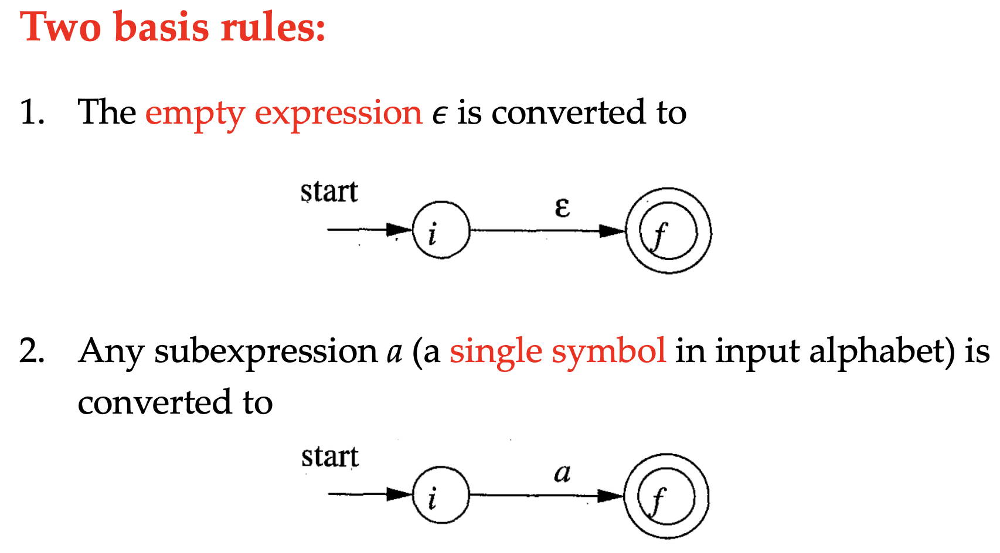
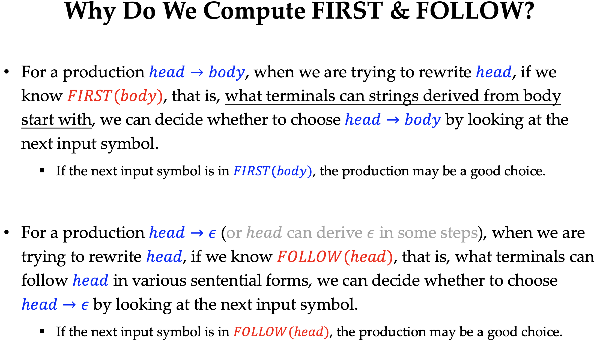
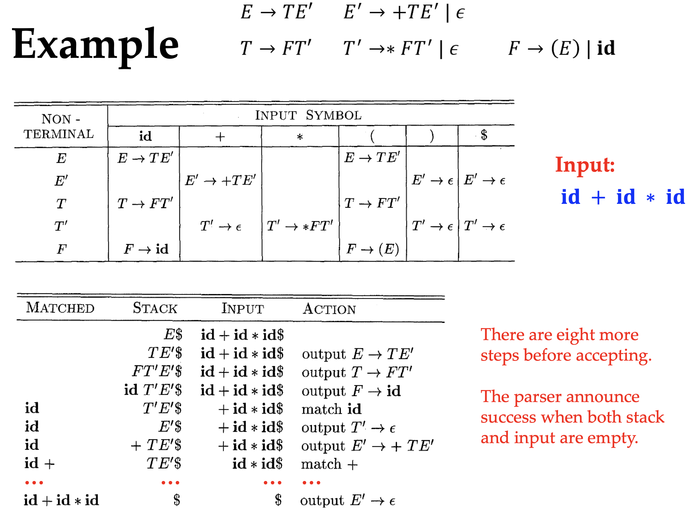

+++
title = 'CS323 Compilers Final Review'
date = 2025-01-19T19:54:59+08:00
summary = "Compilers are fun!"
math = true
draft = false
categories = ["Compilers", "System"]
tags = ["Review"]
+++

> Thanks a lot for the note from IskXCr and [GuTao's](https://site-fan.github.io/posts/cs323_notes/).
> Pictures are from Prof. Liu's slides. Thanks much for the great course.

## Preface

So a couple of weeks after the final exam, I decided to write a review of the course for its elegance. 
This note will try to be not only a review note, but also a crash course for compilers.

And besides the theoretical things, the lab part, where you learn how to do lexing and parsing and IRs, 
is also important. But it's not covered in this note.

## Introduction to Compilers

Ever since Alan Turing first proposed his concept of a universal machine in 1936, computer scientists
have been trying to figure out how to actually build one, and here comes the computer in binary form.
In Computer Organization, we learned how to build a CPU from scratch and write assembly code, but it
sucks to write assembly code by hand.

Our ancestors have been through this pain, from poking the holes in the paper tape, to writing assembly
and finally to writing high-level languages, C/C++ and Python. BUT how did they come to this? While
assembly is only a mnemonic for the binaries, high-level languages provide a more idiomatic way to write
programs, and compilers are the bridge between them.

Why we are still studying compilers, even if we won't research on them? Compilers, despite being a 
language translator, are also a icon of system software. It's a textbook example of software engineering.
If you want to develop a large project, you should probably learn from the compiler, like how it's designed,
modularized, blah blah blah.

### Phases of Compilers

Bilge aside. So how are compilers pieced together? A compiler is usually divided into several phases:


- **Frontend**: Compiler analyzes the source code we wrote at the first look, and generates its own
    form of the code, which is called the Intermediate Representation (IR).
  - **Lexical Analysis**: Breaks the source code into tokens. Souce code is a string of characters, so
    we need to break it into words, like `int`, `main`, `return`, etc. It's called tokens.
  - **Syntax Analysis**: The tokens must come in a certain order, which is called the syntax. Syntax
    analysis checks if the tokens are in the right order. Otherwise, compiler cannot find the meaning.
    Compiler generates a tree-like structure called the Abstract Syntax Tree (AST).
  - **Semantic Analysis**: Compiler checks the context of the tokens. For example, you cannot refer to a
    variable before you declare it. Also, since syntax analysis ignores the context, numerous checks are 
    done here.
  - **IR Generation**: After the source code is checked, compiler generates its own form of the code, 
    which is called the Intermediate Representation (IR), from the AST. IR is a form of code that is
    easier to optimize and generate the final code.
- **Backend**:
  - **Machine-Independent Optimization**: Compiler optimizes the IR, like folding constants, removing
    dead code, etc, to make the code run faster. It's only based on the IR, not the target machine.
  - **Code Generation**: Finally, compiler generates the machine code from the optimized IR
  - **Machine-Dependent Optimization**: Compiler optimizes the binaries based on the target machine, like
    x86 and ARM has different feature instructions like SIMD, so the optimization is different.

> Check what's the input and output of each phase, and what's the purpose of each phase.

### Compiler versus Interpreter

Compiler and interpreter are both language translators, but they are different in the way they work.


Compiler tries to translate the whole program into machine code at once, and then run it. It's faster.

Interpreter translates the program on runtime, which is slower, but it's easier to debug and run.

Also in terms of optimization, compiler can do more optimization, because it can see the whole program.

## Lexical Analysis

Now comes the first phase of compilers, lexical analysis. The goal of lexical analysis is to break the
source code into tokens. For example, the source code `int main() { return 0; }` should be broken into
`int`, `main`, `(`, `)`, `{`, `return`, `0`, `;`, `}`. These words and characters are primarily the 
**lexemes**, which need further conversion into **tokens**.


Firstly, we should define what the tokens look like and how they facilitate the syntax analysis. Tokens
are defined by us, so we can represent them by `enum` and in theory, we denote them with `token name`.
Some of them might have attributes, like the value of an integer, or the name of a variable, so we need
to add an optional attribute to the token. Thus, we have formally defined format of tokens: `<token name, attribute>`.


And we can use a symbol table to store the attributes of the tokens since there might be duplicated attributes.

However, we don't know how to formally define the actual form of tokens, which means that the **pattern** of
tokens must be specified. Usually it's accomplished by regular expressions, or in some advanced lexers, you
can write your own codes to define the pattern.

If none of the patterns match, the lexer will throw an error, which is called a **lexical error**.

### Regular Expressions

Beform learning the regular expressions, we have to know what it operates on.

String has the following terminologies, which we refer to when we describe the string:
- **Alphabet**: The set of symbols that might appear in the string. It's not the English alphabet.
- **String**: A sequence of symbols from the alphabet. The special symbol $\epsilon$ denotes an empty string.
- **Prefix/Suffix**: The beginning/end of a string.
- **Proper Prefix/Suffix**: A prefix/suffix that is not the string itself and not the empty string.
- **Substring**: A string that is not the string itself and not the empty string.
- **Proper Substring**: A substring that is not the string itself and not the empty string.
- **Subsequence**: A string that is obtained by deleting some symbols from the string. Doesn't have to be continuous.

As you see, sub- means to slice the string, and so we also need to combine the strings, which is called **concatenation**
- **Concatenation**: The concatenation of two strings $s_1$ and $s_2$ is denoted by $s_1s_2$.
- **Exponentiation**: Multiple concatenation of the same string, denoted by $s^n$. $s^0 = \epsilon$, $s^1 = s$, $s^i = s^{i-1}s$.

Elements in the alphabet are constructed together to form a string, and so all the possible strings form the set we call **language**.
Language is a set, so it surely has the operations of set:
| Operation | Definition and Notation | Example |
| --- | --- | --- |
| Union | $L_1 \cup L_2 = \{s | s \in L_1 \text{ or } s \in L_2\}$ | Digits $\cup$ Letters = $\{0, 1, 2, \ldots, 9, a, b, c, \ldots, z\}$ |
| Concatenation | $L_1L_2 = \{s_1s_2 | s_1 \in L_1 \text{ and } s_2 \in L_2\}$ | DigitsLetters = $\{0a, 0b, 0c, \ldots, 9z\}$ |
| Kleene Closure | $L^* = \cup_{i=0}^{\infty} L^i$ | $L^* = $ the set of all strings over the alphabet including the empty string |
| Positive Closure | $L^+ = \cup_{i=1}^{\infty} L^i$ | Excluding the empty string |

Regular expressions describe the pattern of the strings by constructing the language, set of all strings that match the pattern. Suppose
we have the alphabet $\Sigma$ and denote the language by $L(a)$, where $a \in \Sigma$. Then the regular expressions are defined as follows:
- Basis of regular express: $\epsilon$ and $a \in \Sigma$ are regular expressions.
- Induction: If $r$ and $s$ are regular expressions, then so are:
  - $r | s$ union denoting $L(r) \cup L(s)$
  - $rs$ concatenation, denoting $L(r)L(s)$
  - $r^*$ Kleene closure denoting $(L(r))^*$
  - $(r_1)$ grouping the language $L(r) = r$.

Language as a set makes regexp operations with algebraic properties, like identity, associative and communicative,
but we won't go into details here. Since we construct the language from basis and induction, the definitions like building 
materials from atoms, are called **Regular Definitions**, in forms like
$$
  d_1 \rightarrow r_1
$$
$$
  d_2 \rightarrow r_2
$$
...
$$
  d_n \rightarrow r_n
$$
where $d_i$ is the name of the definition and $r_i$ is the regular expression. For example, when we describe the 
regexp of IPv4 address, we can define the regular definitions like

```regexp
digit -> 0|1|2|3|4|5|6|7|8|9 # 0 or 1 or 2 or ... or 9
term -> ((1|2)digit^2)|((1|2|3|4|5|6|7|8|9)digit)|(digit^1) # 0-9, 10-99, 100-299
ipv4 -> term.term.term.term # 0-299.0-299.0-299.0-299 incorrect, need more tuning
```

### Finite Automata

As learnt in Digital Logic, finite automata has alphabet $\Sigma$, states $S$ and transitions $T$ between states. Special states
are start and accept states. "Finite" means that the number of states is finite, and different transitions form two kinds of automata:
- **Non-deterministic Finite Automata (NFA)**: Multiple transitions when reading the same symbol and possible $\epsilon$ transitions.
- **Deterministic Finite Automata (DFA)**: Only one transition on each symbol and no $\epsilon$ transitions.


NFAs are easy to construct but hard to implement, because we don't know where we head to when we have multiple transitions. So we 
need DFA as a deterministic version of NFA (you probably know DFA is a subset of NFA).


All we need for DFA is to keep executing until out of input

```c
int DFA(int start_state, int accept_states[], int transition[][]) {
    int state = start_state;
    int input;

    while (input = readChar() != EOF) {
        state = transition[state][input];
    }

    for (int i = 0; i < sizeof(accept_states) / sizeof(int); i++) {
        if (state == accept_states[i]) {
            return 1; // Accept
        }
    }
    return 0; // Reject
}
```

### Thompson's Construction

The first step to implement the regexp is to convert it to NFA using Thompson's Construction. The construction is intuitive
and similar to the regexp itself. For the basic rules,



And for the induction rules,


When implementing the lexer, we also need to combine the NFAs for every token to a single one, and distinguish the tokens by
their accept states.


### Subset Construction Algorithm

As said before, DFA must be the implementation of lexer, so we must convert the NFA to DFA then. Intuitively, 
$\epsilon$ transitions, as the first problem, can be solved by combining the states that can be reached by them,
because the states are reached without consuming any input -- they are the same state. So the set of those states
as subset of NFA states, form a new state in DFA. That's where the name "Subset Construction" comes from. Note that
the subset might have intersection, so every unique subset denotes a new state in DFA and same subset denotes the same state.

The second problem is the multiple transitions on the same symbol. Because we have combined the states, we can also
combine the states that can be reached by the same symbol and from the states in the subset, to also form a new state in DFA.

The combination of the states is called $\epsilon$-closure. When constructing $\epsilon$-closure(T) on the initial set T,
we keep adding the states that can be reached by $\epsilon$ transitions from the states in T until no more states can be added.
Yeah it's similar to the BFS, $\epsilon$-closure should also be called $\epsilon$-reachability.

$T$ is the new state in DFA, and then we construct the transitions from $T$ to other states in DFA, called move($T$, a) = $T^\prime$.
where $T^\prime$ is the set of states that can be reached by symbol $a$ from the states in $T$. And finally we extend $T^\prime$ to its
$\epsilon$-closure to form the new state in DFA.

```c++
int* epsilonClosure(int states[], vector<int> epsilonTransitions[]) {
    vector<int> closure;
    stack<int> stk;
    for (int s: states) {
        closure.push_back(s);
        stk.push(s);
    }

    while (!stk.empty()) {
        int state = stk.top();
        stk.pop();
        for (int next: epsilonTransitions[state]) {
            if (find(closure.begin(), closure.end(), next) == closure.end()) {
                closure.push_back(next);
                stk.push(next);
            }
        }
    }

    return closure.data();
}

int* move(int states[], vector<int> transitions[], int symbol) {
    vector<int> next;
    for (int s: states) {
        for (int t: transitions[s]) {
            if (t == symbol) {
                next.push_back(s);
                break;
            }
        }
    }
    return next.data();
}

void constructDFA(int start_state, int accept_states[], int states[], vector<int> transitions[], char alphabet[]) {
    vector<int> epsilonTransitions[]; // Construct epsilon transitions
    for (int i = 0; i < sizeof(transitions) / sizeof(vector<int>); i++) {
        for (int j = 0; j < transitions[i].size(); j++) {
            if (transitions[i][j] == epsilon) {
                epsilonTransitions[i].push_back(j);
            }
        }
    }

    vector<int> start = epsilonClosure({start_state}, epsilonTransitions);
    vector<int> accept;
    vector<vector<int>> transition_dfa[alphabet.size()];
    vector<vector<int>> dfa;
    stack<vector<int>> stk;

    // Construct DFA states and transitions
    stk.push(start);
    while (!stk.empty()) {
        vector<int> T = stk.top();
        stk.pop();
        dfa.push_back(T); // Add DFA state
        for (int a: alphabet) {
            vector<int> U = epsilonClosure(move(T, transitions, a), epsilonTransitions);
            transition_dfa[T][a].push_back(U); // Add DFA transition
            if (find(dfa.begin(), dfa.end(), U) == dfa.end()) {
                stk.push(U);
            }
        }
    }

    // Closures containing the accept states of NFA are accept states of DFA.
    for (int i = 0; i < dfa.size(); i++) {
        for (int j = 0; j < sizeof(accept_states) / sizeof(int); j++) {
            if (find(dfa[i].begin(), dfa[i].end(), accept_states[j]) != dfa[i].end()) {
                accept.push_back(i);
                break;
            }
        }
    }
}
```

Above is the pseudocode of the Subset Construction Algorithm.

Sometimes we can optimize the DFA by merging the states that have the same moves on all symbols.

## Syntax Analysis

After the lexical analysis, we have the tokens, but we don't know how to combine them to form a valid program. That's where
the syntax analysis comes in. Syntax analysis checks if the tokens are in the right order, and generates a tree-like structure
called the Abstract Syntax Tree (AST).

Parsers are stronger versions of lexers, and thus we use it to recognize a more complex structure of the source code.
And similar to the lexing part, where regular definitions give NFA and then DFA, we also have the context-free grammar
to describe the syntax of the programming language. CFGs then are transformed into parsers, another kind of automata.

### Parsers

We have three kinds of parsers:
- **Universal parsers**: Some methods (e.g., Earley’s algorithm1) can parse any grammar but they are hard to implement.
- **Top-down parsers**: Start from the root of the production rules and derive to the leaves. Recursive Descent is a common
  method for top-down parsing and LL(1) is its table-driven version.
- **Bottom-up parsers**: Start from the leaves and deduce to the root. LR(1) is a common method for bottom-up parsing.

Industrially, recursive-descent parsers are called parser combinators and they are mostly used for their flexibility, while
table-driven parsers are referred to as parser generators because they generate tables from production rules.

### Context-Free Grammars

CFGs are similar to regular definitions, and they have four components:
- **Terminals**: The actual symbols of tokens, like `int`, `main`, `return`, etc.
- **Non-terminals**: The symbols denoting the production rules, like `stmt`, `expr`, etc.
- **Start symbol**: The only non-terminal symbol that starts the derivation, like `prgm`.
- **Production rules**: The rules that define the syntax of the language, in form of `A -> B`, where `A` is a non-terminal
  and `B` is a sequence of terminals and non-terminals.

Example of CFG:

- **Terminals**: (, ), +, -, id, num
- **Non-terminals**: expr, term
- **Start symbol**: expr
- **Production rules**: `|` means "or", because there are multiple rules for the same non-terminal.
  - `expr -> expr + expr | expr - expr | term`
  - `term -> ( expr ) | id | num`

If the input tokens are valid according to the CFG, they can be **derived** from the start symbol.
This is called the **derivation**. For example,

**CFG**: `E -> – E | E + E | E * E | ( E ) | id`
**Input**: `-(id)`

We can derive it by `E => -E => -(E) => -(id)`. Sometimes we can save some steps as they are obvious, like `E => -(E) => -(id)`.

Then all of the derivations have their own name,
- **Sentential form**: If the derivation `S => a` is valid, then `a` is a sentential form of `S` and `a` is a string of terminals and non-terminals.
- **Sentence**: If the sentential form contains only terminals, then it's a sentence.

As you may have noticed, the derivation is not unique, and we can have multiple derivations for the same input.
To reduce the ambiguity, we have the concept of **leftmost derivation** and **rightmost derivation**. The leftmost derivation
requires that the leftmost non-terminal is replaced at each step, and the rightmost derivation requires the rightmost.

The derivation might be hard to read, so we have **parse trees** to represent the derivation. The parse tree is a tree-like structure
where
- **Root**: The start symbol
- **Interior nodes**: Non-terminals
- **Leaves**: Terminals


However, the leftmost/rightmost derivation may have ambiguity, for example


Often it's the problem of designing the CFG, and there's no general method to solve it. But we can use the precedence and associativity
to solve it, like the precedence of operators in math.

CFGs are more expressive than regular definitions. We can prove that languages described by regular definitions can also be described
by CFGs. Simply convert regular definitions to NFAs and then write a CFG to simulate the NFA.


But the opposite is not possible because regular expression cannot deal with recursion, while CFG can. Counterexample is the 
language $L = \{a^nb^n | n \geq 0\}$, whose CFG is `S -> aSb | ab`.

### Top-Down Parsing

Top-down parsing acts similar to the derivation. But the major problem for implementation is that if there're alternatives in the
production rule, we don't know which one is the right way to go (no ambiguity). The intuition is that we can backtrack if we went
the wrong way.

```c
// A -> X_1 X_2 X_3 ... X_n
// A -> Y_1 Y_2 Y_3 ... Y_m
void production_A() {
backtrack:
    term current_token = next_token();
    vector<term> terms = get_production_rule();
    if (terms.empty()) return report_error();

    for (int i = 0; i < terms.size(); i++) {
        if (is_non_terminal(terms[i])) {
            if (production(terms[i]) == FAIL) {
                reset_to_last_state();
                goto backtrack;
            } else {
                continue;
            }
        } else if (terms[i] == current_token) {
            current_toke = next_token();
        } else {
            reset_to_last_state();
            goto backtrack;
        }
    }
}
```

Going over the production rules is way too slow, can we avoid backtracking? Or the problem can be paraphrased as
can we predict the right production rule to go? Yes, looking ahead helps because we can avoid those wrong ways that
don't even contain the current token at the beginning -- impossible to derive the current token.


So the FIRST functions give the first terminal that can be derived from a non-terminal, and the prediction can 
simply by implemented by check the FIRST set of the non-terminal.

Next, how can we calculate the FIRST set? $\text{FIRST}(X)$ by
- If $X$ is a terminal, then $\text{FIRST}(X) = \{X\}$
- If $X \rightarrow \epsilon$, then $\epsilon \in \text{FIRST}(X)$
- If $X \rightarrow Y_1Y_2Y_3...Y_n$, then find the leftmost $Y_i$ that doesn't derive $\epsilon$, then $\text{FIRST}(Y_i) \in \text{FIRST}(X)$

and for production $X_1X_2X_3...X_n$
1. Add non-$\epsilon$ $\text{FIRST}(X_1)$ to $\text{FIRST}(X_1 X_2 X_3\cdots X_n)$
2. If $\epsilon \in \text{FIRST}(X_1)$, add non-$\epsilon$ $\text{FIRST}(X_2)$ to $\text{FIRST}(X_1 X_2 X_3 \cdots X_n)$
3. Keep going until no $\epsilon$ in $\text{FIRST}(X_i)$, and add $\epsilon$ if all $X_i$ have $\epsilon$ in FIRST.

Sadly, FIRST is not perfect, because it probably contains epsilon.


Computing FOLLOW set for all nonterminals
1. $\text{FOLLOW}(S) = \{\$\}$, where $S$ is the start symbol and $ is the end of input, i.e., EOF
2. If $A \rightarrow \alpha B \beta$, then everything in $\text{FIRST}(\beta)$ except $\epsilon$ is in $\text{FOLLOW}(B)$
3. If $A \rightarrow \alpha B$, or $A \rightarrow \alpha B \beta$ and $\epsilon \in \text{FIRST}(\beta)$, then everything in $\text{FOLLOW}(A)$ is in $\text{FOLLOW}(B)$
4. Keep repeating 3 and 4 until no more changes



Finally, we can throw backtracking away and at the same time, we receive a table-driven parser. Non-backtracking parsers require LL(1) grammar
- 1st L: Left-to-right scan of input
- 2nd L: Leftmost derivation
- 1: Looking ahead one token

A grammar G is LL(1) if and only if for any two distinct productions $A \rightarrow \alpha | \beta$, the following conditions hold:
1. There is no terminal $a$ such that $\alpha$ and $\beta$ derive strings beginning with $a$
2. At most one of $\alpha$ and $\beta$ can derive the empty string
3. If $\beta$ derives epsilon, then $\alpha$ does not derive any string beginning with a terminal in FOLLOW($A$) and vice versa

Those restrictions are hard to memorize, but they are intuitive when you understand how the LL(1) parser works -- this is all about
choosing the right production rule by looking ahead.

It's more intuitive to understand the LL(1) parser by looking at the table. Table-driven parsers are state machines whose transitions
are the parsing table. During parsing, the parser reads the current token and keep deriving the leftmost non-terminal until the current
token appears leftmost in the stack. Parsing table tells the parser which production rule to choose by looking at the current token and 
push the right-hand side of the production rule to the stack.


If the parsing table has multiple entries, i.e. conflicts, then the grammar is not LL(1). And we get the production rule 
once for all

```c
vector<term> get_production_rule() {
    return parsing_table[current_state][current_token];
}

void production_A() {
    term current_token = next_token();
    vector<term> terms = get_production_rule();

    for (int i = 0; i < terms.size(); i++) {
        if (is_non_terminal(terms[i])) {
            production(terms[i]);
        } else if (terms[i] == current_token) {
            current_token = next_token();
        } else {
            report_error();
        }
    }
}
```

Simulating the LL(1) parser without recursion.



```c
void parse() {
    stack<term> stk;
    stk.push(start_symbol);
    term current_token = next_token();

    while (!stk.empty()) {
        term top = stk.top();
        stk.pop();

        if (is_terminal(top)) {
            if (top == current_token) {
                current_token = next_token();
            } else {
                report_error();
            }
        } else {
            vector<term> production = parsing_table[top][current_token];
            if (production.empty()) {
                report_error(); // No entry in the parsing table
            } else if (top == EOF) {
                return; // Accept
            } else {
                for (int i = production.size() - 1; i >= 0; i--) {
                    stk.push(production[i]); // epsilon is not pushed
                }
            }
        }
    } 
}
```

### LL(1) Ambiguity

Ambiguous leftmost parse tree violates LL(1) immediately. There's no generous solution to the ambiguity, but we can learn from
the famous Dangling-else problem. Suppose

```
stmt -> if expr then stmt 
      | if expr then stmt else stmt 
      | other
```


The last else-statement can be attached to the first if-statement or the second if-statement. We solve it by associating the else
to the nearest if-statement, which is the first parse tree, by rewriting the grammar

```
stmt -> matched_stmt | unmatched_stmt

matched_stmt -> if expr then matched_stmt else matched_stmt
              | other

unmatched_stmt -> if expr then stmt
                | if expr then matched_stmt else unmatched_stmt
```

Left recursion occurs if a non-terminal derives itself directly or indirectly e.g. `A => Ab`, where parser got stuck in an infinite loop.
It's not a problem for LR parser so we transform the left recursion to right recursion by rewriting the grammar

$$
A \rightarrow A\alpha_1 | A\alpha_2 | \cdots | A\alpha_n | \beta_1 | \beta_2 | \cdots | \beta_m
$$

into

$$
A \rightarrow \beta_1A^{\prime} | \beta_2A^{\prime} | \cdots | \beta_mA^{\prime}
$$

$$
A^{prime} \rightarrow \alpha_1A^{\prime} | \alpha_2A^{\prime} | \cdots | \alpha_nA^{\prime} | \epsilon
$$

Left factoring results in conflicts in the parsing table because there^{prime}re same elements in the FIRST sets. Turn

$$
A \rightarrow \alpha \beta_1 | \alpha \beta_2 | \cdots | \alpha \beta_n
$$

to

$$
A \rightarrow \alpha A^{prime}
$$

$$
A^{prime} \rightarrow \beta_1 | \beta_2 | \cdots | \beta_n
$$

### Bottom-Up Parsing

As we human being read from left to right, rightmost derivation is not intuitive [^1]. So we do some reverse thinking.

[^1]: You definitely can revert the token stream but is it really necessary?

What if we don't derive but reduce?

```
E => E + E => E + (E * E) => id + (E * E) => id + (id * E) => id + (id * id)
```
into
```
id + (id * id) => E + (id * id) => E + (E * id) => E + (E * E) => E + E => E
```

If you read the latter one from right to left, it's a rightmost derivation. And meanwhile, the reduction is leftmost,
consistent with the left-to-right scan of the input. Yeah, it's bottom-up parsing. We have the notations
- **Shift**: Push the current token to the stack
- **Reduce**: Replace elements in the stack with a non-terminal according to the production rule

Stack holds the symbols and represents the current state of parser -- bottom-up parser does not have a recursive form.
This is called **LR parsing** and LR(k) parser is the most common bottom-up parser.
- **L**: Left-to-right scan of input
- **R**: Rightmost derivation in reverse(reduction)
- **k**: Looking ahead $k$ tokens, often $k < 2$ is enough

LR parsing is more powerful than LL parsing and can recognize virtually all programming language CFGs.

LR is facing the problem: to shift or to reduce? Lookahead! More specifically, if you're in the middle of parsing
and you have seen the non-terminals, input token gives you the hint to shift or to reduce. So let's first
figure out all of the intermediate states -- LR(0) items.

LR(0) items are the production rules with a dot in the right-hand side, indicating how much we have derived
- $$A \rightarrow X \cdot Y Z$$: We have derived $X$ and are expecting $YZ$

The actual internal state is the set of LR(0) items, called canonical LR(0) collection. To construct it, we
need a start state first, by adding a new production rule $S^{\prime} \rightarrow S$ where $S$ is the start symbol.
$S^{\prime}$ is the new start symbol and we can the new grammar the augmented grammar. When $S^{\prime} \rightarrow S$
is reduced, the parsing is done. And this allows S to have multiple alternatives production.

Then we calculate the closure of LR(0) item sets. Suppose $I$ is the initial set of LR(0) items, then
- If $A \rightarrow \alpha \cdot B \beta$ is in $I$ and $B \rightarrow \gamma$ is a production rule, then
  add $B \rightarrow \cdot \gamma$ to $\text{CLOSURE}(I)$, i.e., about to start deriving $B$

If two closure sets are identical, the initial $I$ distinguish them because $I$ indicates how it transited by GOTO.
Then GOTO generates new sets of LR(0) items by moving the dot one step to the right. The same symbol the dot across
indicates they are in the same new set.

$$
I^{\prime} = \text{GOTO}(I, X) = \{A \rightarrow \alpha B \cdot \beta\}
$$

Going over the CLOSURE and GOTO, we finally get the states and transitions for parser's DFA. 
The parsing table hints four actions
1. Goto, if the next symbol in GOTO is a non-terminal, transit the state at the top of stack to the new state
2. Shift, if the next symbol in GOTO is a terminal, push it to the stack
3. Reduce, if there's LR(0) item with dot reaches the end, reduce the stack by the production rule
    and the next symbols are FOLLOW of it
4. Accpet, $S^{\prime} \rightarrow S$ is reduced when seeing EOF "$"


This is called LR(1)/SLR(1).

Bit of different from DFA, LR parsers do not only have one state but stack of states.
LR parsers have a complete state as what we call "Configuration", which is stack and input status


The states in stack indicates the symbols it holds and the symbols are about to be reduced. And
you may wonder when the Goto action is taken, because inputs are all terminals. The answer is that
it is taken when the stack is reduced to the non-terminal. Recall that reduce action replaces the 
top symbols with one non-terminal, so the stack must also pop out the same number of states and then
push one state according to the Goto action.


So we the algorithm

```c
void parse() {
    stack<int> stk;
    stk.push(0);
    term current_token = next_token();

    while (true) {
        int state = stk.top();
        int action = parsing_table[state][current_token];
        // action = transition * 4 + ACTION (1 shift, 2 reduce, 3 accept, 0 error)
        // i.e. shift 2 = 2 * 4 + 0
        if (action & 3 == SHIFT) {
            stk.push(action >> 2);
            current_token = next_token();
        } else if (action & 3 == REDUCE) {
            vector<term> production = productions[action >> 2];
            for (int i = 0; i < production.size(); i++) {
                stk.pop();
            }
            int new_state = parsing_table[stk.top()][production.index]; // Goto
            stk.push(new_state);
        } else if (action & 3 == ACCEPT) {
            return;
        } else {
            report_error();
        }
    }
}
```

## Semantic Analysis


### Syntax-Directed Definitions


### Syntax-Directed Translation


## Intermediate Representation

## Runtime Environment

## Code Generation

## Data Flow Analysis

## Epilogue

I myself always get surprised by the abstraction of compilers and the well-designed of them. The theories, unlike those in
other CS courses, are intuitive and practical. Learning compilers is not only learning the theories, but also learning the
software engineering. It's a great course and I hope you enjoy it as much as I do. Happy hacking!
