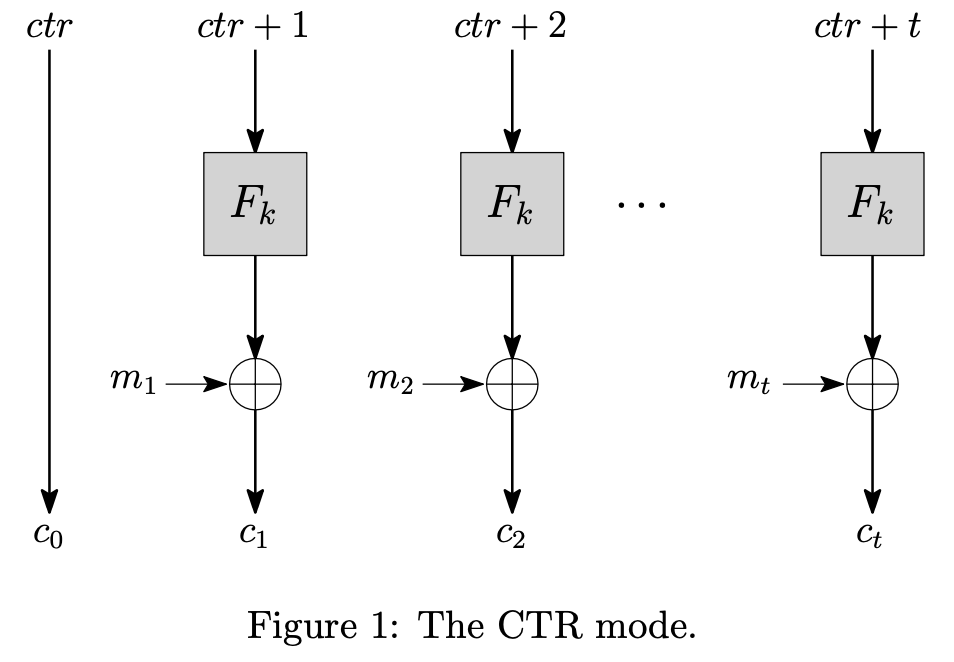
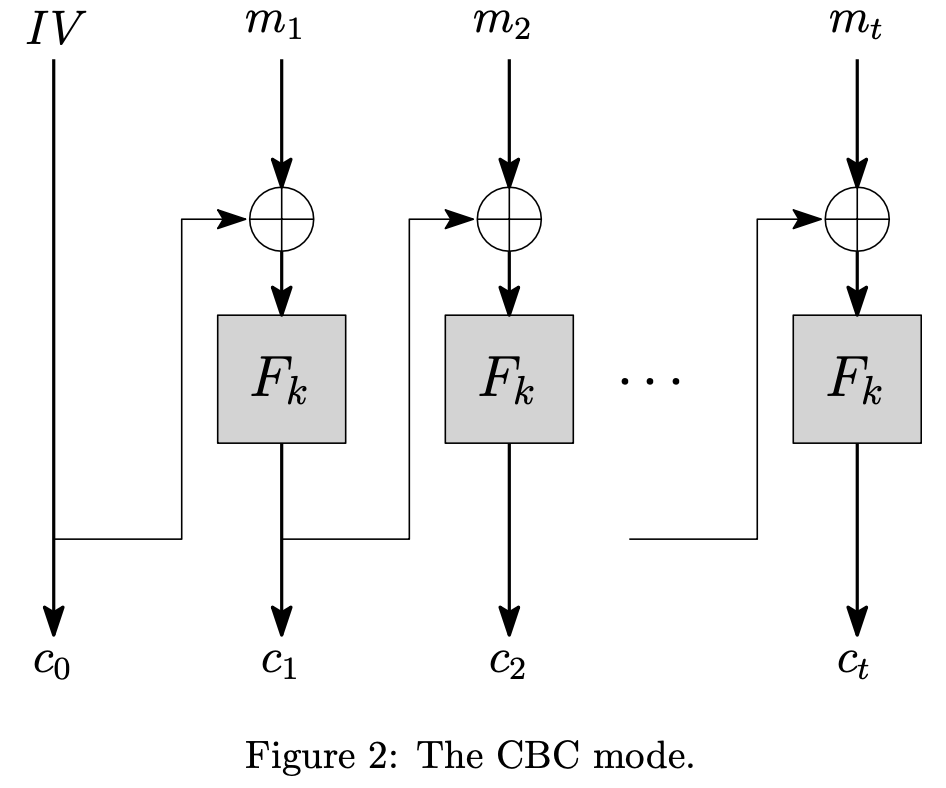
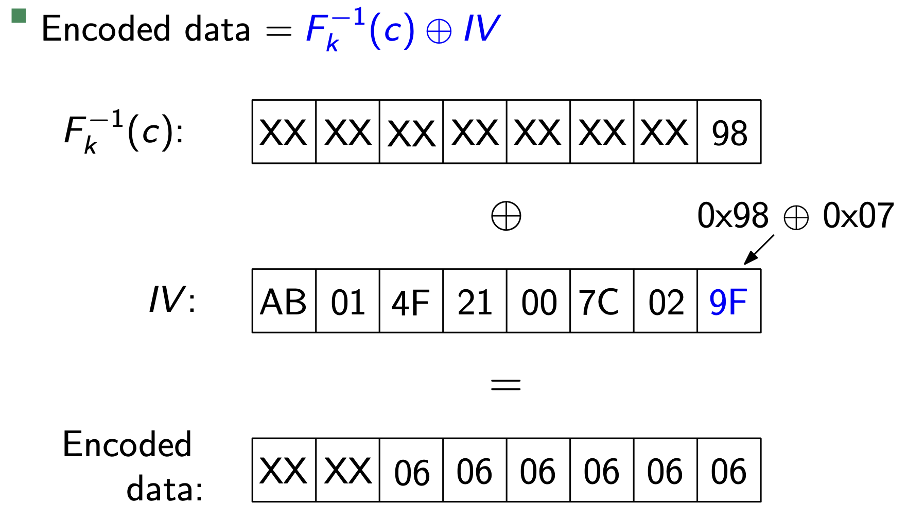
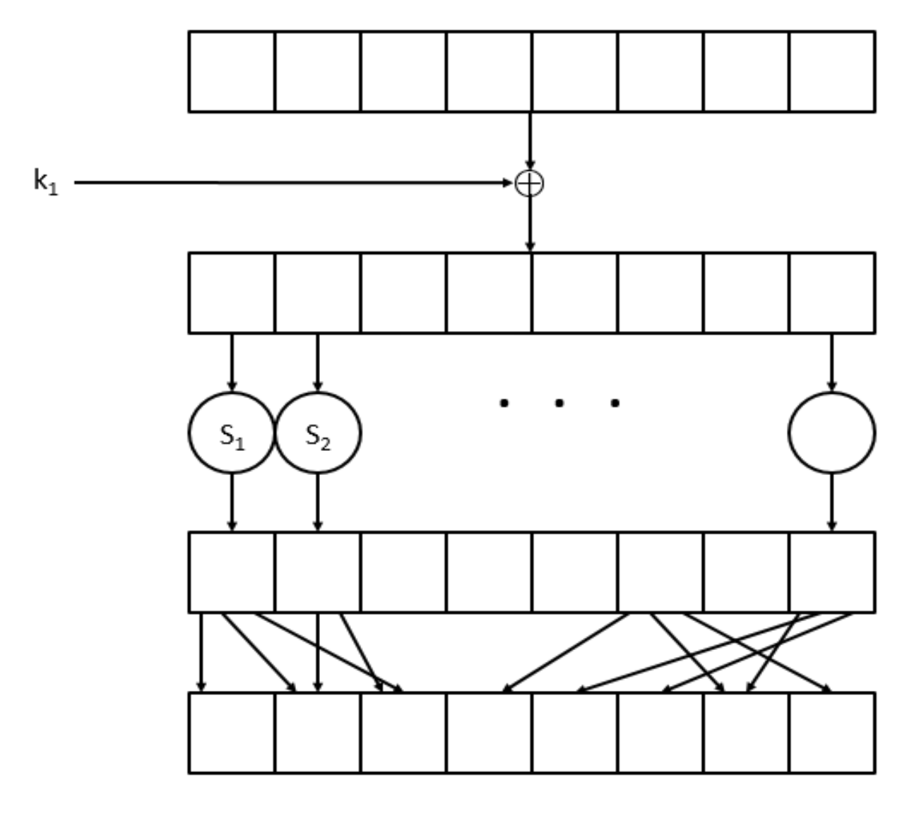
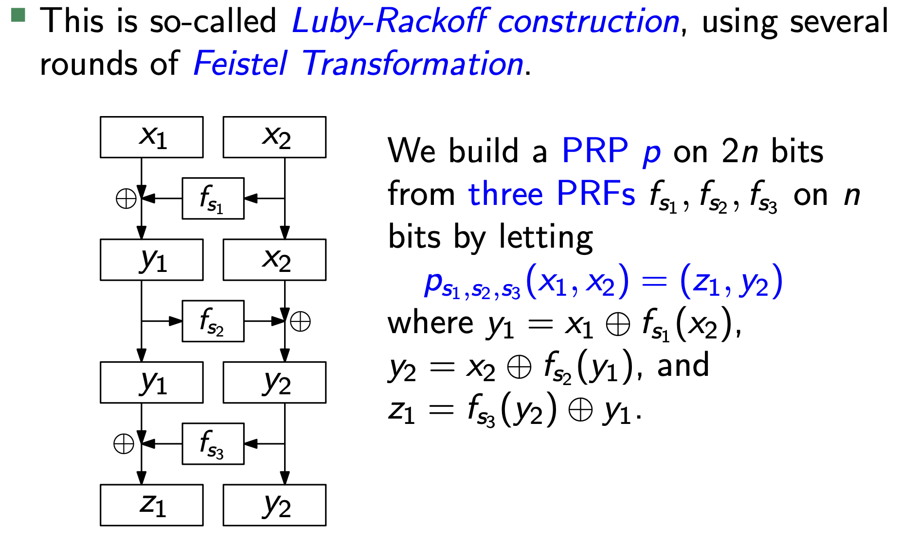
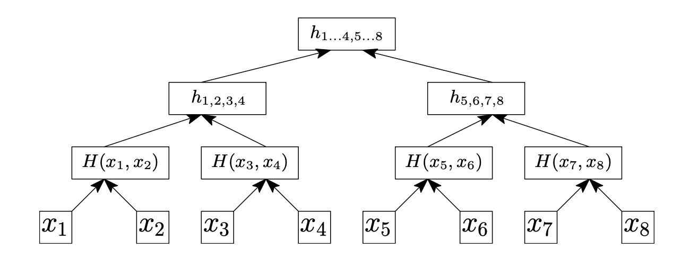

+++
title = 'CSE5014 Cryptography Final Review'
date = 2024-07-30T00:14:51+08:00
summary = "The hardest thing on earth is not your d**k, but the modern cryptography."
math = true
draft = false
categories = ["Cryptography", "Security"]
tags = ["Review"]
+++

> 最近在摸鱼中准备下个月的密码学专场线下赛，所以决定在考完的两个月后再来复习一遍王琦的密码学 ~~虽然好像不是特别有用~~。
>
> 本篇会尽量详细地覆盖一下密码学的基础，应该是有遗漏的。内容来自课件、课本和王老师亲笔写的[总结笔记](https://github.com/chanbengz/sustech-notes/blob/main/CSE5014%20Cryptography%20and%20Network%20Security/Notes/summary.pdf)[^0]。
>
> 本文可以速通密码学，不过还请仔细阅读课本和课件上的证明，因为很重要。

[^0]: 快跟我说：谢谢王老师。 ~~不过王老师也摸了所以没有写完~~

## Introducing Classical & Modern Cryptography 

> 密码和编码是不同的概念。密码涉及到密钥，而编码不涉及密钥。
>
> 古典密码学：安全性依赖于算法未知。现代密码学：安全性依赖于密钥，算法公开。

密码学保证在有恶意第三方(敌手, Adversary)存在的情况下，通信的安全性（保密性、完整性、认证性）。

### Definition of Encryption Scheme

- **Encryption** $E$ 将明文转换为密文的过程
- **Decryption** $D$ 将密文转换为明文的过程
- **Secret Key** $k$ 用于加密和解密的密钥
- **Alice** 发送方 **Bob** 接收方 **Eve** 窃听者

Alice 向 Bob 发送 $c = E(k, m)$，Bob 通过 $m^{\prime} = D(k, c)$ 解密。

如果$m = m^{\prime}$，则称为这个加密算法是正确的。如果 Eve 窃听到$c$，但无法获得$m$，那么这个加密算法是安全的。

### Caesar Cipher

凯撒密码，又被叫做移位密码(ROT13/47)，是一种单表替换密码。其加密过程是将明文中的每个字母按照一个固定的偏移量进行移位，得到密文。密钥是偏移量。

```python
# k is the key
cipher = [(char + k) % 26 for char in plain]
```

密钥空间是 $26$，因为偏移量会循环。

### Substitution Cipher

替换密码，也是一种单表替换密码，是凯撒密码的升级版。其加密过程是将明文中的每个字母按照一个固定的替换表进行替换，得到密文，密钥是替换表。

```python
alphabet = random.shuffle(alphabet)
cipher = [alphabet[char] for char in plain]
```

理论上，密钥空间是 $26!$无法被暴力破解，但实际上当明文长度足够大时，可以通过频率分析破解。

对于所有单表替换密码，都可以通过频率分析破解。

### Vigenère Cipher

维吉尼亚密码，是一种多表替换密码。密码表是一个二维的字母表，密钥是一个字符串。加密过程是将明文的每个字符作为x轴坐标，密钥(小于明文时循环使用)作为y轴坐标，找到对应的密文。

```python
cipher = [plain[i] + key[i % len(key)] % 26 for i in range(len(plain))]
```

由于同一个明文字符可能对应不同的密钥字符，所以加密后的密文也可能不同，从而使得频率分析无法破解。

密钥空间是 $26^k$，其中 $k$ 是密钥长度。但也仍然不安全，因为密钥是循环使用的。

攻击者可以猜测密钥长度，然后按照长度给密文分组，然后对每一组进行频率分析。

### Modern Cryptography

现代密码学有以下特点:
- **Provable Security**: 算法安全性有严格的数学证明。
- **Beyond Encryption**: 不仅仅是加密，还包括完整性、认证、零知识证明等。
- **Advanced**: 安全多方计算、同态加密、密钥交换和抗量子密码等。

下一小节先介绍第一点的现代密码学基础，完美安全性的定义。

## Definition of Perfect Secrecy

现代密码学的安全可证明性依赖于严谨的定义和假设，即完美安全性。

密钥（对称）加密方案的定义：
- $Gen$ 生成密钥$k$
- $Enc$ 加密明文$m$得到密文$c \leftarrow Enc_k(m)$
- $Dec$ 解密密文$c$得到明文$m^{\prime} \leftarrow Dec_k(c)$

正确性：$m = m^{\prime}$ ，即 $Dec_k(Enc_k(m)) = m$。

### Formal Definition

这里先略过之前不完美的安全性定义，直接介绍目前最严格的安全性定义。

> **Definition 1.5** 一个明文空间$\mathcal{M}$和密文空间$\mathcal{C}$的加密方案$(Gen, Enc, Dec)$是完美安全的，当且仅当对于所有的明文 $m \in \mathcal{M}$ 和所有的密文 $c \in \mathcal{C}$，有
$$ Pr[M = m | C = c] = Pr[M = m] $$

这个定义的意思是，无论 Eve 窃听到多少密文，她对明文的猜测概率都不会比随机猜测的概率更高，也就是说密文不会泄漏任何关于明文的信息。

> **Definition 1.6** 一个加密方案是完美安全的，当且仅当对于所有的明文 $m_0, m_1 \in \mathcal{M}$，给定一个密文 $c = Enc_k(m_b)$，其中 $b \in \{0, 1\}$ 是一个随机bit，攻击者成功猜测 $b$ 的概率是 $1/2$，即
$$ Pr[Eve(Enc(m_b)) = b] \leq \frac{1}{2} $$

这个定义可以推广到$b = 0, 1, 2, \ldots, |\mathcal{M}|$，即 Eve 只能随机猜测明文。

> **Definition 1.7** 一个加密方案是完美安全的，当且仅当对于所有的明文 $m_0, m_1 \in \mathcal{M}$，与一个均匀随机产生的密钥 $k \leftarrow_R U_n$，有
$$ Enc_k(m_0) \equiv Enc_k(m_1) $$

即他们的密文是在概率上是等同分布的。

这两个定义是等价的，具体证明略过，可以参考[Assignment1 Q2](https://github.com/chanbengz/sustech-notes/blob/main/CSE5014%20Cryptography%20and%20Network%20Security/Assignment/Assign01_sol.pdf)

### One-Time Pad (OTP)

一次性密码本，密码学原语(Primitive)之一，是完美安全的加密方案。其加密过程是将明文和密钥进行异或运算，得到密文。
$$ Enc_k(m) = c = m \oplus k $$

由于密钥是随机的，所以密文也是随机的。完美安全性的证明略过，请参考总结。但 OTP 有一个缺点，即加密时
$$ Enc: \lbrace 0,1 \rbrace^n \times \lbrace0,1\rbrace^n \rightarrow \lbrace0,1\rbrace^n $$

明文长度和密钥长度必须相等，这在实际中是不可行的。可以证明当
$$ Enc: \lbrace 0,1 \rbrace^n \times \lbrace0,1\rbrace^{n-1} \rightarrow \lbrace0,1\rbrace^n $$

明文长于密钥时，不是完美安全的。并且，OTP 使用的密钥如果能在可信信道传输，那么为什么不直接传输明文呢？

因此完美安全在现实中不太实用，我们需要放宽安全性的定义。

### $\epsilon$-Statistical Secrecy

> **Definition 2.1** 定义两个分布$X$和$Y$的统计距离为
$$ \Delta(X, Y) = \max_{T \subset \lbrace 0,1 \rbrace^n} |Pr[X \in T] - Pr[Y \in T]| $$
>
>如果$\Delta(X, Y) \leq \epsilon$，则称$X$和$Y$是$\epsilon$-等同分布的，记为
$$ X \equiv_{\epsilon} Y $$

这个定义比较正式，但不好计算。我们可以通过一个更简单的引理来计算统计距离。

> **Lemma 2.3** 设$Supp(X)$ 为$X$的支撑集，即$Supp(X) = \lbrace x \in \lbrace 0,1 \rbrace^n | Pr[X = x] > 0 \rbrace$，则
$$ \Delta(X, Y) = \frac{1}{2} \sum_{x \in Supp(X) \cup Supp(Y)} |Pr[X = x] - Pr[Y = x]| $$

从这个定义出发，我们还可以证明统计距离是一个度量，即满足三个性质：
- **非负性** $0 \leq \Delta(X, Y) \leq 1$ 当且仅当 $X = Y$ 时 $\Delta(X, Y) = 0$
- **对称性** $\Delta(X, Y) = \Delta(Y, X)$
- **三角不等式** $\Delta(X, Y) + \Delta(Y, Z) \geq \Delta(X, Z)$

最后就是定义$\epsilon$-统计安全性。

> **Definition 2.2** 一个加密方案$(Gen, Enc, Dec)$是$\epsilon$-统计安全的，当且仅当对于每个明文对$(m, m^{\prime})$有
$$ Enc_{U_n}(m) \equiv_{\epsilon} Enc_{U_n}(m^{\prime}) $$
>
> 即又有
$$ \Delta(Enc_{U_n}(m), Enc_{U_n}(m^{\prime})) \leq 2\epsilon $$

对于攻击者而言，无论如何他成功的概率都不会超过$1 / 2 + \epsilon$。

### Perfectly & Computationally Indistinguishability

假想敌实验，即假设有一个PPT[^5]攻击者(Adversary, $A$)，对于一个加密方案$\Pi = (Gen, Enc, Dec)$，我们做这样一个实验：
1. $A(1^n)$[^6] 生成两个明文 $m_0, m_1 \in \mathcal{M} = \lbrace 0, 1 \rbrace^n$
2. $b \leftarrow_R \lbrace 0, 1 \rbrace$ 随机选择一个明文，生成密钥和密文 $k \leftarrow Gen(1^n), c \leftarrow Enc_k(m_b)$
3. $A(c)$ 攻击者得到密文 $c$，输出一个bit $b^{\prime} \leftarrow A(c)$

[^5]: PPT是多项式时间可计算(Probabilistic Polynomial Time)，即对"有效(Efficient)"，"强大(Strong)"的严谨定义。

[^6]: $1^n$ 是一个全1的bit串，$0^n$同理，${0,1}^n$就是长度为$n$的bit串集合。

当$b = b^{\prime}$时，攻击者成功并输出$1$，否则输出$0$。我们定义攻击者的成功率为
$$ Pr[PrivK_{A, \Pi}(n) = 1] $$

当这个概率至多是$1 / 2$时，我们称这个加密方案是完美安全的。否则，有
$$ Pr[PrivK_{A, \Pi}(n) = 1] \leq \frac{1}{2} + \epsilon(n) $$

我们称这个加密方案是计算安全的，即EAV-Secure。

### Multiple-message Indistinguishability

现实中的消息可能不止一条，因此我们需要定义多条消息的安全性。类似地，我们可以定义多条消息的完美安全性
1. $A(1^n)$ 生成两个明文向量 $(m_{0, 0}, m_{0, 1}, \ldots, m_{0, t})$ 和 $(m_{1, 0}, m_{1, 1}, \ldots, m_{1, t})$
2. $b \leftarrow_R \lbrace 0, 1 \rbrace$ 随机选择明文，生成密钥和密文 $k \leftarrow Gen(1^n), c_i \leftarrow Enc_k(m_{b, i})$
3. $A(c_0, c_1, \ldots, c_t)$ 攻击者输出一个bit $b^{\prime}$，如果$b = b^{\prime}$则实验成功并输出$1$，否则输出$0$

如果对于所有的多项式时间的算法$A$，存在一个可忽略函数$\epsilon(n)$，使得实验成功的概率至多是$1 / 2 + \epsilon(n)$，那么我们称这个加密方案是multiple-message indistinguishable。

> 可以发现安全假设：区分(distinguish) > 解密(decrypt)，即如果攻击者不能区分密文和随机数，那么他也不能解密密文。

## Pseudorandomness

伪随机数生成器(PRG)和伪随机函数(PRF)是密码学中的两个重要原语。上文提到的加密方案需要随机生成密钥，但是实际中我们并不能真正得到一个均匀随机的随机数，因此我们需要一个伪随机数生成器，它可以生成一个看起来像随机数的序列。

### Pseudorandom Generator

PRG 是一个确定性[^1]的，多项式时间可计算的函数，它将一个短的随机种子扩展为一个长的伪随机序列
$$ G: \lbrace 0, 1 \rbrace^* \rightarrow \lbrace 0, 1 \rbrace^n $$

我们定义一个随机数生成器是有效的，当且仅当对于所有的多项式时间的算法$A$，存在一个可忽略函数$\epsilon(n)$，使得
$$ |Pr_{x \leftarrow U_n}[A(G(x)) = 1] - Pr_{y \leftarrow U_{p(n)}}[A(y) = 1]| \leq \epsilon(n) $$

这里$p(n)$是 PRG 的输出长度，$U_n$ 是均匀分布。这个定义保证了 PRG 生成的序列和真正的随机序列看上去是一样的。

用以上的定义和引理，我们可以证明用PRG的OTP也是EAV-Secure的。

[^1]: 确定性(Deterministic)意味着对于相同的输入，获得的输出是相同的。

### Pseudorandom Function

对于函数$F: \lbrace 0,1 \rbrace^* \times \lbrace 0,1 \rbrace^* \rightarrow \lbrace 0,1 \rbrace^*$，函数集的大小$$|Func_n| = 2^{n\cdot 2^n}$$

PRF 是 PRG 的推广，它是一个确定性的，多项式时间可计算的函数，它接受一个密钥，然后将映射随机化
$$ F_k: \lbrace 0, 1 \rbrace^n \rightarrow \lbrace 0, 1 \rbrace^n $$

它的大小
$$ |\lbrace F_k\rbrace_{k \in \lbrace 0, 1 \rbrace^n}| = 2^n $$

由于$f \in \mathcal{F}$，函数族$\mathcal{F}$大小为$2^{n \cdot 2^n}$。因此难以通过密文明文对来完整还原 PRF。

我们定义一个 PRF 是有效的，当且仅当对于所有的多项式时间的算法$D$，存在一个可忽略函数$\epsilon(n)$，使得
$$ |Pr_{k \leftarrow U_n}[D^{F_k(\cdot)}(1^n) = 1] - Pr_{f \leftarrow Func_n}[D^{f(\cdot)}(1^n) = 1]| \leq \epsilon(n) $$

> **Theorm 5.1** 如果$F$ 是一个 PRF，那么下面这个对称加密方案是CPA安全的
$$ Enc_k(m) = \langle r, F_k(r) \oplus m \rangle $$
$$ Dec_k(c_1, c_2) = F_k(c_1) \oplus c_2 $$

### Pseudorandom Permutation

伪随机置换(PRPs)比 PRF 多了一个可逆的要求，后面会用于构造密码学原语S-box。类似地，也可以定义PRP是有效的当且仅当一个随机置换$P_k(\cdot) = (F_k, F_k^{-1})$ 和一个均匀的随机置换$Perm_n$是不可区分的，其中$F_k^{-1}$的是$F_k$的逆，即
$$ F_k^{-1}(F_k(x)) = x $$

如果 PRP 存在，那么 PRF 也存在，因为 PRF 是 PRP 的子集。同样，如果 PRF 存在，那么 PRG 也存在。这个证明很简单，即可以构造 $G(k) = F_k(1^n)$。

### Security of Pseudo OTP

有了伪随机数发生器，我们可以输入一个任意长度的密钥作为种子，然后生成OTP需要的密钥，这样就可以解决密钥长度问题。唯一的问题是要证明这个由伪随机数生成器构造的 OTP 方案是EAV-Secure的(Theorm 3.3)。

这个证明非常简单，可以用反证法[^13]证明。假设Pseudo-OTP不是EAV-Secure的，那么就存在一个多项式时间的算法$A$，使得
$$ |Pr[A(m \oplus G(U_n) = 1] - Pr[A(U_{p(n)}) = 1]| > \epsilon(n) $$

那么就可以构造一个distinguisher $D(k) = A(k \oplus m)$，因为$A$能有效辨别密文和对应明文，这里$k$表示随机数生成器的输出。那么就有
$$ Pr[D(G(U_n)) = 1] - Pr[D(U_{p(n)} \oplus m) = 1] > \epsilon(n) $$

显然有$U_{p(n)} \equiv U_{p(n)} \oplus m$，因为二者都是均匀分布的，这使得$D$可以区分均匀分布和PRG生成的分布，这违背了PRG的定义。

[^13]: 这种证明方法以后还会经常遇到，比如证明两次哈希的安全性。

## Private-Key Encryption

有了以上的理论基础，我们可以开始设计一些使用的加密方案。但还有一些现实要求的安全问题需要定义。

### CPA/CCA Secrecy

选择明文攻击(Chosen-Plaintext Attack, CPA)是一种攻击模型，我们定义一个CPA安全的实验如下:
1. 跟前面的敌手实验一样，$k \leftarrow Gen(1^n), (m_0, m_1) \leftarrow A(1^n), b \leftarrow_R \lbrace 0, 1 \rbrace$
2. 攻击者接受挑战 $c \leftarrow Enc_k(m_b)$
3. 攻击者$A$可以与加密方案(Encryption Oracle，即一个黑盒)交互，即选择明文$m^{\prime} \in \mathcal{M}$发送给加密方案，然后得到密文$c^{\prime} \leftarrow Enc_k(m^{\prime})$
4. 最后攻击者输出一个bit $b^{\prime}$，如果$b = b^{\prime}$则实验成功并输出$1$，否则输出$0$

如果对于所有的多项式时间的算法$A$，存在一个可忽略函数$\epsilon(n)$，使得实验成功的概率至多是$1 / 2 + \epsilon(n)$，那么我们称这个加密方案是CPA安全的。

> **Note** 攻击者可以询问$m_0, m_1$的加密，因此任何一个确定性的加密方案都不是CPA安全的。确定性意味着对于相同的明文，加密后的密文是相同的。

选择密文攻击(Chosen-Ciphertext Attack, CCA)中，攻击者还可以询问解密Oracle，但不能问挑战密文$c$的解密。如果CCA安全实验成功的概率至多是$1 / 2 + \epsilon(n)$，那么我们称这个加密方案是CCA安全的。

> **Note** CCA安全性要求加密方案是不可延展的[^3]，即密文的改变不能带来可预测的明文改变（可预测意味着有信息泄漏）。

[^3]: 可延展(Malleable)意味着攻击者能通过改变密文来得到一个可预测的明文。比如OTP中，$c = m \oplus \Delta$，如果攻击者将$c$的某一位$\Delta$取反，那么$m$对应的那一位也会取反$m^{\prime} = m \oplus \Delta$；又比如，RSA中，$c = m^e \mod n$，如果攻击者将构造$c^{\prime} = c \cdot 2^e \mod n$，那么$m^{\prime} = m \cdot 2 \mod n$，这造成了著名的[Bleichenbacher Attack](https://crypto.stackexchange.com/questions/12688/can-you-explain-bleichenbachers-cca-attack-on-pkcs1-v1-5)

### Block Cipher

为了实现一个CPA安全的加密方案，并且便于加密大段明文，我们引入了块密码(Block Cipher)，即将明文分为固定长度的块，然后对每个块进行加密；大多情况下明文的长度不是块长度的整数倍，所以需要填充(Padding)。解决CPA安全问题的方案一般是引入随机化(Randomization)，在块密码中，这个随机化在于初始向量(Initial Vector, IV)，也被称为nonce(暂且翻译为一次性密码，但不是OTP)。块密码一般有两种模式：CTR mode和CBC mode。

#### CTR Mode

计数器模式(Counter Mode, CTR)的加密方案如下[^2]:
1. 选择一个随机的初始向量$r \leftarrow_R \lbrace 0, 1 \rbrace^n$, 使得$c_0 = r$
2. 设有$t$个明文块，对于$i$从$1$到$t$，有$c_i = m_i \oplus F_k(r + i)$
3. 密文输出为$c = c_0 || c_1 || \ldots || c_t$



这里的$F_k$是一个PRF，因此CTR模式是CPA安全的，证明请参考课本。但是CTR模式并不能保证完整性，以及会泄漏明文的长度信息。

[^2]: 图1来自王琦老师提供的总结笔记，感谢王老师。

#### CBC Mode

块链模式(Cipher Block Chaining, CBC)的加密方案如下:
1. 选择一个随机的初始向量$r \leftarrow_R \lbrace 0, 1 \rbrace^n$, 使得$c_0 = r$
2. 设有$t$个明文块，对于$i$从$1$到$t$，有$c_i = F_k(m_i \oplus c_{i-1})$
3. 密文输出为$c = c_0 || c_1 || \ldots || c_t$



同样可以证明如果$F_k$是一个PRF，那么CBC模式是CPA安全的。

#### Stream Cipher

流密码(Stream Cipher)设计方案是通过一个密钥生成一系列的密钥流，然后再进行加密，这一点其实和CTR模式很像。实际上PRG的实现应用了流密码。流密码和块密码的区别在于加密过程中是否有记忆性，流密码需要维持状态机，例如线性反馈移位寄存器(LFSR)，而块密码是无记忆性的。一个不严谨的流密码定义：
1. 流密码有两个确定性算法$Init$和$Getbits$
2. $Init$ 接收一个密钥$k$（可能有IV）作为种子，初始化状态机$s_0$
3. $Getbits$ 接收一个状态机$s_i$，输出一个bit$y$和一个新的状态机$s_{i+1}$

### Padding Oracle Attack

CBC模式需要填充(Padding)，因此解密时会进行解填充(Unpadding)，但是不恰当的填充方案会导致Padding Oracle Attack。这个攻击是一种侧信道攻击，攻击者通过观察解密预言机(Decryption Oracle，也是一个黑盒)的反馈，来推测密文对应的明文。解密预言机的其中一步是检查填充是否正确，如果填充不正确，那么解密预言机会返回一个错误信息。

有问题的Padding方案是这样的：末尾填充长度为$n$的数据$n$，比如6个`0x06`。因此攻击者可以这么做：
1. 获得一个密文$c = c_0 || c_1 || \ldots || c_t$，先考虑$c_t$的填充，于是可以构造$c^{\prime} = c_{t-1} || c_t$[^4]
2. 回顾CBC模式加密，解密首先会进行$mid = F_k^{-1}(c_t)$，这个是我们要猜测的目标
3. 首先遍历$c^{\prime}_{t-1}$的最后一个字节，并与解密预言机交互，直到解密成功，设这个字节为$p_t$
4. 于是我们知道$mid$的最后一个字节是$p_t \oplus 0x01$，然后设置$c^{\prime}$的最后一个字节为$p_t \oplus \text{0x02}$，即把合法填充的字节全部加一，然后继续猜测$p_{t-1}$，重复第3步
5. 最后我们可以得到$mid$的所有值，就可以知道$m_t = mid \oplus c_{t-1}$
6. 重复上述步骤，就可以得到所有的明文



[^4]: 这个是可以通过解密的，因为$c_{t-1}$可以被看作为IV。

### Real-World Block Cipher

目前最广泛使用的块密码是DES与其增强版AES(Advanced Encryption Standard)。上面的CTR和CBC都忽略了$F_k(\cdot)$[^9]的细节，实际上$F_k(\cdot)$需要满足一些要求来实现理论上的安全性，即加密结果看上去是随机的[^12]，最好让攻击者只能暴力破解$O(2^n)$。

两个重要的性质：
1. Confusion: 明文的任意变化都会导致密文的随机的变化
2. Diffusion: 明文的任意变化都会扩散到整个密文的变化

这两个性质的组合引发了雪崩效应（Avalanche Effect），即明文的任意一个bit都会导致密文的随机变化。

#### Substitution-Permutation Network

SPN 用S-box，即一个公开的置换表，来实现第一个性质
$$ f_{k_i}(x) = S_i(k_i \oplus x) $$
其中的XOR操作被称为Key Mixing。S-box 保证1bit的变化会导致结果至少2bit的变化，

然后再通过一个公开的Mixing Layer来实现第二个性质。Mixing Permutation 将上个S-box的输出作为另一个S-box的输入



通过多轮以上的操作，最后再进行一次Key Mixing，就可以得到一个安全的SPN。

#### Feistel Network

Feistel Network 用不可逆的PRF来实现可逆的PRP，即
$$ F_{k_1}(L0, R0) = (R0, L0 \oplus f_{k_1}(R0)) $$
这是一轮变换，多轮变换(一般3-4轮就够了)就可以得到一个安全的Feistel Network。



#### Meet-in-the-Middle Attack

由于DES 的密钥长度56bit已经过时了，密码学家曾考虑使用2DES来增加密钥长度，即

$$ 2DES(k_1, k_2, m) = DES_{k_2}(DES_{k_1}(m)) $$

密钥长度变为$2*56 = 112$bit，但实际上这也不安全。攻击者可以通过中间相遇攻击(Meet-in-the-Middle Attack)来破解
1. 遍历所有的$k_1$，计算加密$DES_{k_1}(m)$，然后结果存储在一个表$T_1$中
2. 遍历所有的$k_2$，计算解密$DES_{k_2}^{-1}(c)$，然后结果存储在一个表$T_2$中
3. 取$T_1$和$T_2$的交集，即$T_1[k_1] = T_2[k_2]$，就可以得到$k_1$和$k_2$

这个攻击的时间复杂度是$O(2^n)$，因为可以通过哈希表来存储$T_1$和$T_2$。

[^9]: 王琦的课件上和课本都写到Block Cipher实际上不是一个加密方案，即使我们还用CPA, CCA 和 Known-Plaintext Attack 来定义它的安全性。

[^12]: 密码学家们甚至设计了这么一种理想方案：随机选一个操作，要么加密，要么直接输出一个随机数，要么不加密直接输出明文。攻击者永远无法知道到底是哪种操作。

## Message Authentication Code

消息认证码(Message Authentication Code, MAC)是一种用于验证消息完整性和真实性的技术。MAC 是一个确定性的函数，它接受一个密钥和一个消息，然后生成一个固定长度的标签。MAC 有三个PPT算法$(Gen, Mac, Vrfy)$:
- $Gen$ 接收 $1^n$，输出一个密钥$k$
- $Mac$ 接收一个密钥$k$和一个消息$m$，输出一个标签(Tag)$t = Mac_k(m)$
- $Vrfy$ 接收一个密钥$k$，一个消息$m$和一个标签$t$，输出一个bit $b = Vrfy_k(m, t)$

### Forge Attack Experiment

跟前面加密方案的假想敌实验一样，我们定义一个MAC的假想敌实验$Forge_{A, \Pi}(n)$:
1. $k \leftarrow Gen(1^n)$
2. 攻击者$A$可以与MAC(Oracle)交互，即选择一个消息$m$发送给MAC，然后得到一个标签$t = Mac_k(m)$。设$\mathcal{M}$是攻击者的查询集合
3. 最后攻击者输出$(m^{\prime}, t^{\prime})$，其中消息$m^{\prime}$没有被查询过，即$m^{\prime} \notin \mathcal{M}$
4. 如果$Vrfy_k(m^{\prime}, t^{\prime}) = 1$，则实验成功并输出$1$，否则输出$0$

如果对于所有的多项式时间的算法$A$，存在一个可忽略函数$\epsilon(n)$，使得实验成功的概率是
$$ Pr[Forge_{A, \Pi}(n) = 1] \leq \epsilon(n) $$

那么我们称这个MAC是安全的，即标签是不可伪造的。

### Construction of MAC & Security Analysis

MAC 的构造方法有很多，比如HMAC(Hash MAC)、CBC-MAC等。这里介绍一种理论上的构造方法，即将一个PRF转化为一个MAC:
- $Gen$: 生成一个密钥$k$
- $Mac$: 对于一个消息$m$，首先填充，然后计算$Mac_k(m) = F_k(m)$
- $Vrfy$: 对于一个消息$m$和一个标签$t$，计算$F_k(m)$，如果等于$t$则返回$1$，否则返回$0$

但是这个构造只适用于固定长度的消息，对于可变长度的消息，我们借用块密码的思想，将消息分块，然后对每个块进行MAC，如下面这个构造：
$$ Mac_k(m = m_1 || m_2 || \ldots || m_l) = Mac_k(m_1) || Mac_k(m_2) || \ldots || Mac_k(m_l) $$
$$ Vrfy_k(m, t) = 1 \text{\quad  iff\quad  } Vrfy_k(m_i) = t_i $$

这个构造作为一个反面例子，可以考虑下面的伪造攻击：
1. Reordering Attack: 询问$t = t_1 || t_2 = Mac_k(m = m_1 || m_2)$，然后伪造$t^{\prime} = t_2 || t_1 = Mac_k(m^{\prime} = m_2 || m_1)$，即重排块的顺序

有同学敏锐地发现，我们可以通过加入序号$i$来防止这种攻击，即
$$ Mac_k(m = m_1 || m_2 || \ldots || m_l) = Mac_k(i || m_1) || \ldots || Mac_k(i || m_i) $$

但是这样会导致另一个攻击:

2. Truncation Attack: 询问$t = t_1 || t_2 = Mac_k(m = m_1 || m_2)$，然后伪造$t^{\prime} = t_1 = Mac_k(m^{\prime} = m_1)$，攻击者可以丢掉末尾的块

然后我们可以通过加入长度信息来防止这种攻击，即
$$ Mac_k(m = m_1 || m_2 || \ldots || m_l) = Mac_k(l || 1 || m_1) || \ldots || Mac_k(l || i || m_i) $$

又会引入另一个攻击:

3. Mix-and-Match Attack: 询问$t = t_1 || t_2 = Mac_k(m = m_1 || m_2)$ 和 $t^{\prime} = t_1 || t_2 = Mac_k(m^{\prime} = m^{\prime}_1 || m^{\prime}_2)$，然后伪造$t = t_1 || t^{\prime}_2 = Mac_k(m = m_1 || m^{\prime}_2)$，攻击者可以混合不同的块

#### CBC-MAC

Hash MAC 采用哈希函数$Mac_k(m) = H(k || m)$[^7]，安全性依赖于哈希函数的抗碰撞性(Collision Resistance)，会在后续介绍。这一小节介绍一种基于块密码的MAC，即CBC-MAC。CBC-MAC 的签名过程和验证过程是一样的，即
$$ t = Mac_k(m) = c_t $$
将最后一个密文块作为标签。但如果消息长度没有预先固定，那么CBC-MAC是不安全的，因为攻击者可以这样攻击
1. 询问$t = Mac_k(m = m_1 || m_2) = F_k(c_1 \oplus m_2)$ 以及 $t^{\prime} = Mac_k(m^{\prime} = m^{\prime}_1 || m^{\prime}_2) = F_k(c^{\prime}_1 \oplus m^{\prime}_2)$
2. 构造$m = m_1 || m_2 || (m^{\prime}_1 \oplus t) || m^{\prime}_2$，则$Mac_k(m) = t^{\prime}$

不过解决这个问题也很简单，只需要在消息开头加入长度信息即可，即$Mac_k(m) = Mac_k(l || m)$

[^7]: 具体实现更复杂，比如多次哈希、加盐等，这里只是一个简单的例子。

### Authenticated Encryption

将加密和验证结合可以提高安全性，一般有三种方案：
- Encrypt and Authenticate (E&A): 输出$(c,t) = (Enc_{k_1}(m), Mac_{k_2}(m))$ (SSH Style)
- Authenticate then Encrypt (AtE): 计算$t = Mac_{k_1}(m)$，然后输出$c = Enc_k(m || t)$ (SSL Style)
- Encrypt then Authenticate (EtA): 输出$(c, t) = (Enc_{k_1}(m), Mac_{k_2}(c))$ (IPSec Style)

安全性分析略过，可以思考下这三种方案的是否是CCA/CPA安全的。

## Hash Function

哈希函数(Hash Function)是一种将任意长度的消息映射为固定长度的确定性函数，密钥是可选的。一个（无密钥）哈希函数$H: \lbrace 0, 1 \rbrace^* \rightarrow \lbrace 0, 1 \rbrace^n$ 的安全性依赖于以下性质：
1. **Preimage Resistance**: 给定一个哈希值$h$，找到一个消息$m$使得$H(m) = h$是困难的
2. **Collision Resistance**: 找到两个不同的消息$m_1, m_2$使得$H(m_1) = H(m_2)$是困难的

显然第二个性质包含了第一个性质。但是"困难"是一个模糊的概念，我们可以通过碰撞概率来定义哈希函数的安全性，这里需要引入生日悖论(Birthday Paradox)。

### Birthday Attack

如果一个教室里有$n$位同学，那么至少有两位同学生日相同的概率是$Pr[A] = 1 - Pr[B]$，其中$B$是所有人生日都不相同的概率。$B$的计算方法是
$$ Pr[B] = \prod_{i=1}^{n-1} \left(1 - \frac{i}{365}\right) $$

推广到哈希函数，如果哈希函数的输出有$H$中可能，$n$为消息空间，那么至少有两个消息$m_1, m_2$使得$h(m_1) = h(m_2)$的概率是
$$ p(n, H) = 1 - e^{-{n(n-1)}/{2H}} \approx 1 - e^{-{n^2/{2H}}} $$

如果我们要求$p \leq \epsilon$，可通过
$$ n \approx \sqrt{2H \ln \frac{1}{1 - \epsilon}} $$
计算允许的消息空间大小。这也是为什么哈希函数的输出长度要只需要满足$O(2^{l/2})$即可。

### Merkle-Damgård Construction

现实中的哈希函数可以接收任意长度的输入，其中一种构造方法是Merkle-Damgård Construction。这个构造利用树状结构进行哈希，只需要一个基本的哈希函数$h: \lbrace 0, 1 \rbrace^{2n} \rightarrow \lbrace 0, 1 \rbrace^n$，然后将消息分块，对每个块进行哈希，最后将所有块的哈希值连接起来，再进行一次哈希，如下图所示：



这个结构叫做Merkle Tree。构造出来的哈希函数$H: \lbrace 0, 1 \rbrace^* \rightarrow \lbrace 0, 1 \rbrace^n$，其中$n$是基本哈希函数的输出长度，是抗碰撞的，证明可由$h$的抗碰撞性质推导。

### Random Oracle

理想中，密码学家们希望构造这么一个确定性的黑盒，使得对于任何输入都能均匀随机地输出，然后就可以用于证明应用这个黑盒的加密方案的安全性。这个黑盒被称为随机预言机(Random Oracle)。还是过一下定义
- 选择一个均匀的哈希函数$H$，作为实验的一部分
- 攻击者只能询问这个函数，而不能逆向它
- 模拟实验，证明（使用了RO模型的）加密方案的安全性

这个模型也有好有坏，好处在于
- 目前没有已知的能攻击RO模型加密方案的攻击
- 如果这个方案不安全，直接换一个哈希函数就行
- 证明的安全性是严格的

但是坏处也很明显
- 理论上的模型，实际上很难找到一个真正的随机函数
- 有些方案在RO模型下是安全的，但在实际中因为哈希的实现问题而不安全
- 容易被滥用（比如懒得设计一个复杂的方案，直接用RO）

## Public-Key Encryption

对称密码学的一个问题是密钥交换，即如何在被窃听的信道上交换密钥，这个问题可以通过公钥密码学(Public-Key Cryptography)解决。王老师在课上只详细介绍了RSA、ElGamal和Diffie-Hellman三种方案。目前公钥密码学的安全性是基于数论问题的，比如大素数分解、离散对数问题等。还有一些后量子密码学的方案，比如Lattice-based Cryptography（格密码)，这门课就没有涉及。

### Number Theory & Abstract Algebra

复(预)习一下基础数论和抽象代数的基础知识，如群、环、域、同态、同构等。

离散数学中的数论知识：模运算、欧拉函数、欧几里得定理(GCD & exGCD)、费马小定理、中国剩余定理(CRT)和二次剩余等。

群(Group)的定义是一个集合$G$和一个二元运算$\circ$，满足以下性质:
- Closure: $\forall a, b \in G, a \circ b \in G$
- Identity: $\exists e \in G, \forall a \in G, a \circ e = e \circ a = a$
- Inverse: $\forall a \in G, \exists a^{-1} \in G, a \circ a^{-1} = a^{-1} \circ a = e$
- Associativity: $\forall a, b, c \in G, (a \circ b) \circ c = a \circ (b \circ c)$

如果还满足交换律，即$a \circ b = b \circ a$，则称为阿贝尔群(Abelian Group)。

记$G$的阶(Order)为$|G|$，即$G$的元素个数，如果$|G|$是有限的，则称$G$是有限群，比如$Z_n = \lbrace x \mod n | x \in \mathbb{Z}\rbrace = \lbrace 0, 1, \ldots, n-1 \rbrace$。

我们可以证明$\mathbb{Z}_p^* = \lbrace 1, \cdots, p - 1 \rbrace$是一个阿贝尔群，其中$p$是一个素数。如果群$G$有一个生成元(Generator) $g$，使得$\mathbb{Z}_p^* = \lbrace g^0, g^1, \ldots, g^{p-2} \rbrace$，这里省略了模运算，那么这个群是一个循环群(Cyclic Group)。如果$\mathbb{Z}_p^* $的阶 $p$ 是一个素数，那么$\mathbb{Z}_p^*$一定是一个循环群。

设$s_n = \langle 1, 2, \cdots, n \rangle$ 是一个序列，$P_n$是所有$s_n$的排列，$|P_n| = n!$，如
$$ P_3 = \lbrace \langle 1, 2, 3 \rangle, \langle 1, 3, 2 \rangle, \langle 2, 1, 3 \rangle, \langle 2, 3, 1 \rangle, \langle 3, 1, 2 \rangle, \langle 3, 2, 1 \rangle \rbrace $$
定义置换群(Permutation Group) $P_n$的二元运算$\circ$为两个置换的复合，即$\sigma \circ \tau = \sigma(\tau(i))$，则$P_n$是一个群。不过$P_n$不是一个阿贝尔群。例如$\sigma = \langle 3,2,1 \rangle, \tau = \langle 1,3,2 \rangle$，则$$\sigma \circ \tau = \langle 2,1,3 \rangle \neq \langle 1,2,3 \rangle = \tau \circ \sigma$$

当我们再加多一个运算到一个阿贝群上，性质仍保持不变，我们就得到了一个环(Ring)，记为$(R, +, \times)$（这里加号和乘号都不是原来的加法乘法的意思）。环还拓展了三个性质：
1. Closure: $R$ 在 $+$ 和 $\times$ 的结果都在 $R$ 中
2. Associativity: $(a \times b) \times c = a \times (b \times c)$
3. Distributive: $a \times (b + c) = a \times b + a \times c$

再接着拓展，Commutative: $a \times b = b \times a$，那我们称这个环是一个交换环(Commutative Ring)，如果这个环还有单位元且没有零，那么我们称这个环是一个Integral Domain

然后如果Integral Domain上的运算$\times$还存在逆元，使得$a\cdot a^{-1} = e$，那么我们称这个环是一个域(Field)。

### Trapdoor Function

因为广播公钥的需求会导致一定的信息泄漏，现在的公钥密码学都基于单向陷门函数(Trapdoor Function)来维持安全性。单向，即只能正着算，陷门，即不能反着算。
> **Definition 10.1** 一个双射(one-to-one)函数$f \in \mathcal{F}$是一个是Trapdoor Function，要满足以下性质：
> - Generation: 要有一个PPT算法$Gen$，接受$1^n$，输出$(f, f^{-1})$
> - Efficient: $f$和$f^{-1}$都是多项式时间可计算的，还必须是均匀输出的
> - One-wayness: 对于任意多项式时间算法$A$，存在一个可忽略函数$\epsilon(n)$，使得
>  $$ Pr_{(f,f^{-1}) \leftarrow_R G(1^n), x \leftarrow_R S_f}[A(1^n, f, f(x)) = x] \leq \epsilon(n) $$
> 即难以反向计算$f$的逆函数$f^{-1}$

所以可以从Trapdoor Function的定义出发来设计公钥密码学方案。比如有一个简单的例子，Rabin's Trapdoor Function，即
- $Gen$: 选择两个随机数$p, q$，他们都$x \equiv 3\ \mod\ 4$，计算$n = pq$，输出$(pk = n, sk = (p, q))$
- $Enc$: 对于一个消息$m$，计算$c = m^2 \mod n$
- $Dec$: 对于一个密文$c$，计算$m = c^{(p+1)\backslash{4}} \mod p$ 或 $m = c^{(q+1)\backslash{4}} \mod q$，然后通过CRT算法计算$m$

我们需要证明破解这个方案唯一的方法是分解$n$，即整数分解问题。这个证明略过。

### RSA

RSA 是一个确定性的算法，算法方案设计如下
- $Gen$: 随机生成两个大素数$p, q$，计算$n = pq$，然后选择一个$e$使得$\gcd(e, \phi(n) = 1$，计算$d = e^{-1} \mod \phi(n)$，输出$(pk = (n, e), sk = (n, d))$
- $Enc$: 对于一个消息$m$，计算$c = m^e \mod n$
- $Dec$: 对于一个密文$c$，计算$m = c^d \mod n$

然后过一下安全性证明，RSA 是一个Trapdoor Function
- Forward: Key 是 $(n, e)$，那么 $f(m) = m^e \mod n$ 是一个单向函数
- Backward: Key 是 $(n, d)$，$ed = 1 \mod \phi(n)$ 是一个困难问题，难以计算 $f^{-1}(c)$
- Assumption: RSA 的安全性基于这个Trapdoor Function，强于整数分解问题

破解RSA首先要计算$\phi(N)$，但是$phi(N) = (p-1)(q-1)$，也即要分解$N$。这个问题(目前)是一个困难问题。

$\Rightarrow$ 不过还有一些破解思路，如Pollard's p-1, 低指数广播攻击等可以分解$N$；也有一些比如共模攻击等可以在不分解$N$的情况下还原明文。

### Diffie-Hellman Key Exchange

为解决对称密码学传输密钥的问题，密码学家提出了一种密钥交换的理想方案。定义密钥交换方案$\Pi$的安全性实验$KE_{A, \Pi}(n)$如下
1. 可信的双方（多方）通过$\Pi$协议交换密钥$k$，一个被动攻击者$A$（只能监听不能劫持）可以监听所有的通信
2. 选择一个随机bit $b$，如果$b=0$，交换$k^{\prime} = k$，否则交换$k^{\prime} \leftarrow_R \lbrace 0, 1 \rbrace^n$即一个随机数
3. $A$ 监听到$k^{\prime}$，输出$b^{\prime}$，如果$b^{\prime} = b$，则实验成功并输出$1$，否则输出$0$

离散对数问题(Discrete Logarithm Problem)是一个困难问题，即给定一个群$G$和一个生成元$g$，找到一个$x$使得$g^x = h$，记为
$$ \log_g h = x $$
我们可以通过$Dlog_{A, \mathcal{G}}(n)$实验来证明这是困难的：
1. $Gen$: $(G, g, q) \leftarrow \mathcal{G}(1^n)$，然后随机选取$h \in G$
2. $A(G, g, q, h)$，然后输出$x$
3. 如果$x = \log_g h$，则实验成功并输出$1$，否则输出$0$

离散对数问题是困难的当且仅当对于所有PPT算法$A$，存在一个可忽略函数$\epsilon(n)$，使得
$$ Pr[Dlog_{A, \mathcal{G}}(n) = 1] \leq \epsilon(n) $$

Diffie-Hellman Key Exchange 是基于离散对数问题的，其方案设计如下
1. $Gen$: $(G, g, q) \leftarrow \mathcal{G}(1^n)$，然后随机选取$x \in G$，计算$h_1 = g^x \mod q$，输出$(pk = (G, g, q, h_1), sk = x)$
2. 另外一方选取$y \in G$，计算$k = h^y \mod q$，然后发送$h_2 = g^y \mod q$给对方
3. 接收到$h_2$后，计算$k = h_2^x \mod q$，然后双方都得到了相同的密钥$k$，但监听者只能得到$g, q, h_1, h_2$，无法得到$k$

DH问题的正式定义是$ DH(h_1, h_2) = DH(g^x, g^y) = g^{xy}$。因为要得到$g^{xy}$，首先需要得到$x$，即需要解离散对数问题。DH问题还有两个变种
- Computational DH problem: 给定$g, q, g^x, g^y$，计算$g^{xy}$
- Decisional DH problem: 给定$g, q, g^x, g^y, z$，判断$z = g^{xy}$ 或者是随机数(上面的KE实验)

DDH是困难的当且仅当对于所有PPT算法$A$，存在一个可忽略函数$\epsilon(n)$，使得
$$ | Pr[A(G, g, q, g^x, g^y, g^{xy}) = 1] - Pr_{z \leftarrow_R G}[A(G, g, q, g^x, g^y, z) = 1] | \leq \epsilon(n) $$

假设的强度是DDH > CDH > DLP，即左边可以推出右边，困难程度递增。

### El-Gamal

El-Gamal 也是基于离散对数问题的，其方案设计如下
1. $Gen(1^n)$: $(G, g, q) \leftarrow \mathcal{G}(1^n)$，然后随机选取$x \in G$，计算$h = g^x \mod q$，输出$(pk = (G, g, q, h), sk = x)$
2. $Enc_{pk}(m)$: 随机选取$y \in G$，计算$c_1 = g^y$，$c_2 = h^y \cdot m$，输出密文$(c_1, c_2)$
3. $Dec_{sk}(c_1, c_2)$: 计算$m = c_2 \cdot (c_1^x)^{-1}$

El-Gamal自带随机性，因此是一个非确定性加密方案，也是CPA安全的，但不是CCA安全的，因为可以通过延展性攻击:
- 对于密文$c = (g^y, h^y \cdot m)$，攻击者可以在$c_2$上乘上一个任意数$a$，然后得到$c^{\prime} = (g^y, h^y \cdot (m \cdot a))$，然后解密得到$m^{\prime} = m \cdot a$

满足CCA安全的补丁也很简单，即加入CCA安全的对称密码即可，还能保留CPA安全性
- 加密改为: $c = (g^y, Enc_k^{\prime}(m))$，对称密码的密钥$k = H(h^y)$
- 解密改为: 先计算$k = H(c_1^x)$，然后解密$m = Dec_k^{\prime}(c_2)$

### Padding Scheme

显然，由于公钥广播会导致信息泄漏，所以公钥密码学一定不是完美安全的。不过好消息是，由于广播公钥相当于开盒了加密机(Encryption Oracle)，我们只需要关注CPA安全性。公钥密码学的CPA安全实验和对称密码学的CPA安全实验基本一致，只是多了给攻击者公钥的步骤。

回顾前面的"确定性"加密方案不是CPA安全的，但是目前所有介绍的加密方案都是确定性的。块密码可以引入IV来增加随机性，而公钥密码类似的概念是填充方案(Padding Scheme)。原来公钥密码是不需要填充的，引入填充即增加了随机性，又使得明文长度与密钥长度一致，这样就可以保证安全性[^10]。本节只简单介绍PKCS#1 OAEP填充方案。

PKCS#1 v1.5 只是简单地在明文前面填充一些随机数与其长度信息，但是这个方案只有在明文比较短的时候才安全，因此引入了OAEP填充方案。

OAEP 的填充采用了PRG和Hash函数，将明文$m$填充为$m^{\prime} = s || t$，流程和Feistel Network类似，即
$$ s = (m || 0^k) \oplus G(r) $$
$$ t = H(s) \oplus r $$

这里$r$是随机数，$k$是公钥的一部分。

解填充只需先计算出$r = t \oplus H(s)$，然后计算$m = s \oplus G(r)$，最后提取出$m$即可。任意对密文$c$的篡改都会导致解填充出来是乱码，或者$m$后面没有填充的0。

如果OAEP使用的$G$和$H$都是Random Oracle，那么OAEP甚至是CCA安全[^11]的。

[^10]: 这个知识点我考试遇到了，坏消息是没复习到，好消息是考场科研了一下，还是答对了。复习这里的时候又想到了一个问题，如果加密方案是非确定的，那么一个明文会对应多个密文。此时由于填充方案，解密一定是确定的，于是导致了明文空间一定是小于密文空间的。不过不影响安全性。

[^11]: 裸的RSA也不是CCA安全的，因为延展性，攻击者可以询问$c^{\prime} = c \cdot 2^e$，然后解密$m^{\prime} = m \backslash 2$，就使得实验成功率是1。

### CPA & CCA in Public-Key Cryptography

又到了头疼的密码学家快乐时间，构造一个公钥密码学的理论安全模型。先来看看CPA安全的公钥密码学模型：
1. 假设有一个RO模型，$H: \lbrace 0, 1 \rbrace^* \rightarrow \lbrace 0, 1 \rbrace^n$，还有一个Trapdoor Permutation $\lbrace f, f^{-1} \rbrace$，然后$f(\cdot)$ 是公钥，$f^{-1}(\cdot)$ 是私钥
2. 加密明文$x \in \lbrace 0, 1 \rbrace^n$时，随机选一个$r \leftarrow_R \lbrace 0, 1 \rbrace^n$，然后计算$c = f(r) || H(r) \oplus x$
3. 解密密文$c$时，计算$r = f^{-1}(c_1)$，然后计算$x = H(r) \oplus c_2$

这个安全性证明跟PRF的安全性(Theorm 5.1)类似。然后是CCA安全的公钥密码学模型：
1. 假设有两个RO模型$H, H^{\prime}$，还有一个Trapdoor Permutation $\lbrace f, f^{-1} \rbrace$，然后$f(\cdot)$ 是公钥，$f^{-1}(\cdot)$ 是私钥
2. 加密明文$x \in \lbrace 0, 1 \rbrace^n$时，随机选一个$r \leftarrow_R \lbrace 0, 1 \rbrace^n$，然后计算$c = f(r) || H(r) \oplus x || H^{\prime}(r, x)$
3. 解密时先计算$r = f^{-1}(c_1)$，然后计算$x = H(r) \oplus c_2$，最后检查$H^{\prime}(r, x)$是否等于$c_3$（其实就是加了一个MAC），如果不等则随机输出一个数

这个模型的安全性证明比较复杂，推荐看王老师[课件](https://github.com/chanbengz/sustech-notes/blob/main/CSE5014%20Cryptography%20and%20Network%20Security/Slides/lec14.pdf)里的证明

## Digital Signature

数字签名(Digital Signature)就是公钥版的MAC（MAC是对称密码的）。严谨定义:
- Gen: 输入$1^n$，输出$(pk, sk)$
- Sign: 输入$sk, m$，输出$\sigma \leftarrow Sign_{sk}(m)$
- Verify: 输入$pk, m, \sigma$，输出$Vrfy_{pk}(m, \sigma)$

对比MAC的好处是数字签名可由所有人验证，以及签名者没有否认权。同样，数字签名也有伪造实验，即$Forge_{A, \Pi}(n)$，定义如下
1. $Gen$: $(pk, sk) \leftarrow Gen(1^n)$
2. $A(pk)$，然后与签名者(Signing Oracle)交互，可以询问$m$以外的任何消息的签名
3. $A$ 输出$(m, \sigma)$，如果$Vrfy_{pk}(m, \sigma) = 1$ 且 $m \notin Q$，则实验成功并输出$1$，否则输出$0$

数字签名$\Pi$是安全的当且仅当对于所有PPT算法$A$，存在一个可忽略函数$\epsilon(n)$，使得
$$ Pr[Forge_{A, \Pi}(n) = 1] \leq \epsilon(n) $$

### RSA Signature

Plain RSA 签名有一个很严重的问题，即对于这个实验，攻击者可以通过
1. 询问签名者$(m_1, \sigma_1)$ 和 $(m_2, \sigma_2)$
2. 伪造一个新的签名$(m_1 \cdot m_2, \sigma_1 \cdot \sigma_2)$，因为$\sigma_1^d \cdot \sigma_2^d = (m_1^d \cdot m_2^d) = (m_1 \cdot m_2)^d$

于是就有了改进的RSA-FDH签名方案，即
- Gen: $(pk, sk) \leftarrow Gen(1^n)$，其中$pk = (n, e)$，$sk = (n, d)$，**和一个RO模型**$H$
- Sign: 输入$sk, m$，输出$\sigma = H(m)^d \mod n$
- Verify: 输入$pk, m, \sigma$，输出$1$当且仅当$\sigma^e = H(m) \mod n$

安全性依赖于RO模型$H$，如果$H$是一个Random Oracle，那么RSA-FDH是安全的。这个可用反证法证明。

### Rabin Signature

Rabin 签名方案是基于Rabin Trapdoor Function的，其方案设计如下
- Gen: 选择两个随机数$p, q$，他们都$x \equiv 3\ \mod\ 4$，计算$n = pq$，输出$(pk = n, sk = (p, q))$
- Sign: 对于一个消息$m$，计算并随机选一个 $c = \sqrt{m} \mod n$
- Verify: 对于一个签名$c$，计算$m = c^2 \mod n$，然后输出$m$

Rabin 签名也是不抗Chosen-Message Attack 的，因为攻击者可以通过
1. 构造一个消息$m = x^2\mod n$，然后得到签名$\sigma$
2. 一半可能，$\sigma = x \mod n$；如果不是，那么$\gcd(\sigma - x, n)$ 就是$n$的一个因子

## Brief Summary

以上是考试内容，然后王老师贴心的总结了一下考试的重点，按时间顺序排列：
- Perfect secrecy (one-time pad) (Def. 1.5 - Thm. 1.9)
- $\epsilon$-statistical security (Def. 2.2)
- Computational security (Def. 3.1)
- PRG, pseudorandomness (Def. 3.2)
- Pseudo one-time pad (Thm. 3.3)
- Multiple-message indistinguishable (Def. 3.4)
- PRG $\rightarrow$ PRF $\rightarrow$ PRP (block cipher) (Def. 4.2, 4.3)
- PRF $\rightarrow$ CPA security (Def. 4.1, Thm. 5.1, 5.2) 
- PRF $\rightarrow$ CMA-secure MAC (Def. 6.2, Thm. 6.3)
- EtA $\rightarrow$ CCA security (Def. 6.1, lec08)
- Hash function (Def. 7.1, Thm.8.1, 8.2, 14.2) 
- Stream/Block ciphers (lec09, lec10)
- Math fundamentals (hard/trapdoor functions, lec11, lec12) 
- Public key encryption (Def. 12.1 - Thm 12.5)
- CPA security (Def. 13.1, Thm. 13.2)
- CCA security (Def. 13.3, Thm. 13.4)
- Rabin’s trapdoor function, signature & RSA trapdoor function, signature

本文基本覆盖到了，然而没严格按照这个顺序，也懒得加索引了（

## Zero-Knowledge Proof & Homomorphic Encryption

> 王琦老师特别喜欢这一章，可惜不考。所以下面的内容就是选读了。
> 
> 这一部分内容很实用，解决了现实中很多问题，如安全多方计算(MPC)问题、区块链等

零知识证明(Zero-Knowledge Proof, ZKP)为证明者在不泄漏任何关于证明的信息的情况下证明一个命题。一个著名的例子是图灵奖得主姚期智的[百万富翁问题](https://zh.wikipedia.org/zh-hans/%E9%9B%B6%E7%9F%A5%E8%AF%86%E8%AF%81%E6%98%8E)，简单的表述为如何在不泄漏富翁有多少钱的前提下证明两个富翁中的一个更有钱。区块链中，零知识证明可以用于验证交易的真实性，而不泄漏交易的细节，比如加密货币的地址等。

同态加密(Homomorphic Encryption)是一种加密方案，可以在密文上进行运算，然后解密后得到的结果和在明文上进行运算得到的结果是一样的。这个技术可以用于安全多方计算(MPC)问题，即多个不可信的参与者可以在不泄漏私密信息的情况下进行计算。

### Quadratic Residual (QR)

TBD

### Schnorr’s Identification Protocol

TBD

### Homomorphic Encryption

TBD

