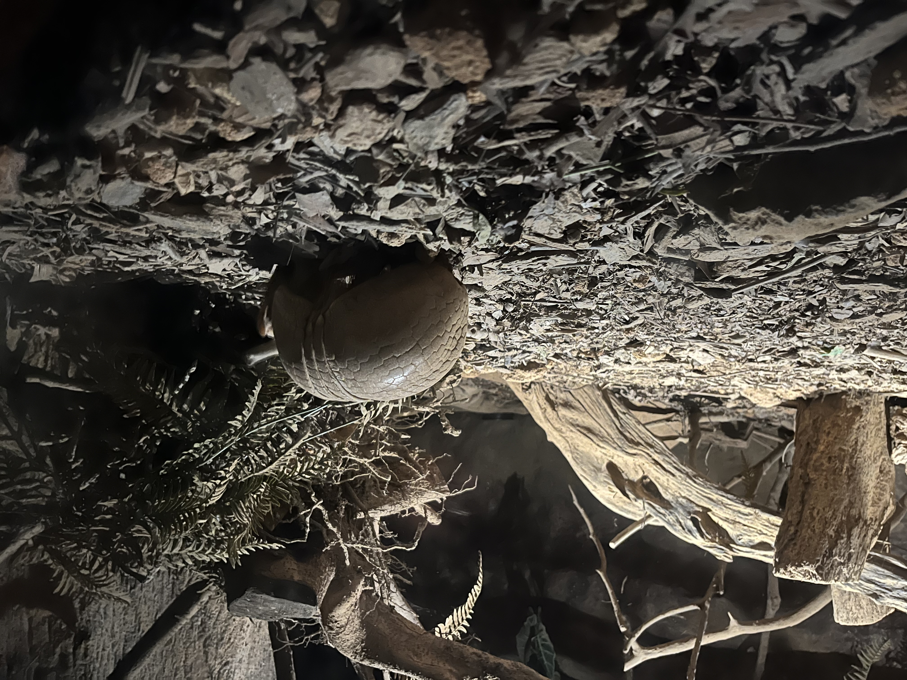
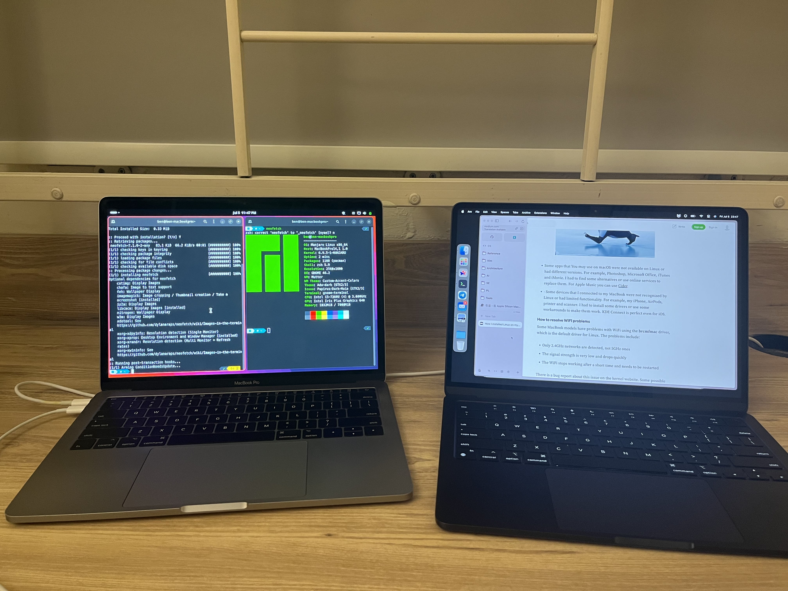

+++
title = 'NUS SOC Summer Workshop 2024 Summary'
date = 2024-07-24T15:59:38+08:00
summary = "What a short day it was as a student in Singapore! Dont wanna go back!"
math = false
draft = false
categories = ['Travel']
tags = ['Diary', 'Singapore']
+++

> **Date**: 29th June - 22th July, 2024

## Arrival

Friends of mine, [Roderick](https://github.com/RoderickQiu), [Mingzhi](https://github.com/Dilemma-CMZ) and [Luo](https://github.com/wLUOw) accompanied me to the workshop. We departed from Bao'an in about 4pm due to the delay, and arrived at Changi in 9pm. It's not a hot weather as expected in equator area, but the humidity is so low that I felt comfortable. The NUS guys picked us up and went to the Prince George's Park Residences (PGPR). Well, I must admit, the single room is quite small, but at least it's clean and tidy, and the air conditioner is working well fortunately. Heard lots of complaints from the colleagues about the broken air conditioner or blablabla, I'm just lucky enough.

30th is a free day, so we decided to shop for some daily necessities. Mingzhi would like to buy a new blanket, and IKEA is the best choice. Singapore seems narrow as we moved for 10 mins by bus to reach the Queen's Street. Food in IKEA tasted emmmm, but it took a tenner. I wouldn't try again:(. Everything is "cheap" in Singapore, only if you do not convert the currency.

## Week 1

After the welcome dinner, I began my first week at NUS. As a hacker, I chose the "Defense Of The Ancient (DOTA)" without a second thought. Our instructor is Prof. Hugh Anderson. We called him Hugh. He's a nice guy from New Zealand who is already retired. At the first lecture, I answered a trival question about breaking the scheme that Microsoft used to hash the password, say, hash the half of 14 digits password each time. I answered immediately that it could be brute forced, and got his reward, a 5 billion Zimbabwian dollar. Funny!

The next day, cute [ice](https://github.com/icelocke) guided us to tour the Night Safari, an unique zoo only opened at night. It's presented in our English textbook.

Though the area was not wide, the animals were super cute!

Well, the topic selection for our project didn't go well. Our initial propose was to research on the software analysis for vulnerability. I came up with three aspects, static analysis, dynamic analysis with fuzzing and symbolic execution, all of which were rejected by Hugh who said they were already done well and we just redo the wheel. Not interesting at all. So we were short of ideas. But next he said, if we want to analyze software with new vulnerability, not something found decades ago, like buffer overflow, it'll be interesting and worthy. So, I responsed, why not just dive into the new vulnerability and show some educational demo with it? He agreed, and that's it. So we were researching on the new GoFetch attack in Apple Silicon. It's pretty hard to understand, I have to say. And I bought a new Macbook for it as well.

And the day that we confirmd the topic with Hugh, I was late due to the lunch. It was Nasi Lemak, yummy but waited for a quarter :(.

At the weekend, Roderick and I went for a riding, around the Singapore. Yes, you heard it, around Singapore!

We headed off at 4am, from the PGPR and towards the north first.

And after 7 hours, at the midday, we arrived at the beach, south of Singapore, with the journey of about 100km. It's a long way, but we enjoyed it.

## Week 2

The days were we working. Three of my friends grouped together in their selected course about big data analysis (not my type), so they were prepared for the final presentation.

By the end of the week, we gathered to watch the national celemoney of Singapore at the Marina Bay Sands. It was a grand event with all kinds of people from different countries in different colors. But you see, there's no racial discrimination in Singapore. We all celebrated for the independence of Singapore and I almost got touched by it. The fireworks were amazing!

During the days, sometimes I woke earlier so that have to get some breakfast. My mom said I must try the most classic breakfast in Singapore, Kaya Toast, Half-boiled Eggs and Kopi/Teh. Luckily, the breakfast shop was right in the classroom building.

## Week 3

So the final week came. We were busy preparing the whole things, the final paper, the expriment data, the poster and the presentation, not for us but for everyone. So days past quickly. We made a huge success in the showcase day. Lots of people came up to us and asked about the GoFetch attack. Never thought it would be so popular. My teammates and I took turn to explain the attack and the demo. One of our audience even proposed to add me on WeChat for further discussion. I was so excited!

So, without any doubt, we got the first prize from people's choice.

Thanks to Hugh, thanks to the audience, and thanks to my teammates. It's a great experience in Singapore. I'll never forget it.

After the farewell dinner at the same day. (Actually I left early) [Lily](https://github.com/liliyigz), my high school classmate, invited me to the Dolus Hope, a sailing library pulling over at the front bay.

The goods and books were expensive, but the view was amazing. It's a good place to relax. Next, we moved to Gaylang (芽笼) for the midnight snake. One of the famous cuisine is the frog porridge.

I was not a fan of frog, but the cuisine really impressed me. The frog was tender and tasted like chicken. Also the drink (爱玉冰) was so cool. I'll miss it.

The day before departure, I decided to take a one-day trip to Malaysia. The city next to Singapore was the Johor Bahru, a city of Chinese people.

The city was not as clean as Singapore, but the price was much cheaper. Just to convert the currency with digits unchanged and unit from SGD to MYR. It's a cultural trip and I won't go back again.

## Epilogue

So our last day in Singapore started from the Changi Airport, with the famous scenic spot, the fountain, Jewelry. It's a good place to take a photo.

See you next time, Singapore. I'll miss you.

