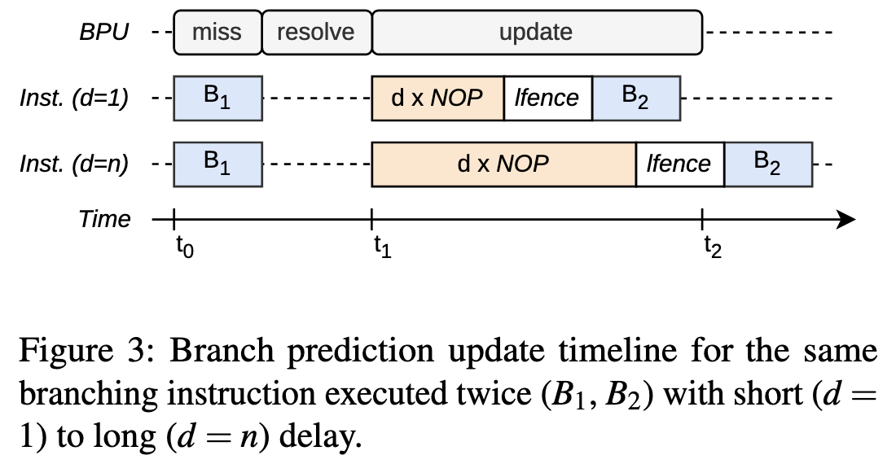
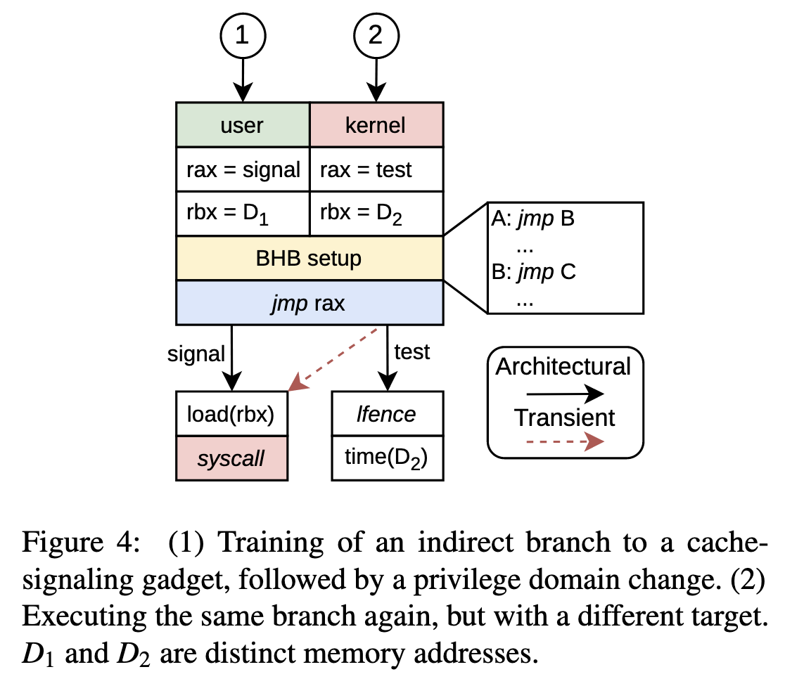
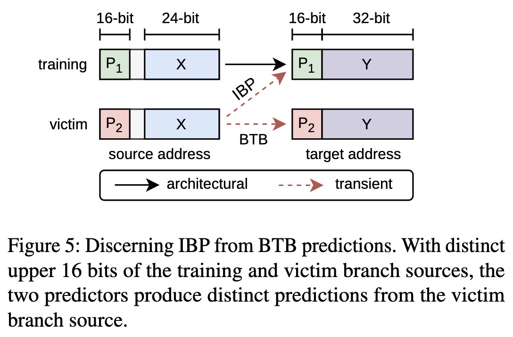
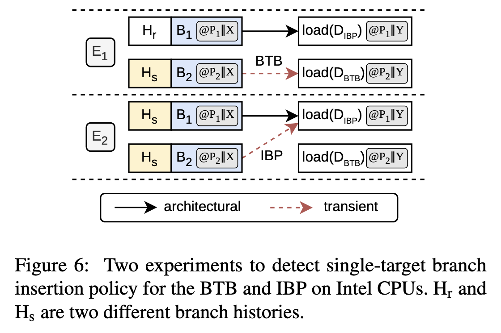
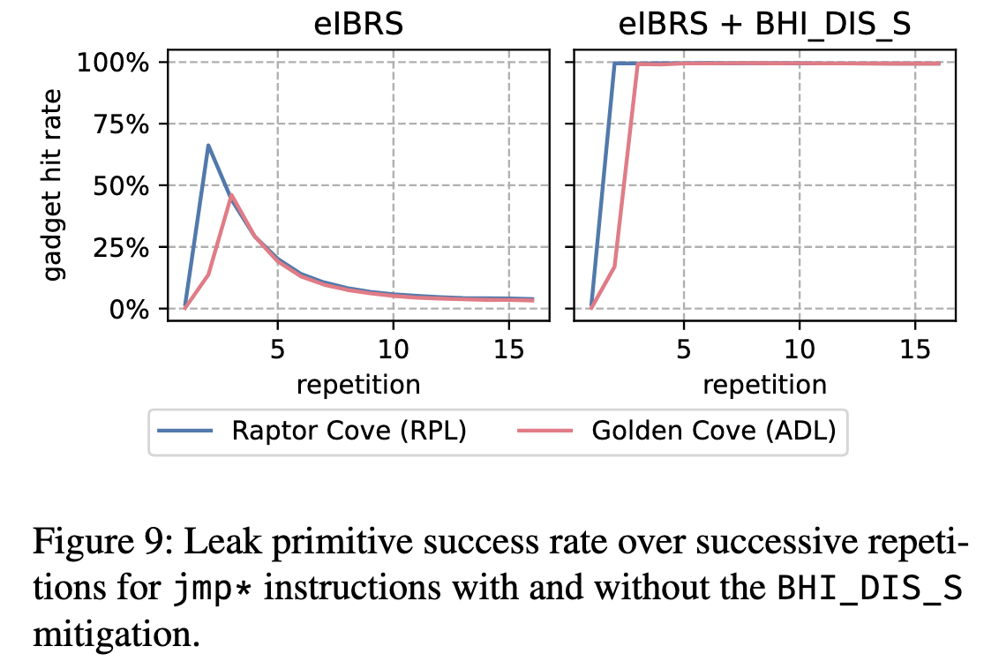

+++
title = 'Branch Privilege Injection: Compromising Spectre v2 Hardware  Mitigations by Exploiting Branch Predictor Race Conditions'
date = 2025-05-16T14:08:42+08:00
summary = "Intel mitigates the BHI & BTI, but incompletely"
math = true
draft = false
categories = ['Security']
tags = ['Paper', 'ARM', 'Side-Channel']
+++

> #### Info
>
> 本文第一作者是ETH Zurich的大佬们, [官网](https://comsec.ethz.ch/bprc)

## Preface

TL;RD: Intel 分支预测器的更新是异步的, 也就是说当一个分支指令被执行完之后的一段时间内才会更新。
这导致BTI的防御实效，使得攻击者仍然可以污染Kernel空间的分支预测器。

ETH Zurich的研究者发现Intel的Branch Predictor存在Race Condition, 即分支指令执行时的context
信息不会跟随Branch Predictor的延迟更新。因此, 如果攻击者在用户态执行一条分支指令并随后立即跳转到
内核态, 这条分支指令触发的 Branch Predictor (e.g. IBP, BTB) 更新会在内核态完成并插入内核的tag。
这可以使得攻击者可以从用户态污染内核态，从虚拟机污染宿主机，并绕过IBRS等一系列mitigation。攻击者
可以利用Spectre v2的攻击以5.6KB/s的速度泄漏任意内存。

## Background

主要介绍间接跳转, Spectre (BTI) 与其防御措施。

### Indirect Branching and Prediction

间接跳转(Indirect Branching) 是指跳转的目标地址来自register或memory，而直接跳转是PC + offset的形式。
间接跳转的指令主要有call, jmp 和 ret等。间接跳转的预测有两种，静态和动态。静态预测是基于PC索引的,
即IP-based (Instruction Pointer-based), 用PC的部分bit来索引条目并更新；动态预测是基于path的，
即根据全局的历史分支情况来预测下一条分支结果。Intel静态预测器是BTB (Branch Target Buffer),
动态预测器是IBP (Indirect Branch Predictor)。

BTB 是set-associative cache形式的，记录对应PC的历史分支目标地址。BTB只cache部分结果，即目标地址的低几位。
这是因为x86的间接跳转只会改变低32位的地址，也是一种局部跳转。与BTB只记录每条分支的一个目标不同, IBP 会记录多条
目标，并用 BHB (Branch History Buffer) 来跟踪与选择预测的目标地址。BHB是一个移位寄存器，追踪全局历史分支执
行结果(Taken/Not Taken)。如果IBP和BTB同时预测命中，会优先采用IBP的结果。

Intel 有一个特殊的feature，由于RSB会存在下溢的问题（即ret指令过多时会清空RSB），此时Intel会采取RSBA (
Return Stack Buffer Alternative) 策略，把ret指令当作indirect branch指令来预测 (虽然ret是一个indirect
branch, 但是ret的预测只会采用RSB的结果)。而AMD和ARM处理器没有这种策略。

### BTI

Spectre攻击，即通过污染分支预测器的目标地址来使得victim的分支预测失效，从而使用Spectre攻击污染cache并泄漏信息。
BTI primitive通过污染能索引到victim分支的条目(记得BTB用部分PC索引)，来使其预测跳转到任意地址，而推测执行会
预先执行victim指令，从而污染cache并泄漏信息。

### Defenses

一般硬件防御有三种类型
- **Restriction**: 代表是Indirect Branch Restricted Speculation (IBRS)隔离不同domain的分支预测器。
低权限的分支历史不会用在高权限的分支预测上
- **Sanitization**: Indirect Branch Prediction Barrier (IBPB) 一般用在同一domain的防御，通过删掉
分支记录来使得切换进程时不会泄漏分支历史。
- **Supplementary speculation controls**: 直接把预测关了


## Reverse Engineering

大家早已知Branch Predictor中的entry会在分支指令执行前提前创建(create), 甚至在decode之前就建立好了，但是
什么时候更新不清楚。并且大型的BP更新entry的速度并不快(可能得消耗十几个cycles)，所以分支指令不会等BP更新，
要不然太慢了。于是一种机制就是异步更新(Asynchronous Update), 即BP更新与分支指令完全无关。

### Asynchronous branch predictor updates



在B1和B2执行相同的跳转指令(`call`, `jmp` and `ret`), 中间插入`nop`指令并用`lfence`保证顺序执行。B1的
分支在t1处执行完，然后相应的更新在t2处完成，如果B2在t2后执行，它会被正确预测，否则预测失误。nop指令的数量
即是update的窗口时间。

同时不只是nop + lfence, 用其他会刷流水线的指令比如`pause`和`cpuid`填充都能观测到延迟更新。作者称之为
Asynchronous Branch Predictor Updates (ABPU)。

### Restricted speculation analysis

因为`lfence`这类会刷流水线的指令都不会等待BP更新完成，所以作者猜测`syscall`这类切换domain的指令也不会
等待BP更新。并且作者猜测BRS防御对异步更新无影响，甚至会使得在切换domain之后使用的是新domain的信息而不是
旧domain的信息。

为了验证这个猜想，作者设计如下实验
1. 跳转到一个signal分支, 这个分支会load一个cache(地址在rbx寄存器)，如果这个分支在未来被推测执行，能观察到这个cache hit
2. 然后`syscall`切换到kernel mode, 并执行相同的gadget，但是使用不一样的cache地址, 跳转test分支测量cache
3. 如果signal分支被预测执行，rbx处的cache(即D2)会观测到cache hit，否则是cache miss



作者称之为Branch Predict Race Condition (BPRC)。

### BPRC variants

这个race condition不止发生在user-kernel跨domain的攻击，作者还发现guest-host中也存在这个攻击(`syscall`换成`vmcall`)。

将`syscall`换成写IBPB MSR, 即使有IBPB的barrier, BP更新也是异步的。

## Attack Primitive

### Discerning between predictors

在利用之前，攻击者需要确定出问题的是哪个BP。实验可以利用BTB只提供部分bits预测的特性，然后这么设计：



1. 训练用从(P1||X)跳转到(P2||Y), 其中P*是高16bit，X/Y是第24bit
2. 测试用(P2||X), P1!=P2, 因为BTB用X索引，所以一定能保证命中
3. 所以如果跳转到(P2||Y)，因为BTB只会提供部分bit，则说明是BTB预测; 如果跳转到(P1||Y), 则说明是IBP预测



实验先分别用Hr和Hs两个历史训练，然后再用Hs来预测。因为IBP是全局历史，所以预测miss，使用BTB预测。而第二个实验
因为历史相同，所以IBP预测hit。这个实验同时说明IBP和BTB的entry都会被更新。最后利用这个实验执行之前BPRC的实验代码，
user态用(P1||X)，signal分支在(P1||Y)或(P2||Y)，然后执行kernel处的(P2||X)，test分支随意。作者发现BTB预测
会触发cache hit（即signal），所以问题出现在BTB的更新上。

作者测量了BPRC的临界时间点，即跟ABPU类似的方法，找到`syscall`后BP被污染的最长延迟时间。并测试`BHI_DIS_S`和
eIBRS的防御对其影响。结果是elBRS没影响。

### Branch Privilege Injection

攻击步骤跟BHI差不多
1. 找到vulnerable的branch
2. 在对应位置的BTB entry注入恶意branch指向leak secret的地方
3. 跟BHI不同在于，训练时用`syscall`切换domain，然后要限制IBP必须miss因为要用BTB预测
4. 训练然后执行，用flush+reload读取cache

## Exploitation

Exploit之前作者发现`BHI_DIS_S`开启之后BPI成功率还更高了。为了搞清楚发生了什么，作者测量`BHI_DIS_S`开启时BP的一些行为，
结果非常amazing, `BHI_DIS_S`会在内核态disable IBP，好家伙不费功夫。



### Spectre v2 with BPI

攻击第一步，找gadget。关键在于(1)要创造一个shared buffer来作为reload数组, (2)分支要攻击者可控,
(3)包含indirect branch, 一般就用call了。然后您猜怎么着，作者找到

```c
static long __keyctl_read_key(struct key *key,
    char *buffer, size_t buflen)
{
    long ret;

    down_read(&key->sem);
    ret = key_validate(key);
    if (ret == 0)
        ret = key->type->read(key, buffer, buflen);
    up_read(&key->sem);
    return ret;
}
```

这个gadget接受一个`struct key`指针, 然后还可以在`key->type->read`注入我们的恶意branch。
这还只是speculation gadget, 我们还需要构造`read`指向的用来读secret的gadget。

```asm
HUF_compress1X_usingCTable_internal_default:
;...
movzx edx, byte ptr [r12]
mov rbx, qword ptr [r13 + rdx*8]
;...
```

这个gadget最好能控制一些关键的参数，比如shared buffer与offset，因为Spectre要求

```c
// offset = 4096
array2[array1[i] * offset] = dummy;
```

你会发现上面这个gadget最合适不过了。

### Breaking KASLR

KASLR只随机`[29, 21]`, 但是BTB只用`[23, 0]`, 不太好搞。但是可以换个思路，用kernel gadget去
evict用户态的BTB entry。如果kernel地址猜对了，eviction发生，否则没发生用户态会预测成功。

这个kernel gadget跟上面`__keyctl_read_key`类似, 不同点在于`if`里面验证的是kernel地址。接着
攻击者可以继续leak physmap，然后利用physmap来构建reload buffer(其实是寻找，reload buffer是上面的array2)
并利用它来读取secret。这样就可以用一个简单的gadget来读取secret。

## Epilogue

Intel 真的完犊子了，这个BP设计真不如隔壁按摩店了，latency不行漏洞还多。但是能发现这个洞也挺nb的。
