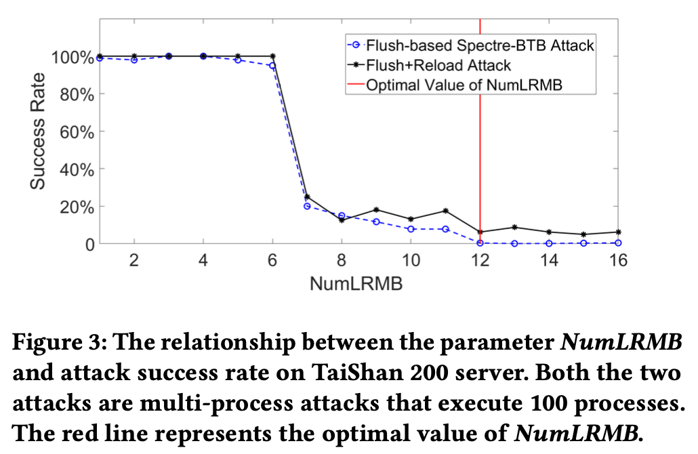

+++
title = 'FlushTime: Towards Mitigating Flush-based Cache Attacks via Collaborating Flush Instructions and Timers on ARMv8-A'
date = 2025-02-06T18:42:24+08:00
summary = "Depowering the timer to mitigate flush-based cache attacks"
math = true
draft = false
categories = ['Security']
tags = ['Paper', 'ARM', 'Side-Channel']
+++

> #### Info
>
> 本文第一作者是我大师兄Jingquan Ge, [代码](https://github.com/gejingquan/FlushTime)

读了挺多做攻击的工作, 所以这次换个口味读一下防御方面的文章, ~顺便学一下如何做"短平快"。~
这篇文章的防御思路很直接, 实现起来也不复杂, 但实验做得很扎实, 非常值得本菜学习如何做实验。

## Introduction

这篇论文介绍了一种在ARMv8平台上的flush指令和timer协同防御flush-based cache attacks的方法, 作者称之为FlushTime。
FlushTime在不修改硬件的情况下, 仅需修改内核代码即可有效地防御所有flush-based cache attacks。
由于目前所有的基于flush指令的攻击都依赖于高精度timer, FlushTime着眼于限制timer的精度来切断攻击路径。
同时, ARMv8上flush和timer访问的机制使得FlushTime的实现变得非常简单。

## Background

Spectre就不重复介绍了, 可以看一下[之前的文章](https://blog.benx.dev/posts/paper-sysbumps/#spectre)。

### Cache Flush Instruction

在x86上, `clflush`指令可以在用户态将一个虚拟地址对应的cache行置为无效, 从而刷掉cache中的(旧)数据。
这种指令维护cache的状态, 保持cache和内存的一致性, 比如DMA对内存的频繁写入可能导致cache中的数据过期, 
这时候就需要使用flush指令来保证cache和内存的一致性。ARMv8上的flush指令有`dc civac`, `dc cvau` 和 `dc cvac`, 
但与其他架构不同的是, ARMv8同时提供了一个chicken bit来控制flush的权限, `SCTLR_EL1.UCI`设为0时, flush指令不会直接被执行
而是会触发一个trap, 由内核来执行flush操作, 比如Linux内核代码中的`user_cache_maint_handler()`处理用户态的flush指令。

### High Resolution Timers and API

Timer 作为PMU的一部分, 一开始用于性能分析, 但后来被用于各种侧信道攻击, 比如Timing Attacks通过测量程序的执行时间来推断程序的内部状态。
在x86上, `rdtsc`指令可以读取时间戳计数器, 精度可达纳秒级别。在ARMv8上, 用户态可以访问三种timer: `PMCCNTR_EL0`, `CNTPCT_EL0`(物理)和`CNTVCT_EL0`(虚拟)。
出于安全考虑, 物理计数器只能在内核态访问, 而虚拟计数器可以在用户态访问, 但由内核控制。跟flush指令一样, timer的权限控制也有chicken bit, 
`CNTVCT_EL0.EL0VCTEN`设为0时, 用户态访问虚拟计数器会触发trap, 由内核来处理, 比如Linux内核代码中的`cntvct_read_handler()`。
一般用户访问timer的方法是调用`clock_gettime()`等API, 但这些API的实现会读取`CNTVCT_EL0`来获取时间, 所以不需要修改这部分代码。

### Cache-related Attacks

Flush+Reload和Flush+Flush是两种常见的flush-based cache attacks。Flush+Reload观察cache中的数据是否被load
1. 通过flush指令刷掉目标地址所在的所有cache line
2. 等待受害进程访问目标地址
3. 逐个访问目标地址, 步长为一个cache line, 访问时间短则cache hit, 访问时间长则cache miss
4. 以此判断受害进程访问了哪一段数据

Flush+Flush基于flush指令的执行实际差异, 第三步load替换为flush, flush时间短则cache miss, flush时间长则cache hit。
一般以上攻击会结合Spectre和Meltdown来窃取敏感信息。

Flush-based攻击虽然成功率高, 但也有局限性, 比如依赖共享内存, flush指令和timer的精度, 所以后续又有Prime+Probe, Evict+Time等攻击。
Prime+Probe不依赖flush指令, 而是攻击者自己构造驱逐集去填充cache line, 然后判断驱逐集的访问时间。虽然不依赖flush指令和共享内存, 而且可以跨核心
但对噪声的容忍度较低, 因为要求驱逐集填满整个set, 其他共享缓存的核心会干扰攻击者的驱逐集。

### Defenses and Limitations

现有的防御措施有几大缺陷:
1. 硬件防御: 难以实现, 且现有的芯片没法patch
2. 软件防御: Linux内核有防御措施如KPTI, Google的Retpoline, 但开销大
3. 代码修复: 开销大
4. 浏览器防御: 也是基于减少timer的精度, 但底层计数器的精度不变, 仍然可以被利用

## Design

### Threat Model

假设攻击者
1. 没有root权限但能执行用户态代码
2. 无法获取内存地址的物理映射
3. 采用flush-based cache attacks
4. 攻击进程与受害进程共享cache

### Mechanism

FlushTime的核心思想是flush指令被执行时降低timer的精度, 从而扰乱攻击者获取的时间信息。
如果攻击者无法区分cache hit和cache miss的访问时间, 那么攻击就会失败。


且基于ARMv8的flush指令和timer的权限机制, FlushTime的实现非常简单:
1. 上文提到的chicken bit都设置为0, 禁止用户态直接访问flush指令和timer并触发trap
2. 修改内核的`user_cache_maint_handler()`代码, 当用户态执行flush指令时, 重置LRDCounter为NumCSLR, 表示要降低timer的精度
3. 修改内核的`cntvct_read_handler()`代码, 当用户态访问虚拟计数器时, 如果LRDCounter不为0, 则返回一个低位为0的时间戳, 低位0的位数称为NumLRMB,
Number of Low-Resolution Masked Bits, 用于控制timer的精度; 否则正常返回时间戳
4. 当然不能一直保持低精度, 需要有一个时间范围, FlushTime的考量是由于进程切换会flush cache, 所以只要确保攻击进程被切换过一次即可。
低精度的范围为NumCSLR(Number of Context Switch Low-Resolution)次。
实现就是在内核的`context_switch()`中, 每次切换进程时, 将LRDCounter减1, 当LRDCounter为0时, 恢复timer的精度。


显然单核处理器NumCSLR=1, 多核处理器NumCSLR需要实验确定。同时, NumLRMB也需要实验确定, 因为过低的精度会影响正常的系统运行。

```c
int LRDCounter[4096][2] = {0}; // 4096 entries, each entry contains pid and LRDCounter

// ... 
void user_cache_maint_handler(void* vir_addr)
{
    int index = 0;
    while (index < 4096 && LRDCounter[index][0] != current->pid) index++;
    if (index == 4096) { // not found, create a new entry
        index = 0;
        while (index < 4096 && LRDCounter[index][0] != 0) index++;
        if (index == 4096) return; // no space, need fix
        LRDCounter[index][0] = current->pid;
        LRDCounter[index][1] = NumCSLR;
    }
    // flush cache
    asm volatile("dc civac, %0" : : "r" (vir_addr) : "memory");

    // ...
}
```

```c
void cntvct_read_handler(void)
{
    if (LRDCounter[0][1] != 0) {
        // return a low-resolution timestamp
        asm volatile("mrs %0, cntvct_el0" : "=r" (val));
        val &= ~((1 << NumLRMB) - 1);
    } else {
        asm volatile("mrs %0, cntvct_el0" : "=r" (val));
    }
    return val;
}
```

```c
void context_switch(void)
{
    // store ctx

    // decrease LRDCounter
    for (int i = 0; i < 4096; i++) {
        if (LRDCounter[i][1] != 0) LRDCounter[i][1]--;
    }

    // restore ctx
}
```

原先的LRDCounter的设计有几个缺陷
- 全相联会导致每次访问的时间复杂度为O(n), 大大增加了`context_switch()`的时间
- 4096个entry可能不够, 攻击者可以创建多个进程来填充LRDCounter entry, 从而绕过FlushTime的防御

所以FlushTime暂时全局共享一个LRDCounter。

## Experiment

实验目的有二, 一是确定最小所需的NumCSLR和NumLRMB, 二是评估FlushTime的性能开销。

### NumCSLR and NumLRMB

> 实验环境是华为的TaiShan 2280服务器, Raspberry Pi 4B and ZCU102(FPGA)。

作者测试了两个攻击原语, 攻击OpenSSL 1.1.0 T-table和Spectre-BTB, 都是Flush+Reload攻击。
T-table会占据256个cache line中的16个, 如果攻击者能够以大于1/16的概率猜中cache line, 那么攻击就成功。
Spectre-BTB则是还原所有的bytes。




实验结果表明, 泰山上NumLRMB=12, NumCSLR=96即可阻止攻击, 大概将纳秒级别的精度降低到了微秒级别, NumCSLR约等于核心数。


明显测量到t-table被加载到cache中, 对角线上的cache hit次数高于其他地方, 说明攻击者能观测到受害进程的访问。

其他平台

| Platform | ARMv8-A Cores | NumCSLR | NumLRMB |
| --- | --- | --- | --- |
| TaiShan 2280 | 96 | 96 | 12 |
| Raspberry Pi 4B | 4 | 4 | 14 |
| ZCU102 | 4 | 4 | 15 |

### Security Evaluation

作者测试了其他的cache攻击

| Attack | Mitigation Capability |
| --- | :---: |
| Prime+Probe | ❎ |
| Evict+Reload | ❎ |
| Flush+Reload | ✅ |
| Flush+Flush | ✅ |
| Spectre-PHT | ✅ |
| Spectre-BTB | ✅ |
| Spectre-STL | ✅ |
| SpectrePrime | ❎ |
| Meltdown | ✅ |
| Meltdown-GP | ✅ |
| MeltdownPrime | ❎ |

基于Flush的攻击都被成功防御, 但Prime+Probe和SpectrePrime仍然可以成功, 因为这两种攻击不依赖flush指令。

### Performance

首先是这些修改过的API代码的性能开销

| API | Original (Cycles) | FlushTime (Cycles) |
| --- | --- | --- |
| `CNTVCT_EL0` | 12.14 | 27.73 (127%) |
| `clock_gettime()` | 103.02 | 115.29 (19%) |
| `DC CIVAC` | 38.21 | 28.15 (-26%) |
| `DC CVAU` | 69.33 | 26.98 (-61%) |
| `DC CVAC` | 69.58 | 28.11 (-60%) |

访问timer的指令性能开销增加比较大, 主要因为这些指令会触发trap。但flush指令的性能开销减少了, 内核态调用flush指令的性能开销会比用户态调用小。

然后是整体性能开销, 作者选取了UnixBench和SPEC CPU 2017, 并与Linux内核Mitigation的开销进行了对比, 如KPTI, Spectre-BTB 和 Spectre-STL。


作者还调查了内核中需要访问timer的代码, 发现只有少数测试代码和性能工具会受到影响,
但这些代码不是核心功能, 因此FlushTime的不影响正常的系统运行。

## Limitations

需要改进的点还是有很多的...
1. LRDCounter的设计需要优化, 比如能智能地监控可疑进程
2. 实际的NumLRMB, 即精度的调整需要根据实际情况调整, 防止错杀
3. 关注其他的性能计数器, 比如`PMCCNTR_EL0`; 能阻止攻击者自己构造的timer
4. 防御非flush-based攻击, 比如Prime+Probe和SpectrePrime, 考虑与其他防御措施结合
