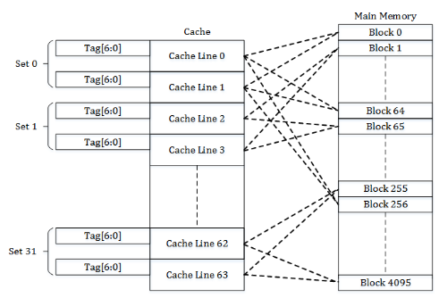
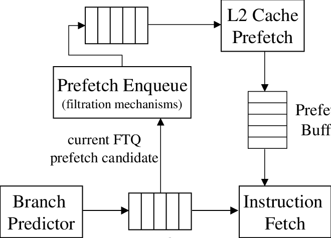
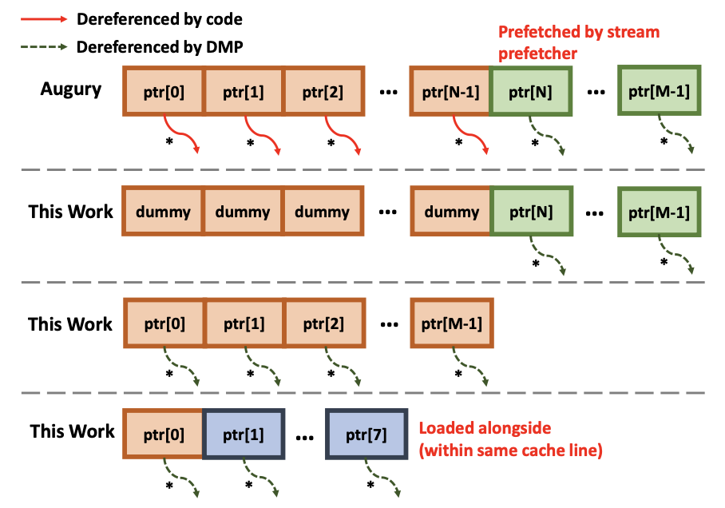
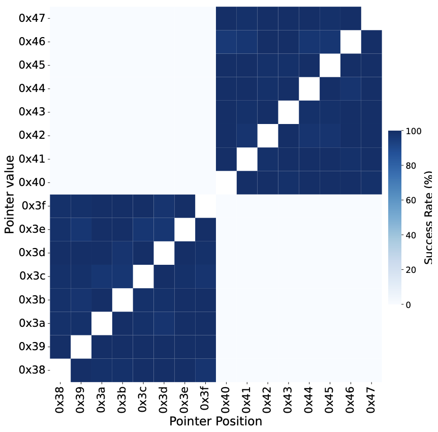

+++
title = 'GoFetch: Breaking Constant-Time Cryptographic Implementations Using Data Memory-Dependent Prefetchers'
date = 2024-07-09T01:17:38+08:00
draft = false
summary = 'Apple f**ked up. Is it really worthy to trade security off for such little performance gain?'
categories = ['Security']
tags = ['Paper', 'Apple', 'Side-Channel']
+++

## Preface

> #### Info
>
> 本文第一作者是 UIUC 的博士生 Boru Chen [[官网]](https://gofetch.fail)

参加 NUS 的夏令营时选择了这篇论文的复现+可视化+防御作为项目[^NUS SWS3011 DOTA]。~~项目本身非常trivial就不在这献丑了~~。这个侧信道攻击非常巧妙，但由于非常新颖，简中互联网暂时没有这篇文章的解读，于是决定尝试以本人浅薄的理解来解读一下。本文并不是翻译，而是对论文的解读，所以可能会有一些错误和论文中没有提到的内容。如果有错误，欢迎指正。

由于时间有限且本人太菜，针对密码的攻击部分这里只介绍RSA-2048，后续有空再补充（ ~~开摆~~

[^NUS SWS3011 DOTA]: NUS SoC 的课程 SWS3011 Defense of The Ancient，主讲教授是 Prof. Norman Hugh Anderson，主要计算机安全的基础知识和技术。队友做的可视化网站链接: [DOTA/gofetch-introduction](https://chanbengz.github.io/DOTA/gofetch-introduction.html)，repo 地址: [Ray0v0/DOTA_WebPage](https://github.com/Ray0v0/DOTA_WebPage)

## Introduction

这篇论文介绍了一种针对 Apple M 系列芯片的侧信道攻击，被研究者取名为 GoFetch。不同于以往的基于共享缓存的侧信道攻击，GoFetch 利用的是Data Memory-dependent Prefetcher (DMP)，即数据相关的预取器。由于 DMP 会根据数据的访问模式和地址特征来预取数据，甚至会预解引用数据，因此会造成缓存访问的时间差异，从而导致侧信道攻击。DMP 相关的侧信道攻击并不是很新的概念，但是 Apple 的 DMP 策略非常激进，导致侧信道攻击的成功率非常高。这个漏洞甚至可以用来攻击 Constant-Time 的算法。论文中，作者详细介绍了 Apple M 芯片的 DMP 策略和他们逆向过程与结果，并提出了 GoFetch 攻击原理和4中不同的攻击场景。最后，作者还提出了一些缓解措施。

## Background

这里介绍一下相关知识和术语，大佬请空降到[下一节](#dmp-reverse-engineering)。

### Cache & Prefetcher

Cache (高速缓存) 是一种处理器内部组件。在架构设计中，Cache 是介于处理器核心和内存之间的处理单元，用来存放最近访问的数据和指令，以减少内存访问的时间。Cache 通常分为 L1, L2, L3 多级，L1 容量最小且最快，L3 容量最大且最慢。Cache 的原理基于时间局部性，即被访问过的数据很可能会在不久之后再次被访问，与空间局部性，即被访问过的数据附近的数据也很可能会被访问 (比如数组)。现代超标量处理器的瓶颈之一就是缓存/内存访问延迟，因此缓存设计和优化是非常重要的。目前几乎所有的 Cache 都使用组相联(Set-Associative)的方式来实现, 如下图。详细内容请前往大佬的文章[计算机体系结构-cache高速缓存](https://zhuanlan.zhihu.com/p/482651908)



Prefetcher (预取器) 是一种硬件机制，用来预测未来可能会访问的数据，以减少 Cache Miss 的次数。Prefetcher 通常会根据数据的访问模式和地址特征来预取数据，以提高 Cache 的命中率。Prefetcher 通常分为两种类型：Instruction Prefetcher (IP) 和 Data Prefetcher (DP)。IP 用来预取指令，DP 用来预取数据。DP 又分为两种类型：Stride Prefetcher 和 Stream Prefetcher。Stride Prefetcher 会根据数据的访问模式来预取数据，Stream Prefetcher 会根据数据的地址特征来预取数据。Prefetcher 会有一定侧信道风险，因此要严格限制预测策略。



### Cache Side-Channel Attack

侧信道攻击利用系统运行过程中无意泄漏的有用信息，比如时间、功耗、电磁等信号。一个生活中的例子：开锁师傅用铁丝试探性插入锁芯时，锁芯的弹簧会有不同的触感和声音反馈，师傅从中推断锁芯的状态还原钥匙。计算机安全领域中有各种奇奇怪怪的侧信道，比如通过 CPU 解密 AES 时的功耗来推断密钥，甚至还有利用 TCP 计数器来猜测 TCP 连接的四元组信息，最后任意劫持 TCP 会话的侧信道[^2]。

基于缓存的侧信道攻击利用了缓存访问的时间差异来推测敏感数据, 例如数据在 L1 的访问时间小于不在 L1 的时间，并且数据被访问之后的一段时间都会在 L1 内，因此可以通过访问时间推测其是否最近被访问过[^4]。最经典的缓存侧信道莫过于 Meltdown and Spectre，利用了架构设计中安全检查不通过时不清空 Cache 已加载过的数据的缺陷[^1]，把机密数据作为偏移加载到 Cache 中，然后通过访问时间来推断数据。一般缓存侧信道攻击发生在有共享缓存的多核处理器上，攻击方式有 Flush+Reload, Prime+Probe 等。这些攻击方法基本上通过不断刷新缓存再访问来推断受害者的访问行为，并从中推断敏感数据。

[^1]: 当然通过权限检查时对数据的操作是清空的，所以这个攻击非常巧妙，推荐了解一下。
[^2]: 来自 UCR 的 [Zhiyun Qian (钱志云)](https://www.cs.ucr.edu/~zhiyunq/) 老师的研究: [CVE-2016-5696](https://nvd.nist.gov/vuln/detail/CVE-2016-5696)
[^4]: 为保证这个数据确实是近期访问而不是历史遗留，攻击者通常会在攻击前清空 Cache, 这个过程叫做 flush, prime, 或者 evict。flush 和 prime 的时间差是相反的。

### Apple M-series Chip

> Apple M 系列是苹果自研的 ARM 芯片，从自家的 A 系列发展而来，与公版架构的 ARM 没啥关系。

加入虚拟内存设计后，由于 MMU 地址转换的延迟太大，实际设计中 Cache 通常采用 VIPT (Virtual Index Physical Tag) 作为命中判断，即先通过虚拟地址推断缓存命中，再通过物理地址解决重名问题。这种设计简化了缓存侧信道的复杂度，因为攻击者可以推断受害者的虚拟地址并生成驱逐集(Eviction Set)和探测集(Probe Set)。

Apple M1 有4个性能核心 (Firestorm) 和4个效率核心 (Icestorm)，DMP 只在性能核心的 Cache 上启用。M1 每个性能核心有一个L1 Cache, 容量为 128 KByte, 8 way set-associative, 每条cache line有64 Byte; 4个核心共享L2 Cache, 容量为 12 MByte, 12 way set-associative, 每条cache line有128 Byte。

## DMP Reverse Engineering

GoFetch 攻击的核心是 DMP 解引用的机制，因此这一部分介绍作者是逆向 Apple M1 芯片的 DMP 策略的方法论和结果。作者通过一系列的实验和分析，发现了 Apple M1 芯片的 DMP 策略非常激进, 并且有一些限制上的特性反倒促成了这次的漏洞。`TL;DR` 的内容是与本文攻击相关的特性，方便后续理解。

### Data Access Pattern

> #### TL;DR
> 
> 无论是否主动解引用指针，DMP 都会预取当前指针指向的数据(预解引用) 和后续指针指向的数据。

作者之前的工作 [Augury](https://www.prefetchers.info/augury.pdf) 揭示了 DMP 的一个特性。对于一个指针数组 (array of pointers, aop)，DMP 会根据解引用历史，预取后续未解引用的指针。例如下面的实验代码:

```c
uint64_t* aop[M]; // M = 264, N = 256

for (int i = 0; i < N; i++) {
    *aop[i % N]; // architectural dereference
}
```

通过实验作者发现, 如果主动解引用[^3]前面部分的指针, DMP 会解引用数组内未被访问过的 (out of bound) , 即`aop[256...263]` 部分的指针，作者推测 DMP 会预解引用后续至少 8 个指针。在此作者进一步推测，如果不主动解引用前面的指针，那么 DMP 是否也会预解引用后续的指针呢？

实验结果表明，DMP 也会预解引用后续指针，且与上面的结果一致。实验代码如下:

```c
uint64_t* aop[M]; // M = 264, N = 256

for (int i = 0; i < N; i++) {
    aop[i % N]; // avoid architectural dereference
}
```

同时，访问过(in-bound)但不主动解引用的指针也会被预解引用(下图第3行); 对于单个指针的情况(下图第4行)也是如此。



根据上述猜测、实验和结果，作者认为当数据从 L2 加载到 L1 时，DMP 会扫描整个 Cache Line，并尝试解引用所有指针。

[^3]: 作者这里使用的是 architectural dereference (架构上解引用), 为方便理解就翻译成主动解引用了

### Activation Criteria

> #### TL;DR
>
> DMP 会记录解引用历史，不会重复预取已经解引用过的指针，并且会在 L1 Cache Line 上打一个标记防止重复扫描。这个特性是 GoFetch 攻击的基础。(苹果，真有你的)

本节介绍 DMP 的激活条件，主要分为三个部分：历史过滤器、已扫描标记和部分预解引用。

作者首先访问一个指针`ptr`，并将其与其指向的数据都驱逐出 cache，然后再访问其他垃圾数据来清刷一定量的历史记录。最后再访问`ptr`，探测 DMP 是否解引用了`ptr`。实验结果表明，DMP 解引用的概率随着垃圾数据的数量增加而提升，即 `ptr` 近期内不会重复解引用，这表明 DMP 会记录解引用历史。这个实验还能推测历史记录的大概容量，作者认为 DMP 对于128个记录后重复解引用的概率很高。

上小节只考虑了 DMP 的预测和解引用机制，于是作者进一步研究数据从 DRAM 填充到 L1 L2 的情况 (Cache Miss) 来解释机制背后的原因。回忆一下，L1 每条 Cache Line 的大小是 `64 Byte = 8 * sizeof(int64)`, L2 每条的大小刚好是 L1 的两倍。当缓存未命中时，数据会填充到 L1 和 L2。作者发现访问一个指针 `aop[i]` 时，如果 `i = 0..7`，那么 DMP 只会解引用 `aop[0..7]`, 如果 `i = 8..15`，那么 DMP 会解引用`aop[8..15]`，这刚好是 L2 Cache Line 的上半部份和下半部份。这个实验表明 DMP 只会解引用 L1 填充的部分而不会解引用 L2 的部分。这是否说明 DMP 只会预取到 L1?

DMP 会为 L1 缓存打上已扫描标记。基于前面的实验，作者猜想 DMP 在填充 L1 Cache Line 的时候会扫描整个 Line，但是这个假设仍存在细节上的缺失，于是作者设计了另一个实验：还是先加载`aop`，然后驱逐`ptr`指向的数据。接着尝试
- 将`aop`逐出 L1，然后再访问`aop`，观察 DMP 是否解引用`ptr`。结果是❎。
- 逐出 L1 和 L2，然后访问`aop`，同样观察 DMP 是否解引用。结果是✅。

实验结果显示只有第二种情况 DMP 解引用`ptr`，可以推断 DMP 存在一种机制让 `L2 -> L1` 填充时避免扫描填充的 Cache Line。作者取名为"do-not-scan hint"。

### Restrictions

> #### TL;DR
>
> DMP 的预解引用机制只在同一 4GB 空间内有效，会忽略最高字节`[63:56]`。

最后，作者还调查了 DMP 解引用时可能的限制。通过精心构造`ptr`的地址和值，作者用一系列实验去推测`ptr`的地址和被解引用地址的关系，结果表明 DMP 只会在地址和指向的数据都在 4GB 对其的区域内时解引用`ptr`；超过这个边界的指针不会被解引用。实验数据见下图。



同时，由于公版ARMv8标准会忽略最高的字节(top byte)，作者也验证了 DMP 也有类似的机制。实验中，作者翻转一个正常指针中的`[63:48]`每一位，然后测量其是否被解引用。结果表明`[55:48]`中的位被翻转后都没有被解引用(即不是合法指针)，`[63:56]`翻转后成功解引用。

Apple 曾申请过一项关于 DMP 预取`ptr`指向数据的周围数据的专利，作者也验证了M1中是否采用了这项专利。结果确认了这一特性的存在。

作者还用[相同的实验](#augury)测试了 Intel 13 代酷睿 CPU 的 DMP 作为对比。Intel 的 DMP 明显保守很多，在后3个情况中(解引用`ptr`和`aop`后续的指针, 解引用单个`ptr`) Intel 的 DMP 均为表现出解引用行为。

## Proof of Concept

这一节作者使用一个常时间编程(Constant-Time Programming)的经典例子`Constant-Time Swap`函数作为受害者来演示如何利用 DMP 进行侧信道攻击，窃取1bit的密文(secret)。

### Constant-Time Swap

首先简单介绍一下`ct-swap`函数的实现和安全性。最简单的`swap(int *a, int *b)`函数一般长这样

```c
// secret = 0: no swap; secret = 1: swap
void swap(int secret, int *a, int *b, size_t len) {
    int temp;
    if (secret) for (int i = 0; i < len; ++i) {
        temp = a[i];
        a[i] = b[i];
        b[i] = temp;
    }
}
```

这段代码对于侧信道攻击是非常脆弱的，主要漏洞有二：
- 其一是`secret`不同代码执行时间不同。如果`secret=0`，这段代码的运行时间几乎是0；否则攻击者可以观测到这段(用户)代码的执行时间
- 其二与上面类似，当`secret=0`时不会发生访存操作，而`secret=1`时攻击者可以通过缓存侧信道攻击观测到`a[]`和`b[]`的访问

于是人们发明了`Constant-Time Swap`，它长这样：

```c
// secret = 0: no swap; secret = 1: swap
void ct-swap(uint64_t secret, uint64_t *a, uint64_t *b, size_t len) {
    uint64_t delta;
    uint64_t mask = ~(secret-1);
    for (size_t i = 0; i < len; i++) {
        delta = (a[i] ^ b[i]) & mask;
        a[i] = a[i] ^ delta;
        b[i] = b[i] ^ delta;
    }
}
```

`mask`巧妙地规避了`secret`的if，因此`secret`的值不影响程序的执行时间和访存行为，一般称这种特性为"secret-independent"。

### Challenges & Compound Eviction Set


### Attack


## Attacking Cryptographic Implementations

### Go's RSA-2048


### OpenSSL's DH Key Exchange

TBD

### Kyber

TBD

### Dilithium

TBD

## Mitigation

文章粗略地给出了一些缓解措施，这里稍微翻译总结一下

- 
- 
- 
- 

## Guidance to Duplication

> #### Note
> 
> 需要注意攻击只能在 M1 芯片上进行，但逆向实验可以在 M2/M3 上进行。本人尝试过在 M3 上优化参数 (threshold, cache line size 等) 并成功过一段时间，然后不知为何又寄了。作者发文章后估计也不考虑维护这个代码了，遂作罢。

是的，作者开源了。你可以从 [Github](https://github.com/FPSG-UIUC/GoFetch) 上找到他们的代码并尝试复现他们的实验和攻击，README 写的也非常详细。这里我就粗略地翻译一下。我在同学的 Macbook Air M1 上成功复现过，并打算回国后用宿舍的 Mac mini 再试一次 (至于为什么不ssh，因为宿舍停电然后宕机了)。

