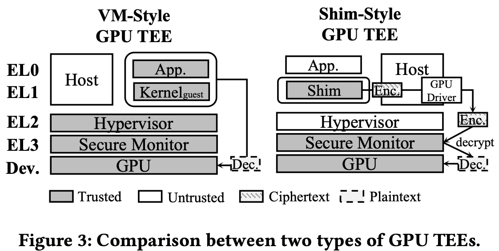
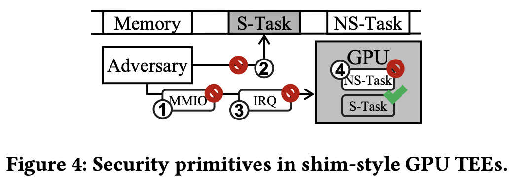

+++
title = 'Mole: Breaking GPU TEE with GPU-Embedded MCU'
date = 2025-05-20T18:42:24+08:00
summary = "Shouldn't blame the GPU TEE on ARM Mali GPU, but the Shim-Style GPU TEE's credit chain."
math = true
draft = false
categories = ['Security']
tags = ['Paper', 'ARM', 'TEE Attack']
+++

本文介绍利用ARM Mali GPU内置的MCU窃取GPU秘密的攻击。核心在于Shim-Style GPU TEE的信用链有缺陷。

## Motivation & Background

### GPU TEE

ARM公版的Mali GPU有一个ARMv7-M系列的MCU作为控制器, 作为gateway负责与CPU进行交互, 以及计算任务的调度。类似Hopper的Work Launch。

因为GPU属于外设，在没有GPU的硬件实现时通过ARM CPU的硬件feature和软件构建GPU TEE

- TZASC (TrustZone Address Space Controller): 内存控制器集成，给CPU和每个外设(Periphsal)都分配一个 NSAID (Non-Secure Access Identity)来划分权限控制。只划分了8段内存区域。
- Two-Stage Translation: VA先翻译成Intermediate PA (IPA), 再翻译成PA。好处是内存区域比TZASC更多，CPU提交任务后, GPU TEE可以把Stage 2的PTE删掉(或者把valid bit设为0), 来防止恶意CPU窃取GPU信息。
- SMMU (System Memory Management Unit): 其实就是Intel/AMD上的IOMMU, 通过给外设也分配VA来限制外设通过DMA只能读写特定区域。同时GPU TEE用SMMU防止其他外设攻击GPU。
- ARM CCA: ARMv9, 在SMMU内集成了Granule Protection Table (GPT), 与页表结构很像, 每一个物理页是一个granule (粒度) 来控制物理页权限。

现有的GPU TEE都利用上述安全特性构建，按照架构特点分为以下两种

- VM-Style: 全都要, 既然GPU driver和OS不可信, 那TEE可以利用ARM的TZASC或CCA构建一个CPU cVM, 再通过这个cVM提交GPU任务。好处是强隔离和兼容性, 坏处是代码量大(容易出别的漏洞), assumption太强。
- Shim-Style: 在OS里, GPU任务通过driver提交给下一层之前加入一个shim来加密, 然后在secure monitor通过MMIO实际提交给GPU前解密。好处很明显，代码量大幅减小, assumption没那么强, 坏处是driver不可控, 其他非计算的功能(比如电源管理)没法防御, 因为这些功能都不太重要所以忽视。

### Motivation

本文只攻击Shim-Sytle, 因为

1. MCU功能完整(ARMv7-M)
2. Shim-Sytle遗漏了一个很重要的部份: MCU firmware。MCU firmware从kernel driver中加载。
3. ARM的security features权限划分粒度都不够: 无法区分外设的不同组件, 比如GPU和GPU MCU。这个其实没办法区分，因为GPU也不直接与CPU交互，而是通过GPU MCU。

所以attack path: 恶意kernel加载恶意firmware到GPU MCU, 因为信任GPU, 所以GPU MCU也被信任, GPU MCU就被劫持来攻击GPU。

## Analysis & Reverse Engineering

攻击者的attack path有

1. MMIO, 能窃取/篡改外设的寄存器数据, 主要跟GPU setting有关
2. Secure Task的内存
3. Interrupt, 与GPU任务提交和结果接收有关
4. 来自Non-secure Task的攻击, 恶意调度/占用

以上path都被StrongBox防御了, 同时Shim-Style GPU TEE有两个假设

1. 受保护的任务不会同时进行
2. GPU management 不重要。这个假设不成立, 因为firmware management很重要。

通过实验证明

1. 逆向MCU firmware, 反推MCU结构: 内存区域和结构, CPU通过MMIO读写MCU内存和中断IRQ
2. 验证firmware可控: 随便加几个bytes也能正常运行, 没有任何验证
3. 绕过内存保护: MCU内存有16个区域（Address Space), MCU只能访问第一个。但是不可信的OS在初始化GPU的时候可以控制MCU的PTE, map一段page table的内存到MCU的address space, 然后MCU就可以修改PTE了。最后MCU map一段secure memory到自己的空间, 再窃取/修改
4. 调查提交GPU任务时哪个IRQ会触发代码执行。修改所有IRQ handler, 都把自己的地址写到shared memory
5. MPU可控, firmware可以修改每个内存段的权限

## Attack Primitive

GPU信任内部MCU, 

1. 修改内核, 植入恶意firmware控制MCU, secure task提交给GPU
2. 窃取敏感信息, copy secure memory to shared memory
3. 修改运算结果, copy shared memory to secure memory

实验:

- 测试配备Mali GPU的设备: 手机笔记本IoT

- 能攻击啥？in-GPU AES的密钥窃取, AI模型推理结果篡改

- 性能损失多少？太大的损失容易被怀疑。

## Future Work

师兄给大伙们肉吃

1. Make Mole an unprivileged attacker

## Related Work

[1] Zhenkai Zhang, Tyler Allen, Fan Yao, Xing Gao, and Rong Ge. 2023. TunneLs for Bootlegging: Fully Reverse-Engineering GPU TLBs for Challenging Isolation Guarantees of NVIDIA MIG. In Proceedings of the 2023 ACM SIGSAC Conference on Computer and Communications Security (CCS ’23), November
