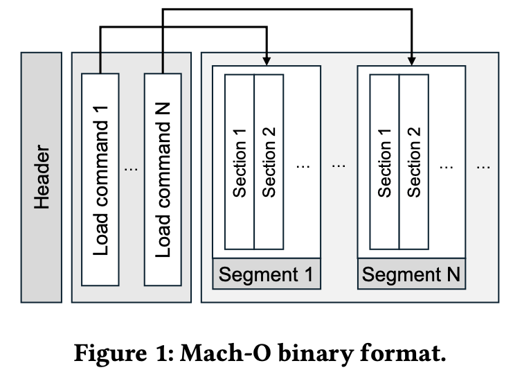
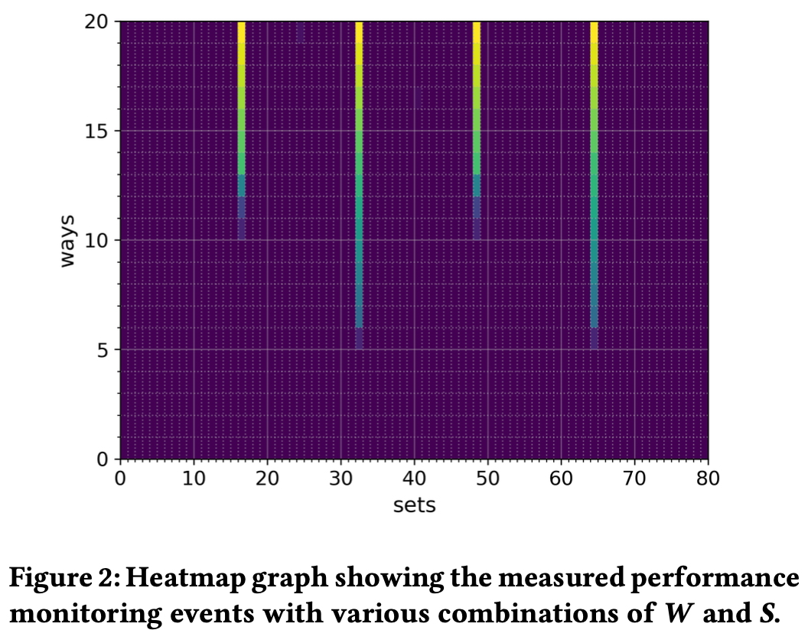
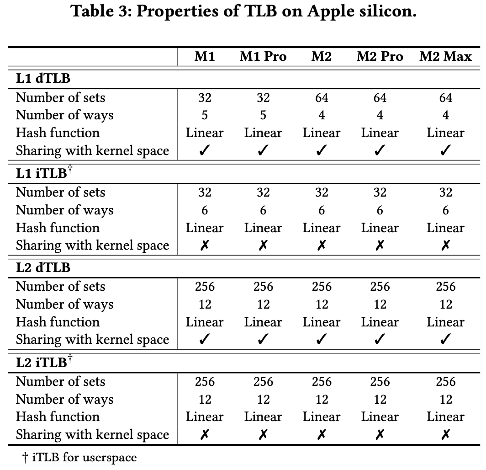
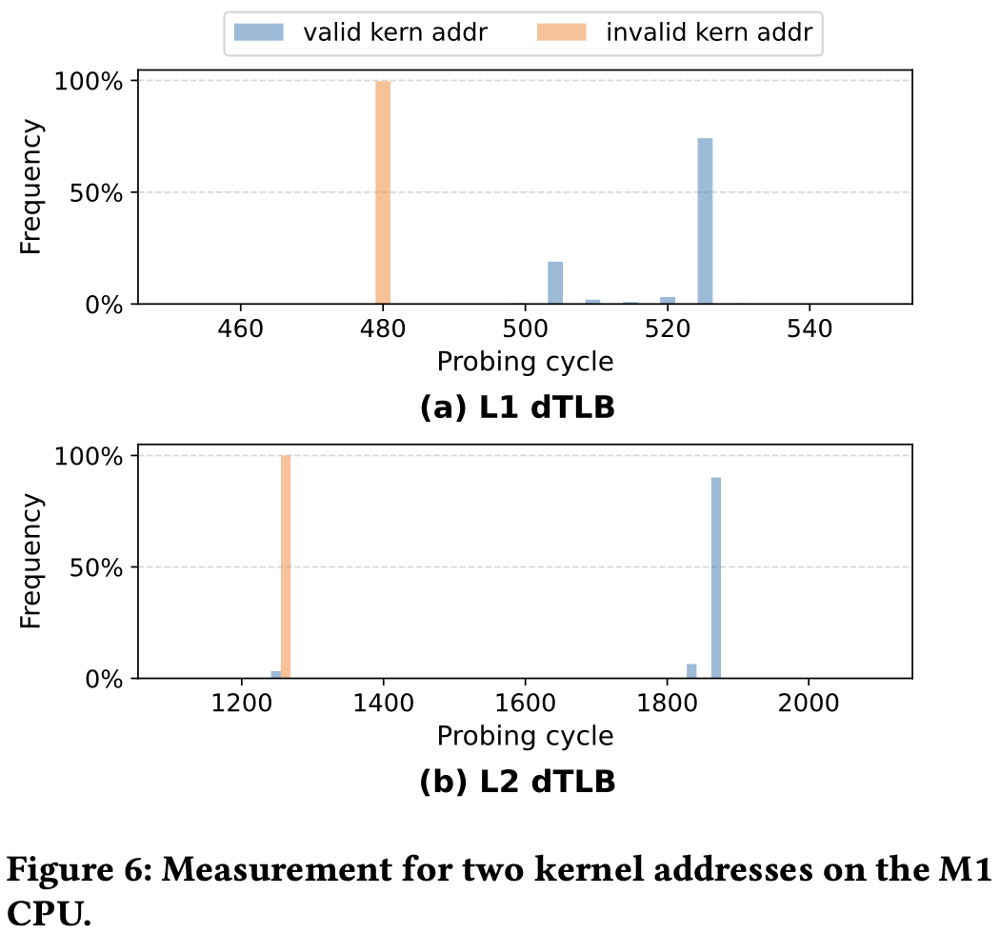
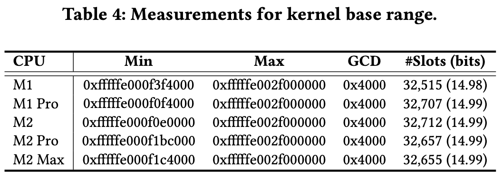
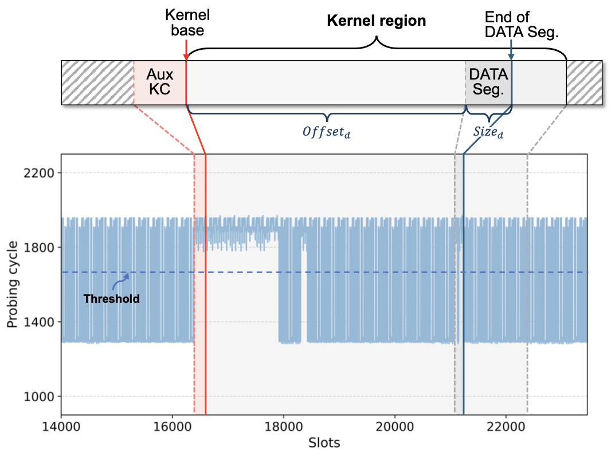

+++
title = 'SysBumps: Exploiting Speculative Execution in System Calls for Breaking KASLR in macOS for Apple Silicon'
date = 2025-01-24T01:05:45+08:00
summary = "Hacking Apple Silicon by macOS. Kinda ironic."
math = true
draft = false
categories = ['Security']
tags = ['Paper', 'Apple', 'Side-Channel']
+++

## Preface

> #### Info
>
> 本文作者是高丽大学的Hyerean Jang和Taehun Kim，[论文](https://dl.acm.org/doi/10.1145/3658644.3690189)

挺神奇的, 在苹果硅上做Spectre的有[^1], 打穿KASLR, 绕KPTI的也很多, 把这两个结合起来的就可以出一篇新paper了。
不过这篇工作还是很扎实的, 比如用PMU逆向苹果硅的TLB[^2], 利用Syscall执行Spectre攻击绕过KPTI。~~以及作者预计会开源
本菜能白嫖实验代码~~

[^1]: [iLeakage: Browser-based Timerless Speculative Execution Attacks on Apple Devices](https://ileakage.com/)
[^2]: PACMAN 的逆向比较粗糙，论文作者如是说。Section 3.1, Because the PMU provides rich data on microarchitectural
behavior, we were able to obtain more detailed information on the TLB, which even gave us slightly different results 
from the previous work.

## Introduction

这篇论文介绍了一种利用macOS系统调用实现的Spectre攻击，来绕过Apple Silicon的KPTI，获取KASLR基地址的方法。
与以往的工作不同, 作者利用PMU来逆向Apple Silicon的TLB配置和结构, 并且利用这些信息来实现Spectre攻击。
单单只是Spectre v1已经足够破解KASLR了，但Apple引入了Kernel Page Table Isolation (KPTI)来缓解Spectre。
因此, 作者提出通过执行Syscall的代码来绕过KPTI, 并通过阅读开源的XNU内核代码[^3]和实验来证明这个方法的可行性。

[^3]: XNU开源, 但不允许修改, 详见[Github](https://github.com/apple-oss-distributions/xnu.git)

## Backgroud

如果你对侧信道不熟悉, 可以看看我之前的[文章](https://blog.benx.dev/posts/paper-gofetch/)

### Spectre

最经典的缓存侧信道攻击。这个漏洞存在与大部分的现代高性能处理器中, 因为CPU为了提高性能采用了推测执行的技术,
比如在访问内存指令执行完前预先执行后续指令, 并通过分支预测技术预先执行分支之后的指令, 预测错误会回滚。

听起来没什么问题, 但Cache的状态不会回滚, 也就是说, 如果预测错误的分支访问了Cache, 那么Cache的状态就会被改变。
攻击者可以通过这个特性来实现侧信道攻击, 通过Cache的状态来推断程序的内存访问情况。

```c
size_t array1_size = 16;
size_t array1[256] = {0, 1, 2, ..., 15};

void victim_function(size_t x) {
    if (x < array1_size)
        y = prob_array[array1[x] * PAGE_SIZE];
}

char attack(size_t* addr) {
    // train the branch predictor
    for (int i = 0; i < 16; ++i) victim_function(i);

    // execute the attack
    _mm_clflush(&prob_array[i * PAGE_SIZE]);
    victim_function(addr - array1);

    // measure the cache hit time
    for (int i = 0; i < 256; ++i) {
        // loaded by the victim function
        if (is_cache_hit(&prob_array[i * PAGE_SIZE]))
            return i;
    }
}
```

### KASLR & KPTI

> 如果对页表不熟悉, 请预习/复习一下操作系统。TLB (Translation Lookaside Buffer) 是加速页表翻译的Cache。

Kernel Address Space Layout Randomization (KASLR) 通过随机化内核的地址空间来缓解攻击者对内核的攻击, 如Kernel的ROP攻击[^4],
同时也可以防御Spectre泄漏内核的一些信息。KASLR的实现方式大同小异, 但都有固定的范围, 跨度从7bit到15bit不等, 且都与page大小对其。

[^4]: Return-Oriented Programming (ROP) 利用栈溢出来构造恶意的代码执行链, 劫持程序正常的执行流程。如果程序的内存地址对于
攻击者是未知且完全随机化的, 那ROP就很难实现。

KASLR 一开始是很安全的, 一是因为内核地址对于非root用户不可见, 二是因为如果用户尝试去猜内核地址, 
用户态程序访问合法的内核地址也会抛core dump, 内核禁止用户态程序访问内核地址。Spectre 的出现打破了第二个条件。
用Prime & Probe就可以让攻击者得知他猜的正不正确, 正确的内核地址会驱逐Cache Line。
用论文的形式化表述就是, 破解KASLR的方法是通过构造一个Oracle[^5] $D(v)$, 其中$v$是一个内核地址, $D(v)$返回一个bit,
用来判断$v$是否在内核地址空间内。Spectre 就显然可以实现这个Oracle。

然后很多芯片引入了KPTI的设计, 即通过分离内核和用户页表, 攻击者无法在用户态触发内核虚拟地址翻译[^6], 于是正确的内核地址也不会进入Cache。
Apple的KPTI叫double map, 用两个TTBR寄存器分别翻译内核和用户地址。

[^5]: 又开始复习[密码学](https://blog.benx.dev/posts/crypto-review)了
[^6]: 原因很简单, 用户态的页表没有内核的页表项, 无法访问内核地址

### Mach-O Format

> 这部分内容可能用处不大，可跳过

Mach Object Format (Mach-O) 是macOS的二进制文件格式, 用于存储可执行文件、动态链接库和内核扩展。熟悉Linux的ELF的同学
可能会觉得这个格式很熟悉, 因为Mach-O的Segment结构和ELF很像(Mach-O Section = ELF Segment), 只是顺序和一些字段不一样。
Mach-O想较于ELF多了Load Command描述布局结构和链接特征和多个Segment, 可以在同一个文件中存储多个代码数据段, 甚至可以包括多个架构(FAT)。



## Attack Primitive

这一节介绍论文的逆向实验过程和结果。因为
1. 实现 Spectre 首先要知道 Cache(TLB) 的信息, 比如 Cache 结构、配置和策略[^7]等(可能还需要确认分支预测器的算法, 但这个没有提到)
2. 确认 Apple Silicon 确实会分开内核和用户页表, 且内核页表不会被用户态程序访问
3. 调查 macOS 的系统调用, 以及人工搜索与 Spectre 的漏洞代码相似的代码片段

[^7]: PACMAN 论文指出Apple Silicon的Cache替换策略是LRU的一种近似实现

### Reveal TLB on Apple Silicon

作者发现可以利用macOS提供的PMU信息来逆向Apple Silicon, 比如`/usr/share/kpep/<CPU name>.plist`提供了所有root用户
能读取的PMU信息列表[^8], 如`L1I_TLB_MISS_DEMAND` L1 TLB Miss 数。

[^8]: 每个做Apple逆向的都离不开这个: https://gist.github.com/ibireme/173517c208c7dc333ba962c1f0d67d12

首先作者假设TLB的内部是组相联(Set-Associative)的, 然后设L1 TLB的大小是$S$组(Set), $W$路(Way)。MMU 转换虚拟地址(Page Walk)的时候,
VPN(Virtual Page Number)的低$\log_2(S)$位用来选择组, 每个组有$W$个条目, 用来存放PPN(Page Physical Number)和一些标志位。所以, 
我们可以这么逆向来得到$W$和$S$的值:
1. 遍历所有$W$和$S$的组合
2. 访问$W$个低位相同的VPN, 填充TLB的某个组
3. 再访问第$W+1$个VPN, 如果TLB Miss, 说明这个组的大小是$W$

实际上, 我们可以直接分配一段巨大的内存, 然后每隔$S \times P$个bytes访问就可以保证第一步正确, 其中$P$是页大小, mac上是16KB。
所以代码如下

```c
void profile(size_t* base_addr, size_t w, size_t s)
{
    for (int i = 0; i < TRIALS; ++i) {
        for (int j = 1; j <= w + 1; ++j) {
            size_t dummy = base_addr[j * s * PAGE_SIZE];
        }
    }
}

int main()
{
    // set up kperf configs
    size_t* base_addr = malloc((w + 1) * s * PAGE_SIZE);
    size_t result[MAX_W][MAX_S] = {0};

    for (size_t w = 1; w < MAX_W; ++w) {
        for (size_t s = 1; s < MAX_S; ++s) {
            size_t start = get_tlb_miss();
            profile(base_addr, w, s);
            size_t end = get_tlb_miss();
            result[w][s] = end - start;
        }
    }

    return 0;
}
```

上面是dTLB的实验, 直接访问数据就可以了, 而测试iTLB的时候, 作者用`ret`填充了一大片内存, 然后直接跳转到`base_addr + j * s * PAGE_SIZE`处。



结果很明显, $W=10, S=16$ 或 $W=5, S=32$ 的时候就能观察到明显的TLB Miss[^8]。但作者更偏向于后者, 也没解释为啥, 我猜测是因为后者更符合业界的设计。

[^8]: 后面的数据是这俩组合的2次方倍, 就没啥意义了, 找最小的组合即可。

然后作者还完善了这个逆向实验
- 测试L2 TLB的大小, 方法一样。结果与Apple 的公开文档中L2的大小一致。
- 确认L2是最后一级TLB, 通过构造大小为$W + 1$的驱逐集, 然后测量Page Table Walk次数。
- 确认TLB分为iTLB和dTLB。填充iTLB 然后访问offset相同的数据, 发现没有TLB Miss, 说明iTLB和dTLB是分开的。

最后是逆向User和Kernel的TLB是不是分开的。这个很重要, 因为如果是分开的, 那走Kernel的TLB就不会驱逐User的TLB, 也就不会泄露信息。[^9]
实验方法也一样, 从用户态尝试驱逐内核地址$T$, 然后测量$T$的TLB Miss。不同点在于需要通过macOS的内核拓展kext来在内核态执行代码。

[^9]: 不知道为什么不走Cache



结果表明iTLB不共享, 但dTLB共享。而且dTLB驱逐会容易一些, 所以作者选择了dTLB来实现攻击。

### Speculative System Call

攻击的目标是绕过页表隔离构造$D(v)$, 那要触发内核态的Table Walk也必须得执行内核代码。所以这一节的任务是找到Spectre snippet,
它的特征是在分支条件后访问内核地址, 且这个分支条件是攻击者可控的。然后作者根据这个思路去人工搜索565个XNU内核的Syscall,
找接受指针的Syscall并排除掉包含跨进程通信和进程管理的Syscall来防止噪声干扰。最后筛出来80个, 其中有25个是能成功利用的。
比如`chdir(user_addr_t path)`包括一段检验用户地址的代码, 用户地址合法后会把相应的字符串拷贝到内核地址。

```c
int copyinstr(const user_addr_t user_addr, char *kernel_addr, vm_size_t nbytes, vm_size_t *lencopied)
{
    int result;
    ...
    result = copy_validate(user_addr, (uintptr_t)kernel_addr, nbytes, COPYIO_IN);
    if (__improbable(result)) {
        // When user_addr is invalid
        return result;
    }

    // When user_addr is valid
    user_access_enable();
    result = _bcopyinstr((const char *)user_addr, kernel_addr, nbytes, &bytes_copied);
    user_access_disable();
    ...
}
```

对于每个Syscall, 攻击者执行

```c
int validity_test(char * kernel_addr, int sys_num)
{
    // Step1. training with an arbitrary userspace address
    for(int i = 0; i < TRAIN_DEPTH; i++)
        syscall(sys_num, user_addr);

    // Step2. priming the TLB with an eviction set
    prime();

    // Step3. invoking a system call with 𝑣
    syscall(sys_num, kernel_addr);

    // Step4. probing the TLB state
    if( probe(kernel_addr) < THRESHOLD )
        return false; // v is an invalid address.
    else
        return true;  // v is a valid address.
}
```

先训练分支预测器, 然后执行Prime & Probe, 如果驱逐集被驱逐, 说明推测执行触发了内核态的Table Walk,
导致正确的内核地址填充了TLB。



作者分别测量了L1和L2 TLB Miss, 发现利用L2稳定性高, 可能是因为L1较小, 驱逐集容易被噪声干扰。附录
作者给出了所有可利用的Syscall, 无一例外它们都会从用户态拷贝数据到内核态。

## Breaking KASLR

有了攻击原语(Attack Primitive), 接下来可以开始尝试攻击了。攻击之前, 作者调查了XNU的KASLR实现,
发现KASLR生成是通过 `kernel_base_addr = 0xfffffe0007004000 + random()` 实现的, 所以攻击者只需要在这个范围内搜索即可。



作者生成了50000个可能的内核地址, 然后从小到大依次测试, 发现内核基地址都是16KB对齐的, 非常完美啊。然后
一算这个range, 有$32515 \approx 2^{15}$。

有了基地址, 作者接下来继续探测内核布局, 并跟实际的内核布局对比一下



发现跟正确的内核基地址有点偏差, 然后调查发现这一段偏差是因为macOS在内核前预留了一段空间给内核拓展, 这段空间叫
Auxiliary kernel collection (AuxKC)。[^10] 不过这段偏差是不确定的, 给攻击增加了一些难度。

[^10]: 这图有点画的不直观, 看了半天才看出来那一段是稳定驱逐(probing cycle大)

所以攻击者需要调整一下策略。作者发现内核空间DATA段的大小和偏移量比较固定且可知, 所以攻击只需倒着测量
找到DATA段末尾地址, 然后计算 `kernel_base_addr = data_end_addr - data_seg_offset - data_seg_size` 即可。

### Threat Model

攻击者的目标是绕过KPTI获取内核基地址, 不需要root权限, 只需执行代码, 攻击步骤如下
1. 获取DATA段的大小和偏移量, 这个可以通过`otool`看内核缓存文件得到
2. 执行Sysbumps攻击, 从高地址开始搜索第一个有效的内核地址, 记为`data_end_addr`
3. 计算`kernel_base_addr = data_end_addr - data_seg_offset - data_seg_size`

实验表明成功率在 94.1% 到 97.8% 之间, 且攻击时间在 3s 左右, 证明了这个攻击的可行性。


## Countermeasures

有几个比较简单的方法可以防御这种攻击
- 隔离dTLB, 使得内核和用户的TLB不共享
- 构造一些假的内核TLB条目, 混淆攻击者的判断
- 在有漏洞的Syscall加上内存屏障, 防止推测执行
- 稍有精细一点, 限制推测执行窗口, 防止访问内核地址指令被推测执行

## Epilogue

论文结尾提到了许多相关工作, 算是一篇小的综述, 有空就看看。
